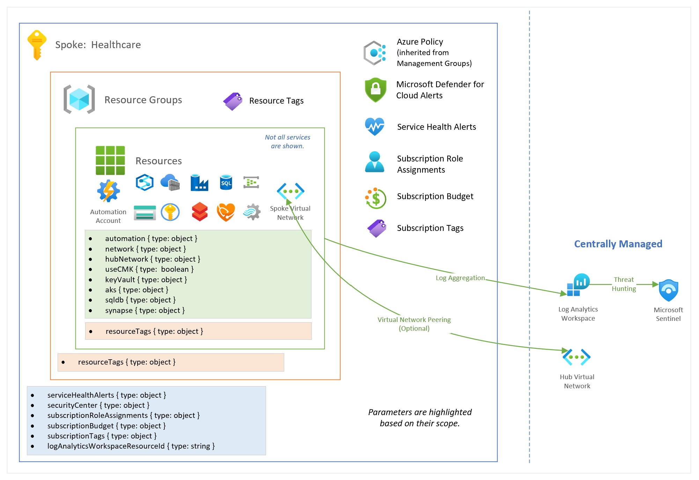

# Archetype: Healthcare

## Table of Contents

* [Overview](#overview)
* [Data Flow](#data-flow)
* [Access Control](#access-control)
* [Networking and Security Configuration](#networking-and-security-configuration)
* [Customer Managed Keys](#customer-managed-keys)
* [Secrets](#secrets)
* [Logging](#logging)
* [Testing](#testing)
* [Azure Deployment](#azure-deployment)
  * [Schema Definition](#schema-definition)
  * [Deployment Scenarios](#deployment-scenarios)
  * [Example Deployment Parameters](#example-deployment-parameters)
  * [Deployment Instructions](#deployment-instructions)

## Overview

Teams can request subscriptions from CloudOps team with up to Owner permissions for **Healthcare workloads**, thus democratizing access to deploy, configure, and manage their applications with limited involvement from CloudOps team.  CloudOps team can choose to limit the permission using custom roles as deemed appropriate based on risk and requirements.

Azure Policies are used to provide governance, compliance and protection while enabling teams to use their preferred toolset to use Azure services.



**CloudOps team will be required for**

1.  Establishing connectivity to Hub virtual network (required for egress traffic flow & Azure Bastion).
2.  Creating App Registrations (required for service principal accounts).  This is optional based on whether App Registrations are disabled for all users or not.

**Workflow**

*  A new subscription is created through existing process (either via ea.azure.com or Azure Portal).
*  The subscription will automatically be assigned to the **pubsecSandbox** management group.
* CloudOps will create a Service Principal Account (via App Registration) that will be used for future DevOps automation.
* CloudOps will scaffold the subscription with baseline configuration.
* CloudOps will hand over the subscription to requesting team.

**Subscription Move**

Subscription can be moved to a target Management Group through Azure ARM Templates/Bicep.  Move has been incorporated into the landing zone Azure DevOps Pipeline automation.

**Capabilities**

| Capability | Description |
| --- | --- |
| Service Health Alerts | Configures Service Health alerts such as Security, Incident, Maintenance.  Alerts are configured with email, sms and voice notifications. |
| Microsoft Defender for Cloud | Configures security contact information (email and phone). |
| Subscription Role Assignments | Configures subscription scoped role assignments.  Roles can be built-in or custom. |
| Subscription Budget | Configures monthly subscription budget with email notification. Budget is configured by default for 10 years and the amount. |
| Subscription Tags | A set of tags that are assigned to the subscription. |
| Resource Tags | A set of tags that are assigned to the resource group and resources.  These tags must include all required tags as defined the Tag Governance policy. |
| Automation | Deploys an Azure Automation Account in each subscription. |
| Hub Networking | Configures virtual network peering to Hub Network which is required for egress traffic flow and hub-managed DNS resolution (on-premises or other spokes, private endpoints).
| Networking | A spoke virtual network with minimum 4 zones: oz (Operational Zone), paz (Public Access Zone), rz (Restricted Zone), hrz (Highly Restricted Zone).  Additional subnets can be configured at deployment time using configuration (see below). |
| Key Vault | Deploys a spoke managed Azure Key Vault instance that is used for key and secret management. |
| SQL Database | Deploys Azure SQL Database.  Optional. |
| Azure Data Lake Store Gen 2 | Deploys an Azure Data Lake Gen 2 instance with hierarchical namespace.  *There aren't any parameters for customization.* |
| Synapse Analytics | Deploys Synapse Analytics instance. |
| Azure Machine Learning | Deploys Azure Machine Learning Service. *There aren't any parameters for customization.* | 
| Azure Databricks | Deploys an Azure Databricks instance.  *There aren't any parameters for customization.* |
| Azure Data Factory | Deploys an Azure Data Factory instance with Managed Virtual Network and Managed Integrated Runtime.  *There aren't any parameters for customization.* |
| Azure Container Registry | Deploys an Azure Container Registry to store machine learning models as container images.  ACR is used when deploying pods to AKS. *There aren't any parameters for customization.* |
| Azure API for FHIR | Deploys Azure API for FHIR with FHIR-R4. *There aren't any parameters for customization.* |
| Azure Functions | Deploys Azure Functions. *There aren't any parameters for customization.* |
| Azure Stream Analytics | Deploys Stream Analytics instance for streaming scenarios. *There aren't any parameters for customization.* |
| Azure Event Hub | Deploys Azure Event Hub for stream scenarios. *There aren't any parameters for customization.* |
| Application Insights | Deploys an Application Insights instance that is used by Azure Machine Learning instance.  *There aren't any parameters for customization.* |

## Data Flow

**Azure Services circled on the diagram are deployed in this archetype.**


| Category | Service | Configuration | Reference |
| --- | --- | --- | --- |
| Storage | Azure Data Lake Gen 2 - Cloud storage enabling big data analytics. | Hierarchical namespace enabled.  Optional – Customer Managed Keys. | [Azure Docs](https://docs.microsoft.com/azure/storage/blobs/data-lake-storage-introduction)
| Compute | Azure Databricks - Managed Spark cloud platform for data analytics and data science | Premium tier; Secured Cluster Connectivity enabled with load balancer for egress. | [Azure Docs](https://docs.microsoft.com/azure/databricks/scenarios/what-is-azure-databricks) |
| Compute | Azure Synapse - End-to-end cloud analytics and data warehousing platform. | Disabled public network access by default.  Managed Private Endpoints for Compute & Synapse Studio.  Optional – Customer Managed Keys. | [Managed Private Endpoints](https://docs.microsoft.com/azure/synapse-analytics/security/synapse-workspace-managed-private-endpoints) / [Connect to Synapse Studio with private links](https://docs.microsoft.com/azure/synapse-analytics/security/synapse-private-link-hubs)
| Compute | FHIR API - Fast Healthcare Interoperability Resources for healthcare medical exchange. | Private endpoint by default. | [Azure Docs](https://docs.microsoft.com/azure/healthcare-apis/fhir/) |
| Compute | Azure Stream Analytics | Real-time analytics and event-processing engine for process high volumes of fast streaming data from multiple sources simultaneously. | [Azure Docs](https://docs.microsoft.com/azure/stream-analytics/stream-analytics-introduction)
| Compute | Azure Function App - Serverless computing service | Virtual Network Integration for accessing resources in virtual network. | [Azure Docs](https://docs.microsoft.com/azure/azure-functions/functions-overview)
| Ingestion | Azure Data Factory - Managed cloud service for data integration and orchestration | Managed virtual network.  Optional – Customer Managed Keys | [Azure Docs](https://docs.microsoft.com/azure/data-factory/introduction) |
| Ingestion | Event Hub - Data streaming platform and event ingestion service | N/A | [Azure Docs](https://docs.microsoft.com/azure/event-hubs/event-hubs-about)
| Machine learning and deployment | Azure Machine Learning - Cloud platform for end-to-end machine learning workflows | Optional – Customer Managed Keys, High Business Impact Workspace | [Azure Docs](https://docs.microsoft.com/azure/machine-learning/overview-what-is-azure-ml) |
| Machine learning and deployment | Azure Container Registry - Managed private Docker cloud registry | Premium SKU.  Optional – Customer Managed Keys | [Azure Docs](https://docs.microsoft.com/azure/container-registry/container-registry-intro) |
| SQL Storage | Azure SQL Database - Fully managed cloud database engine | Optional – Customer Managed Keys | [Azure Docs](https://docs.microsoft.com/azure/azure-sql/database/sql-database-paas-overview) |
| Key Management | Azure Key Vault - Centralized cloud storage of secrets and keys | Private Endpoint | [Azure Docs](https://docs.microsoft.com/azure/key-vault/general/overview)
| Monitoring | Application Insights - Application performance and monitoring cloud service | - | [Azure Docs](https://docs.microsoft.com/azure/azure-monitor/app/app-insights-overview)

The intended cloud service workflows and data movements for this archetype include:

1.  Data can be ingested from data sources using Data Factory with managed virtual network for its Azure hosted integration runtime
2.  Streaming data can be ingested using Event Hub and Stream Analytics
3.  The data would be stored in Azure Data Lake Gen 2.
4.  Healthcare providers can connect to existing data sources with FHIR API.
5.  Data engineering and transformation tasks can be done with Spark using Azure Databricks. Transformed data would be stored back in the data lake.
6.  End to end analytics and data warehousing can be done with Azure Synapse Analytics.
7.  Machine learning would be done using Azure Machine Learning.
8.  Monitoring and logging would be through Application Insights.

## Access Control

Once the machine learning archetype is deployed and available to use, access control best practices should be applied. Below is the recommend set of security groups & their respective Azure role assignments.  This is not an inclusive list and could be updated as required.

**Replace `PROJECT_NAME` placeholder in the security group names with the appropriate project name for the workload**.

| Security Group | Azure Role | Notes |
| --- | --- | --- |
| SG_PROJECT_NAME_ADMIN | Subscription with `Owner` role. | Admin group for subscription. |
| SG_PROJECT_NAME_READ | Subscription with `Reader` role. | Reader group for subscription. |
| SG_PROJECT_NAME_DATA_PROVIDER | Data Lake (main storage account) service with `Storage Blob Data Contributor` role.  Key Vault service with `Key Vault Secrets User`. | Data group with access to data as well as key vault secrets usage.
| SG_PROJECT_NAME_DATA_SCIENCE | Azure ML service with `Contributor` role.  Azure Databricks service with `Contributor` role.  Key Vault service with `Key Vault Secrets User`. | Data science group with compute access as well as key vault secrets usage. |

## Networking and Security Configuration


| Service Name | Settings | Private Endpoints / DNS | Subnet(s)|
| --- | --- | --- | --- |
| Azure Key Vault | Network ACL Deny | Private endpoint on `vault` + DNS registration to either hub or spoke | `privateEndpoints`|
| SQL Database | Deny public network access | Private endpoint on `sqlserver` + DNS registration to either hub or spoke | `privateEndpoints`|
| Azure Data Lake Gen 2 | Network ACL deny | Private endpoint on `blob`, `dfs` + DNS registration to either hub or spoke | `privateEndpoints`|
| Synapse | Disabled public network access; managed virtual network | *  Managed Private Endpoints & Synapse Studio Private Link Hub. Private endpoint DNS registration. | `privateEndpoints` |
| Azure Databricks | No public IP enabled (secure cluster connectivity), load balancer for egress with IP and outbound rules, virtual network ibjection | N/A |  `databricksPrivate`, `databricksPublic`|
| Azure Machine Learning | No public workspace access | Private endpoint on `amlWorkspace` + DNS registration to either hub or spoke | `privateEndpoints`|
| Azure Storage Account for Azure ML | Network ACL deny | Private endpoint on `blob`, `file` + DNS registration to either hub or spoke | `privateEndpoints`|
| Azure Data Factory | Public network access disabled, Azure integration runtime with managed virtual network | Private endpoint on `dataFactory` + DNS registration to either hub or spoke | `privateEndpoints`|
| FHIR API | N/A | Private endpoint on `fhir` + DNS registration to either hub or spoke | `privateEndpoints`|
| Event Hub | N/A | Private endpoint on `namespace` + DNS registration to either hub or spoke | `privateEndpoints`|
| Function App | Virtual Network Integration | N/A | `web` |
| Azure Container Registry | Network ACL deny, public network access disabled | Private endpoint on `registry` + DNS registration to either hub or spoke | `privateEndpoints`|
| Azure Application Insights | N/A | N/A | N/A |

This archetype also has the following security features as options for deployment:

* Customer managed keys for encryption at rest, including Azure ML, storage, Container Registry, Data Factory, SQL Database, Azure Machine Learning, Synapse Analytics and Kubernetes Service.

* Azure ML has ability to enable high-business impact workspace which controls amount of data Microsoft collects for diagnostic purposes.

## Customer Managed Keys

To enable customer-managed key scenarios, some services including Azure Storage Account and Azure Container Registry require deployment scripts to run with a user-assigned identity to enable encryption key on the respective instances.

Therefore, when the `useCMK` parameter is `true`, a deployment identity is created and assigned `Owner` role to the compute and storage resource groups to run the deployment scripts as needed. Once the services are provisioned with customer-managed keys, the role assignments are automatically deleted.

If customer-managed key is required for the FHIR API, a separate Key Vault with access policy permission model is required.

The artifacts created by the deployment script such as Azure Container Instance and Storage accounts will be automatically deleted 1 hour after completion.

## Secrets
Temporary passwords are autogenerated, and connection strings are automatically stored as secrets in Key Vault. They include:

* SQL Database username, password, and connection string In the case of choosing SQL Authentication, if choosing Azure AD authentication, no secrets needed.
* Synapse username and password

## Logging

Azure Policy will enable diagnostic settings for all PaaS components in the machine learning archetype and the logs will be sent to the centralized log analytics workspace.  These policies are configured at the management group scope and are not explicitly deployed.

## Testing

Test scripts are provided to verify end to end integration. These tests are not automated so minor modifications are needed to set up and run.

The test scripts are located in [tests/landingzones/lz-healthcare/e2e-flow-tests](../../tests/landingzones/lz-healthcare/e2e-flow-tests)

The scripts are:

1. Azure ML Key Vault integration test
2. Azure ML terminal connection to ACR test
3. Databricks integration with Key Vault Data Lake test
4. Synapse integration tests for SQL Serverless, Spark, and SQL DW (dedicated) Pools

**Considerations for testing Azure Data Factory and Synapse using managed virtual networks**

* Data Factory - in order to test connectivity to data lake, ensure a managed private endpoint is set up along with interactive authoring enabled
* Synapse Analytics
  * Pipeline, ensure a managed private endpoint is set up along with interactive authoring enabled to test connectivity to data lake
  * SQL Serverless connectivity to data lake:
    * The default connectivity is to use user identity passthrough, thus, the user should have storage blob data contributor role to the role
    * Managed Synapse identity can be used, which the landing zone deployment automatically grants the MSI storage blob data contributor to the data lake
    * Upload some data to the default ADLS Gen 2 of Synapse
    * Run the integration tests for Synapse SQL Serverless Pool
  * Spark pool connectivity to data lake
    *  Ensure the user has storage blob data contributor role for the data lake
    *  Upload some data to the default ADLS Gen 2 of Synapse
    *  Run the integration tests for Synapse Spark Pool
  * Dedicated SQL (SQL Data warehouse)
    *  Ensure the user identity has a SQL Login (e.g. the admin user could be assigned the SQL AD admin)
    *  Upload some data to the default ADLS Gen 2 of Synapse
    *  Run the integration tests for Synapse SQL Dedicated Pool (DW)

### Test Scenarios

**Azure ML SQL / Key vault test**

1. Access the ML landing zone network and log into Azure ML through https://ml.azure.com
2. Set up a compute instance and create a new notebook to run Python notebook
3. Use the provided test script to test connection to Key Vault by retrieving the SQL password
4. Create a datastore connecting to SQL DB
5. Create a dataset connecting to a table in SQL DB
6. Use the provided dataset consume code to verify connectivity to SQL DB

**Azure ML terminal connection to ACR test**

1. Access the ML landing zone network and log into Azure ML through https://ml.azure.com
2. Set up a compute instance and use its built-in terminal
3. Use the provided test script to pull a hello-word Docker image and push to ACR

**Databricks integration tests**

1. Access Azure Databricks workspace
2. Create a new compute cluster
3. Create a new Databricks notebook in the workspace and copy in the integration test script
4. Run the test script to verify connectivity to Key Vault, SQL DB/MI, and data lake

**Azure ML deployment test**

1. Access the ML network and log into Azure ML through https://ml.azure.com
2. Set up a compute instance and import the provided tests to the workspace
3. Run the test script, which will build a Docker Azure ML model image, push it to ACR, and then AKS to pull and run the ML model

### Azure Deployment

### Schema Definition

Reference implementation uses parameter files with `object` parameters to consolidate parameters based on their context.  The schemas types are:

* Schema (version: `latest`)

  * [Spoke deployment parameters definition](../../schemas/latest/landingzones/lz-healthcare.json)

  * Common types
    * [Location](../../schemas/latest/landingzones/types/location.json)
    * [Service Health Alerts](../../schemas/latest/landingzones/types/serviceHealthAlerts.json)
    * [Microsoft Defender for Cloud](../../schemas/latest/landingzones/types/securityCenter.json)
    * [Subscription Role Assignments](../../schemas/latest/landingzones/types/subscriptionRoleAssignments.json)
    * [Subscription Budget](../../schemas/latest/landingzones/types/subscriptionBudget.json)
    * [Subscription Tags](../../schemas/latest/landingzones/types/subscriptionTags.json)
    * [Resource Tags](../../schemas/latest/landingzones/types/resourceTags.json)
  * Spoke types
    * [Automation](../../schemas/latest/landingzones/types/automation.json)
    * [Hub Network](../../schemas/latest/landingzones/types/hubNetwork.json)
    * [Azure Key Vault](../../schemas/latest/landingzones/types/keyVault.json)
    * [Azure SQL Database](../../schemas/latest/landingzones/types/sqldb.json)
    * [Azure Synapse Analytics](../../schemas/latest/landingzones/types/synapse.json)

### Deployment Scenarios

| Scenario | Example JSON Parameters | Notes |
|:-------- |:----------------------- |:----- |
| Deployment with Hub Virtual Network | [tests/schemas/lz-healthcare/FullDeployment-With-Hub.json](../../tests/schemas/lz-healthcare/FullDeployment-With-Hub.json) | - |
| Deployment with Location | [tests/schemas/lz-healthcare/FullDeployment-With-Location.json](../../tests/schemas/lz-healthcare/FullDeployment-With-Location.json) | `parameters.location.value` is `canadacentral` |
| Deployment without Hub Virtual Network | [tests/schemas/lz-healthcare/FullDeployment-Without-Hub.json](../../tests/schemas/lz-healthcare/FullDeployment-Without-Hub.json) | `parameters.hubNetwork.value.*` fields are empty & `parameters.network.value.peerToHubVirtualNetwork` is false. |
| Deployment with subscription budget | [tests/schemas/lz-healthcare/BudgetIsTrue.json](../../tests/schemas/lz-healthcare/BudgetIsTrue.json) | `parameters.subscriptionBudget.value.createBudget` is set to `true` and budget information filled in. |
| Deployment without subscription budget | [tests/schemas/lz-healthcare/BudgetIsFalse.json](../../tests/schemas/lz-healthcare/BudgetIsFalse.json) | `parameters.subscriptionBudget.value.createBudget` is set to `false` and budget information removed. |
| Deployment without resource tags | [tests/schemas/lz-healthcare/EmptyResourceTags.json](../../tests/schemas/lz-healthcare/EmptyResourceTags.json) | `parameters.resourceTags.value` is an empty object. |
| Deployment without subscription tags | [tests/schemas/lz-healthcare/EmptySubscriptionTags.json](../../tests/schemas/lz-healthcare/EmptySubscriptionTags.json) | `parameters.subscriptionTags.value` is an empty object. |
| Deployment without SQL DB | [tests/schemas/lz-healthcare/SQLDBIsFalse.json](../../tests/schemas/lz-healthcare/SQLDBIsFalse.json) | `parameters.sqldb.value.enabled` is false. |
| Deployment with SQL DB using AAD only authentication | [tests/schemas/lz-healthcare/SQLDB-aadAuthOnly.json](../../tests/schemas/lz-healthcare/SQLDB-aadAuthOnly.json) | `parameters.sqldb.value.aadAuthenticationOnly` is true, `parameters.sqldb.value.aad*` fields filled in. |
| Deployment with SQL DB using SQL authentication | [tests/schemas/lz-healthcare/SQLDB-sqlAuth.json](../../tests/schemas/lz-healthcare/SQLDB-sqlAuth.json) | `parameters.sqldb.value.aadAuthenticationOnly` is false & `parameters.sqldb.value.sqlAuthenticationUsername` filled in. |
| Deployment with SQL DB using mixed mode authentication | [tests/schemas/lz-healthcare/SQLDB-mixedAuth.json](../../tests/schemas/lz-healthcare/SQLDB-mixedAuth.json) | `parameters.sqldb.value.aadAuthenticationOnly` is false,  `parameters.sqldb.value.aad*` fields filled in & `parameters.sqldb.value.sqlAuthenticationUsername` filled in. |
| Deployment without customer managed keys | [tests/schemas/lz-healthcare/WithoutCMK.json](../../tests/schemas/lz-healthcare/WithoutCMK.json) | `parameters.useCMK.value` is false. |

### Example Deployment Parameters

This example configures:

1. Service Health Alerts
2. Microsoft Defender for Cloud
3. Subscription Role Assignments using built-in and custom roles
4. Subscription Budget with $1000
5. Subscription Tags
6. Resource Tags (aligned to the default tags defined in [Policies](../../policy/custom/definitions/policyset/Tags.parameters.json))
7. Automation Account
8. Spoke Virtual Network with Hub-managed DNS, Hub-managed private endpoint DNS Zones, Virtual Network Peering and all required subnets (zones).
9. Deploys Azure resources with Customer Managed Keys.

> **Note 1:**  Azure Automation Account is not deployed with Customer Managed Key as it requires an Azure Key Vault instance with public network access.

> **Note 2:** All secrets stored in Azure Key Vault will have 10 year expiration (configurable) & all RSA Keys (used for CMK) will not have an expiration.

```json
{
    "$schema": "https://schema.management.azure.com/schemas/2019-04-01/deploymentParameters.json#",
    "contentVersion": "1.0.0.0",
    "parameters": {
        "serviceHealthAlerts": {
            "value": {
                "resourceGroupName": "pubsec-service-health",
                "incidentTypes": [ "Incident", "Security" ],
                "regions": [ "Global", "Canada East", "Canada Central" ],
                "receivers": {
                    "app": [ "alzcanadapubsec@microsoft.com" ],
                    "email": [ "alzcanadapubsec@microsoft.com" ],
                    "sms": [ { "countryCode": "1", "phoneNumber": "5555555555" } ],
                    "voice": [ { "countryCode": "1", "phoneNumber": "5555555555" } ]
                },
                "actionGroupName": "Sub2 ALZ action group",
                "actionGroupShortName": "sub2-alert",
                "alertRuleName": "Sub2 ALZ alert rule",
                "alertRuleDescription": "Alert rule for Azure Landing Zone"
            }
        },
        "securityCenter": {
            "value": {
                "email": "alzcanadapubsec@microsoft.com",
                "phone": "5555555555"
            }
        },
        "subscriptionRoleAssignments": {
            "value": [
                {
                    "comments": "Built-in Role: Contributor",
                    "roleDefinitionId": "b24988ac-6180-42a0-ab88-20f7382dd24c",
                    "securityGroupObjectIds": [
                        "38f33f7e-a471-4630-8ce9-c6653495a2ee"
                    ]
                },
                {
                    "comments": "Custom Role: Landing Zone Application Owner",
                    "roleDefinitionId": "b4c87314-c1a1-5320-9c43-779585186bcc",
                    "securityGroupObjectIds": [
                        "38f33f7e-a471-4630-8ce9-c6653495a2ee"
                    ]
                }
            ]
        },
        "subscriptionBudget": {
            "value": {
                "createBudget": true,
                "name": "MonthlySubscriptionBudget",
                "amount": 1000,
                "timeGrain": "Monthly",
                "contactEmails": [
                    "alzcanadapubsec@microsoft.com"
                ]
            }
        },
        "subscriptionTags": {
            "value": {
                "ISSO": "isso-tag"
            }
        },
        "resourceTags": {
            "value": {
                "ClientOrganization": "client-organization-tag",
                "CostCenter": "cost-center-tag",
                "DataSensitivity": "data-sensitivity-tag",
                "ProjectContact": "project-contact-tag",
                "ProjectName": "project-name-tag",
                "TechnicalContact": "technical-contact-tag"
            }
        },
        "resourceGroups": {
            "value": {
                "automation": "healthcare-Automation",
                "compute": "healthcare-Compute",
                "monitor": "healthcare-Monitor",
                "networking": "healthcare-Network",
                "networkWatcher": "NetworkWatcherRG",
                "security": "healthcare-Security",
                "storage": "healthcare-Storage"
            }
        },
        "useCMK": {
            "value": true
        },
        "keyVault": {
            "value": {
                "secretExpiryInDays": 3650
            }
        },
        "automation": {
            "value": {
                "name": "healthcare-automation"
            }
        },
        "sqldb": {
            "value": {
              "enabled": true,
              "aadAuthenticationOnly":true,
              "aadLoginName":"DBA Group",
              "aadLoginObjectID":"4e4ea47c-ee21-4add-ad2f-a75d0d8014e0",
              "aadLoginType":"Group"
          }
        },
        "synapse": {
            "value": {
                "username": "azadmin"
            }
        },
        "hubNetwork": {
            "value": {
                "virtualNetworkId": "/subscriptions/ed7f4eed-9010-4227-b115-2a5e37728f27/resourceGroups/pubsec-hub-networking-rg/providers/Microsoft.Network/virtualNetworks/hub-vnet",
                "rfc1918IPRange": "10.18.0.0/22",
                "rfc6598IPRange": "100.60.0.0/16",
                "egressVirtualApplianceIp": "10.18.1.4",
                "privateDnsManagedByHub": true,
                "privateDnsManagedByHubSubscriptionId": "ed7f4eed-9010-4227-b115-2a5e37728f27",
                "privateDnsManagedByHubResourceGroupName": "pubsec-dns-rg"
            }
        },
        "network": {
            "value": {
                "peerToHubVirtualNetwork": true,
                "useRemoteGateway": false,
                "name": "healthcare-vnet",
                "dnsServers": [
                    "10.18.1.4"
                ],
                "addressPrefixes": [
                    "10.5.0.0/16"
                ],
                "subnets": {
                    "oz": {
                        "comments": "Foundational Elements Zone (OZ)",
                        "name": "oz",
                        "addressPrefix": "10.5.1.0/25"
                    },
                    "paz": {
                        "comments": "Presentation Zone (PAZ)",
                        "name": "paz",
                        "addressPrefix": "10.5.2.0/25"
                    },
                    "rz": {
                        "comments": "Application Zone (RZ)",
                        "name": "rz",
                        "addressPrefix": "10.5.3.0/25"
                    },
                    "hrz": {
                        "comments": "Data Zone (HRZ)",
                        "name": "hrz",
                        "addressPrefix": "10.5.4.0/25"
                    },
                    "databricksPublic": {
                        "comments": "Databricks Public Delegated Subnet",
                        "name": "databrickspublic",
                        "addressPrefix": "10.5.5.0/25"
                    },
                    "databricksPrivate": {
                        "comments": "Databricks Private Delegated Subnet",
                        "name": "databricksprivate",
                        "addressPrefix": "10.5.6.0/25"
                    },
                    "privateEndpoints": {
                        "comments": "Private Endpoints Subnet",
                        "name": "privateendpoints",
                        "addressPrefix": "10.5.7.0/25"
                    },
                    "web": {
                        "comments": "Azure Web App Delegated Subnet",
                        "name": "webapp",
                        "addressPrefix": "10.5.8.0/25"
                    }
                }
            }
        }
    }
}
```

### Deployment Instructions

Please see [archetype authoring guide for deployment instructions](authoring-guide.md#deployment-instructions).
