# Archetype: Hub Networking with Azure Firewall

## Table of Contents

* [Overview](#overview)
* [Hub Virtual Network](#hub-virtual-network)
* [Management Restricted Zone Virtual Network](#management-restricted-zone-virtual-network)
* [Shared Public Access Zone subnet in the Hub](#shared-public-access-zone-subnet-in-the-hub)
* [User Defined Routes](#user-defined-routes)
* [Network Security Groups](#network-security-groups)
* [Required Routes](#required-routes)
* [Azure Firewall Rules](#azure-firewall-rules)
* [Log Analytics Integration](#log-analytics-integration)
* [Delete Locks](#delete-locks)

## Overview

The recommended network design achieves the purpose of hosting [**Protected B** workloads on Profile 3][cloudUsageProfiles] (cloud only).  This is a simplified network design given all ingress and egress traffic will traverse through the same VIP.

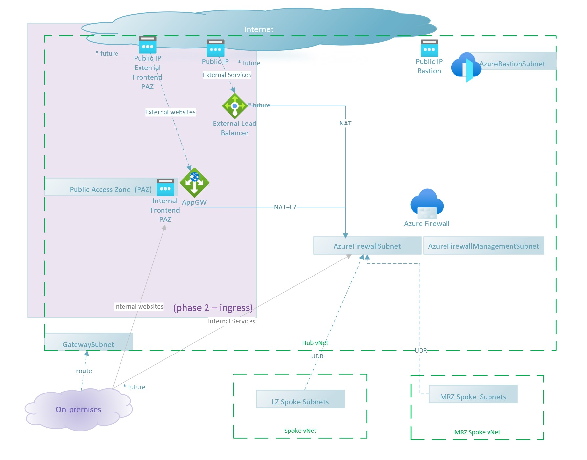

* Cloud network topology based on proven **hub-and-spoke design**.

* Hub contains a single instance of Azure Firewall and Azure Firewall Policy.
* The hub contains a subnet acting as a public access zones (PAZ, using [RFC 6598][rfc6598] space) where service delivery occurs (i.e. web application delivery), either dedicated to line of business workload or as a shared system. When using Azure Application Gateway, this subnet(PAZ) will be reserved for it.
* Hub links to a spoke MRZ Virtual Network (Management Restricted Zone) for management, security, and shared infrastructure purposes (i.e. Domain Controllers, Secure Jumpbox, Software Management, Log Relays, etc.).
* Spokes contains RZ (Restricted Zone) for line of business workloads, including dedicated PAZ (Public Access Zone), App RZ (Restricted Zone), and Data RZ (Data Restricted Zone).
* All ingress traffic traverses the hub's firewall, and all egress to internet routed to the firewall for complete traffic inspection for virtual machines. PaaS and Managed IaaS services will have direct communication with the Azure control plane to avoid asymmetric routing.
* No public IPs allowed in the landing zone spokes for virtual machines. Public IPs for landing zones are only allowed in the external area network (EAN).  Azure Policy is in place to prevent Public IPs from being directly attached to Virtual Machines NICs.
* Spokes have network segmentation and security rules to filter East-West traffic and Spoke-to-Spoke traffic will be denied by default in the firewall.
* Most network operations in the spokes, as well as all operations in the hub, are centrally managed by networking team.
* In this initial design, the hub is in a single region, no BCDR plan yet.

Application Gateway with WAFv2 will be used for ingress traffic and application delivery.  Application Gateways will be placed on the shared Public Access Zone (a subnet in the Hub), where public IPs will be protected with Azure DDoS (either Basic or Standard).

Other possible topologies are explained in [Azure documentation](https://docs.microsoft.com/azure/architecture/example-scenario/gateway/firewall-application-gateway) and we recommend reviewing to ensure the topology aligns to your department's network design.

There will be at least one shared Application Gateway instance and multiple dedicated Application Gateways for those line of businesses that require their own deployment (i.e. performance or cost allocation). All egress traffic from the spokes will be routed to the hub's edge firewall, inspected, and authorized/denied based on network (IP/Port) or application rules (FQDNs).

## IP Addresses

Network design will require 3 IP blocks:

* [RFC 1918][rfc1918] for Azure native-traffic (including IaaS and PaaS).  Example:  `10.18.0.0/16`
* [RFC 1918][rfc1918] for Azure Bastion.  Example:  `192.168.0.0/16`
* [RFC 6598][rfc1918] for department to department traffic through GCnet. Example:  `100.60.0.0/16`

> This document will reference the example IP addresses above to illustrate network flow and configuration. 

**Virtual Network Address Space**
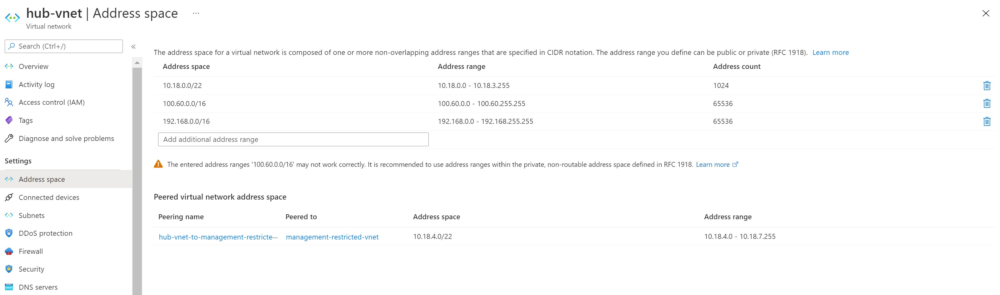

## Hub Virtual Network

* Azure Firewall Premium instance configured with
  * Either [forced tunneling](https://docs.microsoft.com/azure/firewall/forced-tunneling) (requires the next hop as another device such as NVA, on-premises or another Azure Firewall at the edge) or without forced tunneling.  When forced tunneling is turned on, all management traffic will flow through the separate `AzureFirewallManagementSubnet` subnet.
  * [DNS Proxy](https://docs.microsoft.com/azure/firewall/dns-details)
  * [Threat Intelligence in Alert mode](https://docs.microsoft.com/azure/firewall/threat-intel)
  * IDPS in Alert mode
* Azure Firewall Policy
  * Base firewall rules to support spoke archetypes
* Azure Bastion

## Management Restricted Zone Virtual Network

* Management Access Zone (OZ) - to host any privileged access workstations (PAW), with Management Public IPs forwarded via the hub's firewall. 
* Management (OZ) – hosting the management servers (domain controllers).
* Infrastructure (OZ) – hosting other common infrastructure, like file shares.
* Security Management (OZ) – hosting security, proxies and patching servers.
* Logging (OZ) – hosting logging relays.
* A User-Defined-Route forces all traffic to be sent to the Hub's firewall via the Internal Load Balancer in the Hub (this doesn't apply to Azure Bastion).

  **MrzSpokeUdr Route Table**
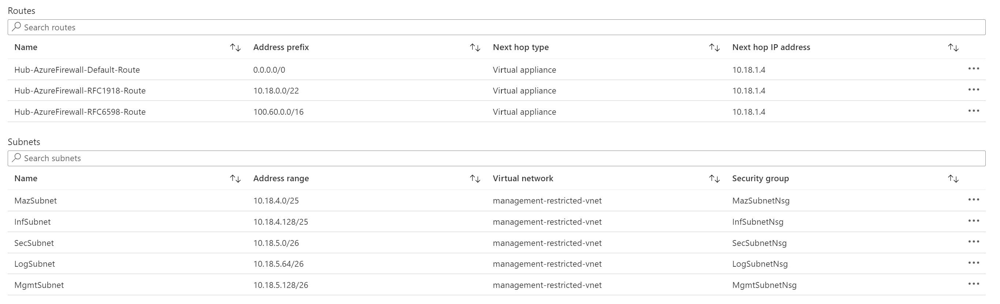

## Shared Public Access Zone subnet in the Hub

To simplify management and compliance, all public-facing web servers, reverse proxies and application delivery controllers will be hosted in this subnet, as a sort of DMZ. 

Application Gateway can have either public or private frontends (also with [RFC 6598][rfc6598] space) and it requires a full subnet for it's instances.

The Backend URL should map to a VIP and Port mapping in the firewall's External network. In the future, Backend URLs could be directly pointed to the Frontend subnets in the spoke. The firewall performs DNAT and sends to the webserver, which will answer to the source IP (Application Gateway's internal IP), which means the webserver may need a UDR to force traffic destined to Application Gateway to re-traverse the firewall (next-hop), which is considered asymmetric routing ([other example topologies](https://docs.microsoft.com/azure/architecture/example-scenario/gateway/firewall-application-gateway#application-gateway-before-firewall)).

## User Defined Routes
All traffic to be sent to the Hub's Azure Firewall VIP.

Azure supports connecting to PaaS services using [RFC 1918][rfc1918] private IPs, avoiding all traffic from the internet and only allowing connections from designated private endpoints as a special kind of NICs in the subnet of choice. Private DNS resolution must be implemented so the PaaS service URLs properly translate to the individual private IP of the private endpoint.

## Network Security Groups
Below is a list of requirements for the NSGs in each subnet:

* Hub Virtual Network

  * PazSubnet – must follow [Application Gateway's guidelines][nsgAppGatewayV2]
    *	TCP ports 65200-65535 for the v2 SKU with the destination subnet as Any and source as GatewayManager service tag
    *	Defaults (Allow [AzureLoadBalancer][nsgAzureLoadBalancer])
  *	AzureBastionSubnet - See [documentation][nsgAzureBastion]

## Subnets and IP Ranges

> This section will reference the [example IP addresses](#ip-addresses) above to illustrate network flow and configuration.

We'll use as few IPs as possible for the Core, MRZ and PAZ virtual networks, and use a small CIDR for a `Generic Subscription archetype` that works as an example for other Prod and Dev workloads. However, it's key to remember that each line of business may have to get their own IP range ([RFC 1918][rfc1918]) and peer it to the Hub network without conflicts (i.e. with `10.18.0.0/16`).

We also use a [RFC 6598][rfc6598] range for external networking, which makes this design compatible with SCED requirements for future hybrid. connectivity.

To leverage Azure Bastion as a shared service for all spoke virtual networks, we use a third IP range (outside of the [RFC 1918][rfc1918] and [RFC 6598][rfc6598] ranges). 

### Core network (Firewall and future VPN/ExpressRoute Gateway)

**Hub Virtual Network Address Space**


**Subnets with Network Security Group & User Defined Routes**
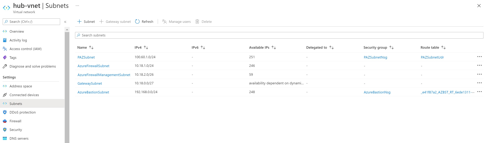

| Hub Virtual Network - 10.18.0.0/22, 100.60.0.0/24, 192.168.0.0/16	| Function | IP block |
| --- | --- | --- |
| PAZSubnet | Shared Application Gateways | 100.60.1.0/24 |
| AzureFirewallSubnet | Data plane traffic.  When forced tunneling is off, it is also used for management traffic. | 100.60.1.0/24 |
| AzureFirewallManagementSubnet | Management plane traffic.  Only used when forced tunneling is on. |
| AzureBastionSubnet | Azure Bastion | 192.168.0.0/24 |
| GatewaySubnet | Gateway Subnet | 10.18.0.0/27 |

### Management Restricted Zone Virtual Network (Spoke)

**MRZ Virtual Network Address Space**
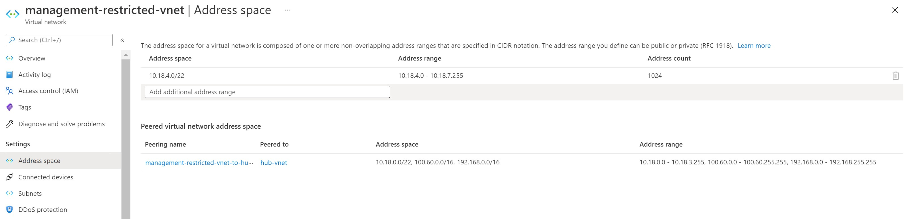

**Subnets with Network Security Group & User Defined Routes**
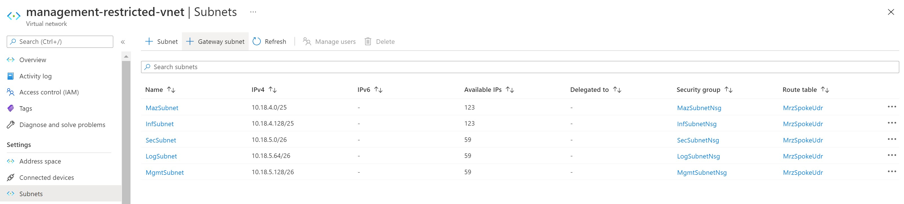

| Hub Virtual Network - 10.18.4.0/22	| Function | IP block |
| --- | --- | --- |
| MazSubnet | Management (Access Zone) | 10.18.4.0/25 |
| InfSubnet | Infrastructure Services (Restricted Zone)| 10.18.4.128/25 |
| SecSubnet | Security Services (Restricted Zone) | 10.18.5.0/26 |
| LogSubnet | Logging Services (Restricted Zone) | 10.18.5.64/26 |
| MgmtSubnet | Core Management Interfaces | 10.18.4.128/26 |

### Example Spoke:  Generic Subscription Archetype

| Spoke Virtual Network - 10.18.16.0/21	| Function | IP block |
| --- | --- | --- |
| oz-subnet | Internal Foundational Elements (OZ) | /25 |
| paz-subnet | Presentation Zone (PAZ) | /25 |
| rz-subnet | Application zone (RZ) | /25 |
| hrz-subnet | Data Zone (HRZ) | /25 |

## Required Routes

Required routing rules to enforce the security controls required to protect the workloads by centralizing all network flows through the Hub's firewall.

**Example: MrzSpokeUdr Route Table**


| UDR Name | Rules | Applied to | Comments |
| --- | --- | --- | --- |
| PrdSpokesUdr | `0.0.0.0/0`, `10.18.0.0/16` and `100.60.0.0/16` via Azure Firewall VIP. | All production spoke virtual networks. | Via peering, spokes learn static routes to reach any IP in the Hub. Hence, we override the Hub virtual network's IPs (10.18/16 and 100.60/16) and force traffic via Firewall. |
| DevSpokesUdr | Same as above. | All development spoke virtual networks. | Same as above. |
| MrzSpokeUdr | Same as above. | Mrz spoke virtual network  | Same as above. |
| PazSubnetUdr | Same as above. | Force traffic from Application Gateway to be sent via the Firewall VIP | Same as above. |

## Azure Firewall Rules

Azure Firewall Rules are configured via Azure Firewall Policy.  This allows for firewall rules to be updated without redeploying the Hub Networking elements including Azure Firewall instances.

> Firewall Rule definition is located at [landingzones/lz-platform-connectivity-hub-azfw/azfw-policy/azure-firewall-policy.bicep](../../landingzones/lz-platform-connectivity-hub-azfw/azfw-policy/azure-firewall-policy.bicep)

**Azure Firewall Policy - Rule Collections**
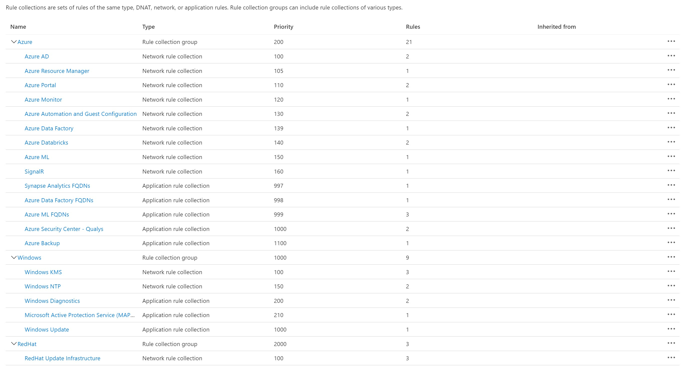

**Azure Firewall Policy - Network Rules**
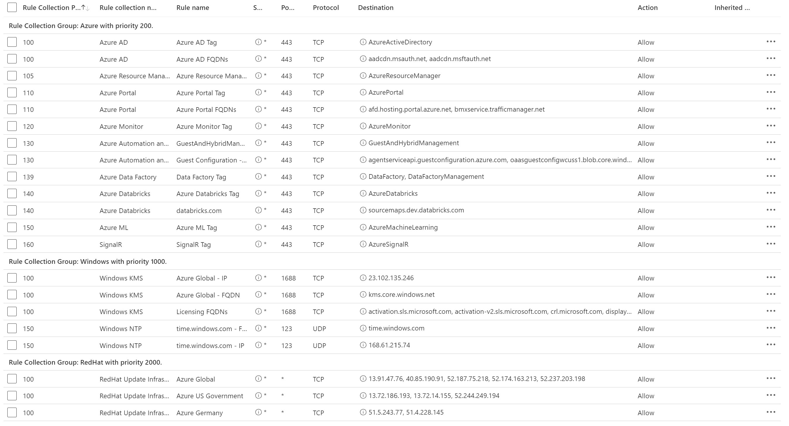

**Azure Firewall Policy - Application Rules**
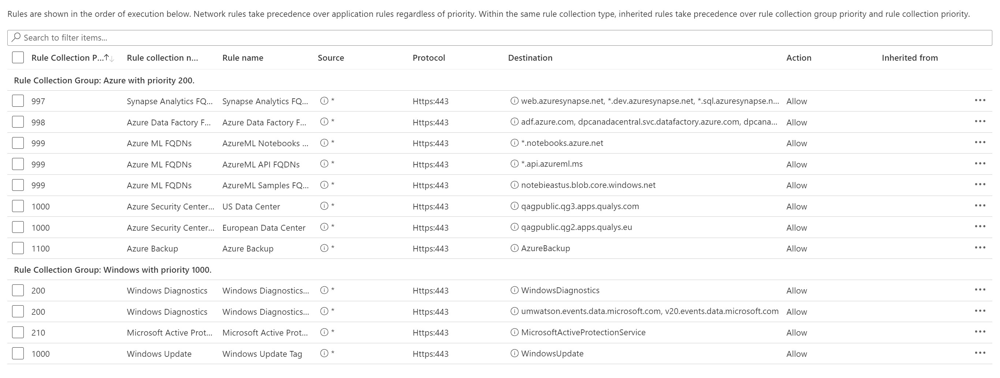

## Log Analytics Integration

Azure Firewall forwards it's logs to Log Analytics Workspace.  This integration is automatically configured through Azure Policy for Diagnostic Settings.

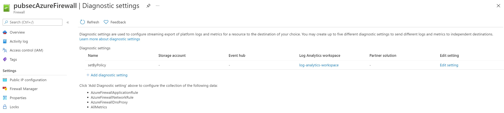

Once Log Analytics Workspace has collected logs, [Azure Monitor Workbook for Azure Firewall](https://docs.microsoft.com/azure/firewall/firewall-workbook) can be used to monitor traffic flows.  

Below are sample queries that can also be used to query Log Analytics Workspace directly.

**Sample Firewall Logs Query**

```none
AzureDiagnostics 
| where Category contains "AzureFirewall"
| where msg_s contains "Deny"
| project TimeGenerated, msg_s
| order by TimeGenerated desc
```

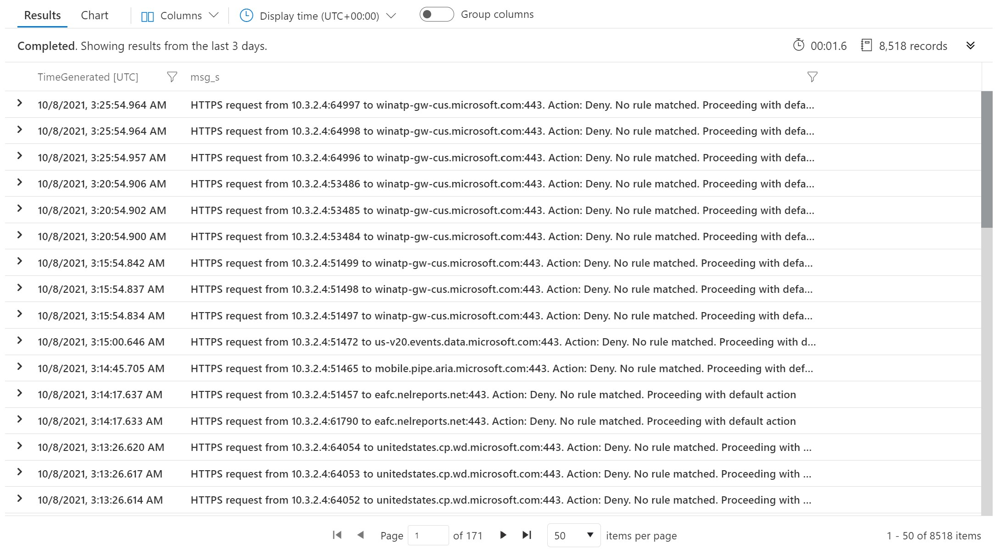

**Sample DNS Logs Query**

```none
AzureDiagnostics
| where Category == "AzureFirewallDnsProxy"
| where msg_s !contains "NOERROR"
| project TimeGenerated, msg_s
| order by TimeGenerated desc 
```

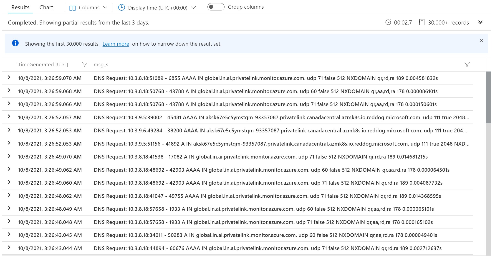

[itsg22]: https://www.cyber.gc.ca/sites/default/files/publications/itsg-22-eng.pdf
[cloudUsageProfiles]: https://github.com/canada-ca/cloud-guardrails/blob/master/EN/00_Applicable-Scope.md
[rfc1918]: https://tools.ietf.org/html/rfc1918
[rfc6598]: https://tools.ietf.org/html/rfc6598
[nsgAzureLoadBalancer]: https://docs.microsoft.com/azure/virtual-network/network-security-groups-overview#allowazureloadbalancerinbound
[nsgAzureBastion]: https://docs.microsoft.com/azure/bastion/bastion-nsg#apply
[nsgAppGatewayV2]: https://docs.microsoft.com/azure/application-gateway/configuration-infrastructure#network-security-groups

## Delete Locks

As an administrator, you can lock a subscription, resource group, or resource to prevent other users in your organization from accidentally deleting or modifying critical resources. The lock overrides any permissions the user might have.  You can set the lock level to `CanNotDelete` or `ReadOnly`.  Please see [Azure Docs](https://docs.microsoft.com/azure/azure-resource-manager/management/lock-resources) for more information.

By default, this archetype deploys `CanNotDelete` lock to prevent accidental deletion at:

* Hub Virtual Network resource group
* Management Restricted Zone resource group
* Public Access Zone resource group
* DDoS resource group (when enabled)
