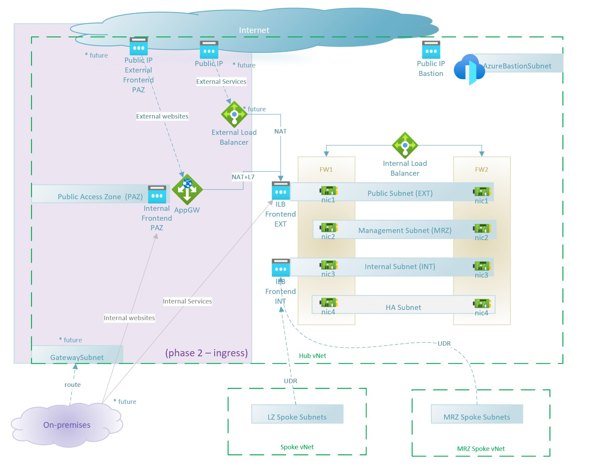
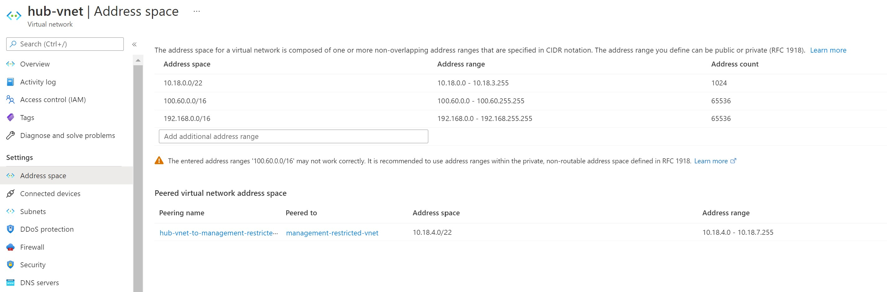
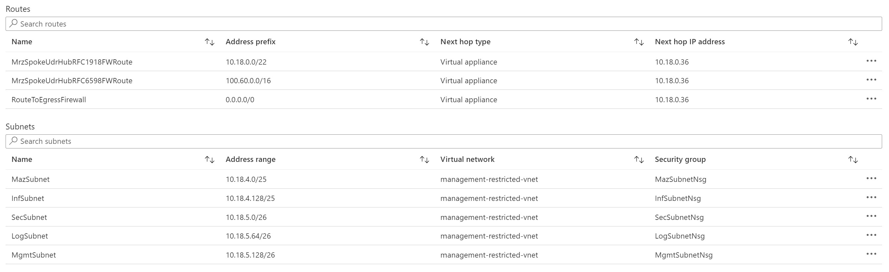
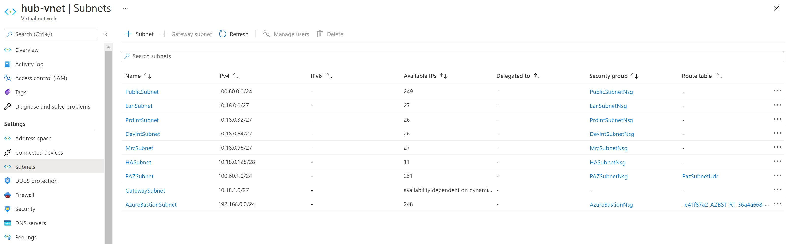
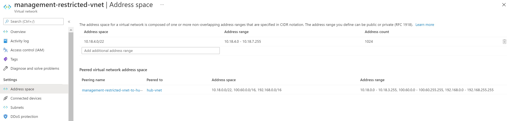
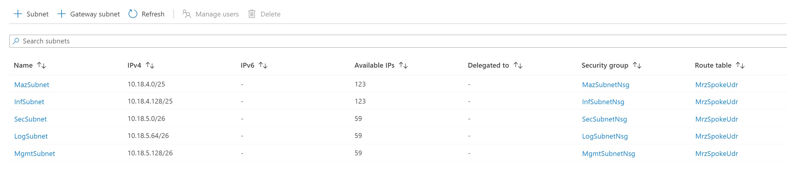

# Archetype: Hub Networking with Fortigate Firewalls

## Table of Contents

* [Overview](#overview)
* [Hub Virtual Network](#hub-virtual-network)
* [Management Restricted Zone Virtual Network](#management-restricted-zone-virtual-network)
* [Shared Public Access Zone subnet in the Hub](#shared-public-access-zone-subnet-in-the-hub)
* [User Defined Routes](#user-defined-routes)
* [Network Security Groups](#network-security-groups)
* [Subnets and IP Ranges](#subnets-and-ip-ranges)
* [Required Routes](#required-routes)
* [Firewall configuration details](#firewall-configuration-details)
* [Fortigate Licences](#fortigate-licences)
* [Delete Locks](#delete-locks)

## Overview

The recommended network design achieves the purpose of hosting [**Protected B** workloads on Profile 3][cloudUsageProfiles] (cloud only). In preparation for a future connection to on-premises infrastructure, we've taken recommendations from SSC guidance ([video](https://www.youtube.com/watch?v=rQYyatlO0-k)) detailed [https://github.com/canada-ca/Azure_LZBCA-AIZDB/tree/master/Network](https://github.com/canada-ca/Azure_LZBCA-AIZDB/tree/master/Network).



* Cloud network topology based on proven **hub-and-spoke design**.

* Hub contains two firewall clusters: one for production and one for non-production (dev) traffic.  Each firewall virtual appliance will contain 4 NICs each.
* The firewalls have one interface in the Public Network (uses [RFC 6598][rfc6598] IPs for future use with GCnet). **EAN will not contain F5 load balancers.**
* The firewalls have one interface for their respective Internal Area Networks (Prod/Dev)
* The hub a contains subnet acting as a public access zones (PAZ, using [RFC 6598][rfc6598] space) where service delivery occurs (i.e. web application delivery), either dedicated to line of business workload or as a shared system. When using Azure Application Gateway, the subnet will be of its exclusively use.
* Hub links to a spoke MRZ Virtual Network (Management Restricted Zone) for management, security, and shared infrastructure purposes (i.e. Domain Controllers, Secure Jumpbox, Software Management, Log Relays, etc.).
* Spokes contains RZ (Restricted Zone) for line of business workloads, including dedicated PAZ (Public Access Zone), App RZ (Restricted Zone), and Data RZ (Data Restricted Zone).
* All ingress traffic traverses the hub's firewall, and all egress to internet routed to the firewall for complete traffic inspection for virtual machines. PaaS services will have direct communication with the Azure control plane to avoid asymmetric routing.
* No public IPs allowed in the landing zone spokes for virtual machines. Public IPs for landing zones are only allowed in the external area network (EAN).  Azure Policy is in place to present Public IPs from being directly attached to Virtual Machines NICs.
* Spokes have network segmentation and security rules to filter East-West traffic and Spoke-to-Spoke traffic will be denied by default in the firewall.
* Most network operations in the spokes, as well as all operations in the hub, are centrally managed by networking team.
* In this initial design, the hub is in a single region, no BCDR plan yet.

Application Gateway with WAFv2 will be used for ingress traffic and application delivery.  Application Gateways will be placed on the shared Public Access Zone (a subnet in the Hub), where public IPs will be protected with Azure DDoS (either Basic or Standard).

Other possible topologies are explained in [Azure documentation](https://docs.microsoft.com/azure/architecture/example-scenario/gateway/firewall-application-gateway) and we recommend reviewing to ensure the topology aligns to your department's network design.

There will be at least one shared Application Gateway instance and multiple dedicated Application Gateways for those line of businesses that require their own deployment (i.e. performance or cost allocation). All egress traffic from the spokes will be routed to the hub's edge firewall, inspected, and authorized/denied based on network (IP/Port) or application rules (FQDNs).

## IP Addresses

Network design will require 3 IP blocks:

* [RFC 1918][rfc1918] for Azure native-traffic (including IaaS and PaaS).  Example:  `10.18.0.0/16`
* [RFC 1918][rfc1918] for Azure Bastion.  Example:  `192.168.0.0/16`
* [RFC 6598][rfc1918] for department to department traffic through GCnet. Example:  `100.60.0.0/16`

> This document will reference the example IP addresses above to illustrate network flow and configuration. 

**Virtual Network Address Space**


## Hub Virtual Network

* 2 Firewall clusters (4 VMs total), one for Prod, one for Dev.
* Each Firewall has NICs connected to 4 subnets: External, Internal (Prod or Dev), HA and Management.
* (Optional) An External Load Balancer maps Public IPs to the external VIP of each FW pair.
* Internal Load Balancers maps Private IPs to the NICs of each FW pair (External, and either Int_Prod or Int_Dev).
* The HA network doesn't require Load Balancers.

## Management Restricted Zone Virtual Network

* Management Access Zone (OZ) - to host any privileged access workstations (PAW), with Management Public IPs forwarded via the hub's firewall.
* Management (OZ) – hosting the management servers (domain controllers).
* Infrastructure (OZ) – hosting other common infrastructure, like file shares.
* Security Management (OZ) – hosting security, proxies and patching servers.
* Logging (OZ) – hosting logging relays.
* A User-Defined-Route forces all traffic to be sent to the Hub's firewall via the Internal Load Balancer in the Hub (this doesn't apply to Azure Bastion).

  **MrzSpokeUdr Route Table**


## Shared Public Access Zone subnet in the Hub

To simplify management and compliance, all public-facing web servers, reverse proxies and application delivery controllers will be hosted in this subnet, as a sort of DMZ. 

Application Gateway can have either public or private frontends (also with [RFC 6598][rfc6598] space) and it requires a full subnet for it's instances.

The Backend URL should map to a VIP and Port mapping in the firewall's External network. In the future, Backend URLs could be directly pointed to the Frontend subnets in the spoke. The firewall performs DNAT and sends to the webserver, which will answer to the source IP (Application Gateway's internal IP), which means the webserver may need a UDR to force traffic destined to Application Gateway to re-traverse the firewall (next-hop), which is considered asymmetric routing ([other example topologies](https://docs.microsoft.com/azure/architecture/example-scenario/gateway/firewall-application-gateway#application-gateway-before-firewall)).

## User Defined Routes

All traffic to be sent to the Hub's firewall via the Internal Load Balancer in the Int_Prod Zone (or for Dev Landing Zones, the Int_Dev ILB) Private Endpoints and Private DNS Design.

Azure supports connecting to PaaS services using [RFC 1918][rfc1918] private IPs, avoiding all traffic from the internet and only allowing connections from designated private endpoints as a special kind of NICs in the subnet of choice. Private DNS resolution must be implemented so the PaaS service URLs properly translate to the individual private IP of the private endpoint.

## Network Security Groups

Below is a list of requirements for the NSGs in each subnet:

* Hub Virtual Network

  * PublicSubnet: defaults (Allow [AzureLoadBalancer][nsgAzureLoadBalancer] for health probes)
  * PrdIntSubnet: defaults (Allow [AzureLoadBalancer][nsgAzureLoadBalancer])
  * DevIntSubnet: defaults (Allow [AzureLoadBalancer][nsgAzureLoadBalancer])
  * MrzIntSubnet
    * Allow Bastion (see doc) from [AzureBastionSubnet][nsgAzureBastion]
    * Defaults (Allow [AzureLoadBalancer][nsgAzureLoadBalancer])
  * HASubnet
  * PazSubnet – must follow [Application Gateway's guidelines][nsgAppGatewayV2]
    *	TCP ports 65200-65535 for the v2 SKU with the destination subnet as Any and source as GatewayManager service tag
    *	Defaults (Allow [AzureLoadBalancer][nsgAzureLoadBalancer])
  *	AzureBastionSubnet - See [documentation][nsgAzureBastion]

## Subnets and IP Ranges

> This section will reference the [example IP addresses](#ip-addresses) above to illustrate network flow and configuration.

We'll use as few IPs as possible for the Core, MRZ and PAZ virtual networks, and use a small CIDR for a `Generic Subscription archetype` that works as an example for other Prod and Dev workloads. However, it's key to remember that each line of business may have to get their own IP range ([RFC 1918][rfc1918]) and peer it to the Hub network without conflicts (i.e. with `10.18.0.0/16`).

We also use a [RFC 6598][rfc6598] range for external networking, which makes this design compatible with SCED requirements for future hybrid. connectivity.

To leverage Azure Bastion as a shared service for all spoke virtual networks, we use a third IP range (outside of the [RFC 1918][rfc1918] and [RFC 6598][rfc6598] ranges). 

### Core network (Firewall and future VPN/ExpressRoute Gateway)

**Hub Virtual Network Address Space**


**Subnets with Network Security Group & User Defined Routes**


| Hub Virtual Network - 10.18.0.0/22, 100.60.0.0/24, 192.168.0.0/16	| Function | IP block |
| --- | --- | --- |
| PublicSubnet | External Facing (Internet/Ground) | 100.60.0.0/24 |
| PAZSubnet | Shared Application Gateways | 100.60.1.0/24 |
| EanSubnet | External Access Network | 10.18.0.0/27 |
| PrdIntSubnet | Internal Facing Prod (Connect PROD Virtual Networks) | 10.18.0.32/27 |
| DevIntSubnet | Internal Facing Dev (Connect Dev Virtual Networks) | 10.18.0.64/27
| MrzIntSubnet | Management Restricted Zone (connect Management Virtual Network) | 10.18.0.96/27 |
| HASubnet | High Availability (Firewall VM <-> Firewall VM heartbeat) | 10.18.0.128/28 |
| AzureBastionSubnet | Azure Bastion | 192.168.0.0/24 |
| GatewaySubnet | Gateway Subnet | 10.18.1.0/27 |

### Management Restricted Zone Virtual Network (Spoke)

**MRZ Virtual Network Address Space**


**Subnets with Network Security Group & User Defined Routes**


| Hub Virtual Network - 10.18.4.0/22	| Function | IP block |
| --- | --- | --- |
| MazSubnet | Management (Access Zone) | 10.18.4.0/25 |
| InfSubnet | Infrastructure Services (Restricted Zone)| 10.18.4.128/25 |
| SecSubnet | Security Services (Restricted Zone) | 10.18.5.0/26 |
| LogSubnet | Logging Services (Restricted Zone) | 10.18.5.64/26 |
| MgmtSubnet | Core Management Interfaces | 10.18.4.128/26 |

### Example Spoke:  Generic Subscription Archetype

| Spoke Virtual Network - 10.18.16.0/21	| Function | IP block |
| --- | --- | --- |
| oz-subnet | Internal Foundational Elements (OZ) | /25 |
| paz-subnet | Presentation Zone (PAZ) | /25 |
| rz-subnet | Application zone (RZ) | /25 |
| hrz-subnet | Data Zone (HRZ) | /25 |

## Required Routes

Required routing rules to enforce the security controls required to protect the workloads by centralizing all network flows through the Hub's firewall.

**Example: MrzSpokeUdr Route Table**


| UDR Name | Rules | Applied to | Comments |
| --- | --- | --- | --- |
| PrdSpokesUdr | 0.0.0.0/0 via PrdInt ILB VIP<br />10.18.0.0/16 via PrdInt ILB VIP<br />100.60.0.0/16 via PrdInt ILB VIP | All production spoke virtual networks. | Via peering, spokes learn static routes to reach any IP in the Hub. Hence, we override the Hub virtual network's IPs (10.18/16 and 100.60/16) and force traffic via Firewall. |
| DevSpokesUdr | 0.0.0.0/0 via DevInt ILB VIP<br />10.18.0.0/16 via DevInt ILB VIP<br />100.60.0.0/16 via DevInt ILB VIP | All development spoke virtual networks. | Same as above. |
| MrzSpokeUdr | 0.0.0.0/0 via PrdInt ILB VIP<br />10.18.0.0/16 via PrdInt ILB VIP<br />100.60.0.0/16 via PrdInt ILB VIP | Mrz spoke virtual network  | Same as above |
| PazSubnetUdr | 10.18.4.0/24 via PrdExtFW VIP<br />(Future) ProdSpokeIPs via PrdExt ILB VIP<br />(Future) DevSpokeIPs via DevExt ILB VIP | Shared PAZ subnet (Application Gateway) | Force traffic from Application Gateway to be sent via the Firewall External ILBs |

## Firewall configuration details

Two firewalls with 4 NICs each will be used, one for prod, one for dev, both with FortiOS 6.4.5 (Azure Image: [fortinet_fortiweb-vm_v5 via  Marketplace][azmarketplacefortinet]), no VDOM (virtual domains).

Note:  In order to use automation to provision Marketplace images, the terms need to be accepted through PowerShell or Azure CLI.  You may use this Azure CLI command to accept the terms.

```
az vm image terms accept --publisher fortinet --offer fortinet_fortigate-vm_v5 --plan fortinet_fg-vm --subscription SUBSCRIPTION_ID
```

They will have different sizes: vm8v (Prod)  and vm04v (Dev), however both need an Azure VM with 4 NICs. For more information, see https://www.fortinet.com/content/dam/fortinet/assets/data-sheets/fortigate-vm.pdf  and https://github.com/fortinetsolutions/Azure-Templates/tree/master/FortiGate/Active-Passive-HA-w-Azure-LBs

The 4 NICs will be mapped as follows (IPs shown for firewall 1 and 2, and the VIP is the ILB frontend).

* **NIC 1 – Public Network** – used as SNAT, so all traffic received on other NICs gets natted when leaving the firewall via this NIC.

    * Prod Firewall: (100.60.0.5, 100.60.0.6), VIP is .4
    * Dev Firewall: (100.60.0.8, 100.60.0.9), VIP is .7

*	**NIC 2 – Management Network**

    * Prod Firewall: (10.18.0.101, 10.18.0.102), VIP is .100
    * Dev Firewall: (10.18.0.104, 10.18.0.105), VIP is .103

*	**NIC 3 for prod – Internal Prod Area Network**

    * Prod Firewall: (10.18.0.37, 10.18.0.38), VIP is .36

*	**NIC 3 for dev – Internal Dev Area Network**

    * Dev Firewall: (10.18.0.69, 10.18.0.70), VIP is .68

*	**NIC 4 – HA clustering**

    * Prod Firewall: (10.18.0.132, 10.18.0.133), VIP is .131
    * Dev Firewall: (10.18.0.134, 10.18.0.135), VIP is .133

### Flows will enter the FW via the following NICs

| From \ To | Public | MRZ | PAZ | Internal (LZ Spokes) |
| --- | --- | --- | --- | --- |
| Public | - | *Forbidden* | NIC 1 | *Forbidden* |
| MRZ | NIC 2 | - | NIC 2 | NIC 2 |
| PAZ (via Public) | NIC 1 | NIC 1 | - | NIC 1 |
| Internal (LZ Spokes) | NIC 3 | NIC 3 | NIC 3 | -

## Fortigate Licences

The Fortigate firewall can be consumed in two modes: bring-your-own-license (BYOL) or pay-as-you-go (PAYG), where the hourly fee includes the fortigate license premium. Both require acceptance of the Fortigate license and billing plans, which can be automated with the following CLI:

**Bring your own license (BYOL)**

```bash
az vm image accept-terms --plan fortinet_fw-vm --offer fortinet_fortiweb-vm_v5 --publish fortinet --subscription XXX
```

**Pay as you go license (PAYG)**

```bash
az vm image accept-terms --plan fortinet_fw-vm-payg_20190624 --offer fortinet_fortiweb-vm_v5 --publish fortinet --subscription XXX
```

The BYOL boots the VM and expects a first login to its Web UI via https on its first nic, to upload the license, which will unlock the firewall and its SSH port.

For that reason, it's recommended to boot a Windows management VM in the MRZ (Management Restricted Zone Virtual Network) and use Azure Bastion to RDP in Windows and then open the Edge browser and navigate to https://firewall-ip . For more information, visit the following links:

* https://docs.fortinet.com/vm/azure/fortigate/6.2/azure-cookbook/6.2.0/358099/locating-fortigate-ha-for-azure-in-the-azure-portal-marketplace

* https://portal.azure.com/#create/fortinet.fortigatengfw-high-availabilityfortigate-ha

## Delete Locks

As an administrator, you can lock a subscription, resource group, or resource to prevent other users in your organization from accidentally deleting or modifying critical resources. The lock overrides any permissions the user might have.  You can set the lock level to `CanNotDelete` or `ReadOnly`.  Please see [Azure Docs](https://docs.microsoft.com/azure/azure-resource-manager/management/lock-resources) for more information.

By default, this archetype deploys `CanNotDelete` lock to prevent accidental deletion at:

* Hub Virtual Network resource group
* Management Restricted Zone resource group
* Public Access Zone resource group
* DDoS resource group (when enabled)


[itsg22]: https://www.cyber.gc.ca/sites/default/files/publications/itsg-22-eng.pdf
[cloudUsageProfiles]: https://github.com/canada-ca/cloud-guardrails/blob/master/EN/00_Applicable-Scope.md
[rfc1918]: https://tools.ietf.org/html/rfc1918
[rfc6598]: https://tools.ietf.org/html/rfc6598
[nsgAzureLoadBalancer]: https://docs.microsoft.com/azure/virtual-network/network-security-groups-overview#allowazureloadbalancerinbound
[nsgAzureBastion]: https://docs.microsoft.com/azure/bastion/bastion-nsg#apply
[nsgAppGatewayV2]: https://docs.microsoft.com/azure/application-gateway/configuration-infrastructure#network-security-groups
[azmarketplacefortinet]: https://portal.azure.com/#blade/Microsoft_Azure_Marketplace/GalleryItemDetailsBladeNopdl/id/fortinet.fortigatengfw-high-availability/product/%7B%22displayName%22%3A%22FortiGate%20NGFW%20for%20Azure%20LB%20HA%20with%20ARM%20template%22%2C%22itemDisplayName%22%3A%22FortiGate%20NGFW%20for%20Azure%20LB%20HA%20with%20ARM%20template%22%2C%22id%22%3A%22fortinet.fortigatengfw-high-availability%22%2C%22offerId%22%3A%22fortigatengfw-high-availability%22%2C%22publisherId%22%3A%22fortinet%22%2C%22publisherDisplayName%22%3A%22Fortinet%22%2C%22summary%22%3A%22FortiGate%20NGFW%20improves%20on%20the%20Azure%20firewall%20with%20complete%20data%2C%20application%20and%20network%20security%22%2C%22longSummary%22%3A%22Automated%20deployment%20for%20the%20combined%20use%20of%20Azure%20LB%20and%20NGFW%20configurations%20(2%20FortiGate%20virtual%20machines)%20to%20support%20your%20Enterprise%20Cloud%20workload%22%2C%22description%22%3A%22%3Cp%3EThe%20FortiGate%20Next-Generation%20Firewall%20combines%20a%20comprehensive%20suite%20of%20powerful%20security%20tools%20into%20a%20high-performance%20virtual%20device.%20FortiGate%20NGFWs%20can%20be%20combined%20with%20other%20Fortinet%20solutions%20to%20form%20a%20unified%20security%20fabric%20to%20secure%20your%20network%2C%20users%2C%20data%20and%20applications%20across%20clouds%20and%20enterprises.%3Cbr%3E%3C%2Fp%3E%3Cp%20class%3D%5C%22x_xmsonormal%5C%22%3EThe%20FortiGate%20NGFW%20includes%20application%20aware%20network%20security%2C%20secure%20SD-WAN%2C%20virus%20protection%2C%20IPS%2C%20Web%20filtering%20and%20VPN%20along%20with%20advanced%20features%20such%20as%20an%20extreme%20threat%20database%2C%20vulnerability%20management%20and%20flow-based%20inspection%20work%20in%20concert%20to%20identify%20and%20mitigate%20the%20latest%20complex%20security%20threats.%20The%20security-hardened%20FortiOS%20operating%20system%20is%20purpose-built%20for%20inspection%20and%20identification%20of%20malware.%3C%2Fp%3E%3Cp%20class%3D%5C%22x_xmsonormal%5C%22%3EDesigned%20to%20ensure%20easy%2C%20consistent%20deployment%20for%20the%20most%20ef