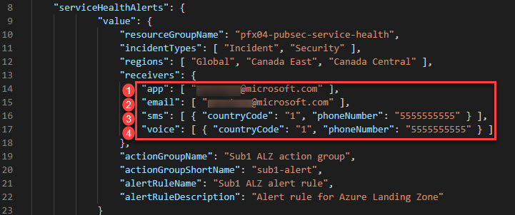
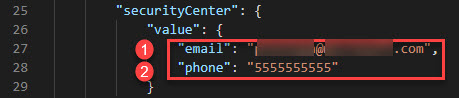
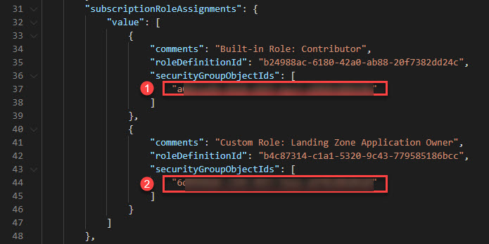
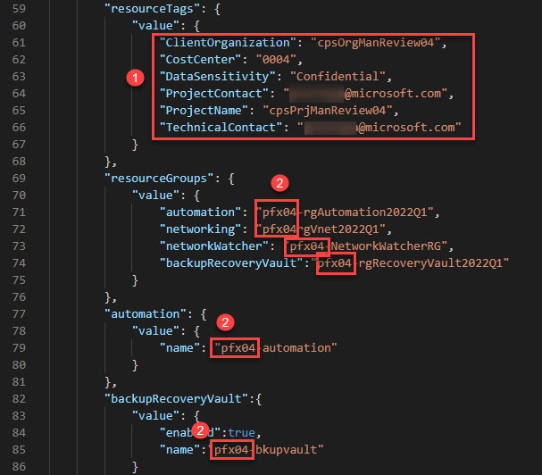
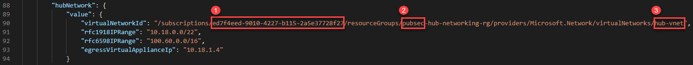
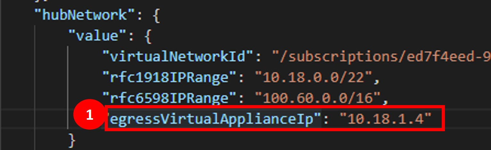

# Archetype: Generic Subscription

## Table of Contents

- [Archetype: Generic Subscription](#archetype-generic-subscription)
  - [Table of Contents](#table-of-contents)
  - [Overview](#overview)
  - [Azure Deployment](#azure-deployment)
    - [Schema Definition](#schema-definition)
    - [Delete Locks](#delete-locks)
    - [Service Health](#service-health)
    - [Deployment Scenarios](#deployment-scenarios)
    - [Example Deployment Parameters](#example-deployment-parameters)
  - [Recommended Parameter Property Updates](#recommended-parameter-property-updates)
    - [Service Health Alerts](#service-health-alerts)
    - [Security Center](#security-center)
    - [Subscription Role Assignments](#subscription-role-assignments)
    - [Resource Tags and Preferred Naming Convention](#resource-tags-and-preferred-naming-convention)
    - [Hub Virtual Network ID](#hub-virtual-network-id)
    - [Deployment Instructions](#deployment-instructions)

## Overview

Identity and access management are core features of the Azure landing zone implementation. The deployment includes a subscription dedicated to identity, where customers can deploy the Active Directory domain controllers their environments require.  This landing zone will be in the `pubsecPlatformIdentity` management group.


**Workflow**

* A new subscription is created through existing process (either via ea.azure.com or Azure Portal).
* The subscription will automatically be assigned to the **pubsecSandbox** management group.
* Update configuration in Azure DevOps Git repo
* Execute the Platofrm - Identity azure DevOps Pipeline.  The pipeline will:
    * Move it to the target management group
    * Scaffold the subscription with baseline configuration.

**Subscription Move**

Subscription can be moved to a target Management Group through Azure ARM Templates/Bicep.  Move has been incorporated into the landing zone Azure DevOps Pipeline automation.

**Capabilities**

| Capability | Description |
| --- | --- |
| Service Health Alerts | Configures Service Health alerts such as Security, Incident, Maintenance.  Alerts are configured with email, sms and voice notifications. |
| Microsoft Defender for Cloud | Configures security contact information (email and phone). |
| Subscription Role Assignments | Configures subscription scoped role assignments.  Roles can be built-in or custom. |
| Subscription Budget | Configures monthly subscription budget with email notification. Budget is configured by default for 10 years and the amount. |
| Subscription Tags | A set of tags that are assigned to the subscription. |
| Resource Tags | A set of tags that are assigned to the resource group and resources.  These tags must include all required tags as defined the Tag Governance policy. |
| Automation | Deploys an Azure Automation Account in each subscription. |
| Backup Recovery Vault | Configures a backup recovery vault . |
| Hub Networking | Configures virtual network peering to Hub Network which is required for egress traffic flow and hub-managed DNS resolution (on-premises or other spokes, private endpoints).
| Networking | A spoke virtual network with minimum 4 zones: oz (Operational Zone), paz (Public Access Zone), rz (Restricted Zone), hrz (Highly Restricted Zone).  Additional subnets can be configured at deployment time using configuration (see below). 

## Azure Deployment

### Schema Definition

Reference implementation uses parameter files with `object` parameters to consolidate parameters based on their context.  The schemas types are:

* Schema (version: `latest`)

  * [Identity deployment parameters definition](../../schemas/latest/landingzones/lz-platform-identity.json)

  * Common types
    * [Location](../../schemas/latest/landingzones/types/location.json)
    * [Service Health Alerts](../../schemas/latest/landingzones/types/serviceHealthAlerts.json)
    * [Microsoft Defender for Cloud](../../schemas/latest/landingzones/types/securityCenter.json)
    * [Subscription Role Assignments](../../schemas/latest/landingzones/types/subscriptionRoleAssignments.json)
    * [Subscription Budget](../../schemas/latest/landingzones/types/subscriptionBudget.json)
    * [Subscription Tags](../../schemas/latest/landingzones/types/subscriptionTags.json)
    * [Resource Tags](../../schemas/latest/landingzones/types/resourceTags.json)
    * [Log Analytics Workspace](../../schemas/latest/landingzones/types/logAnalyticsWorkspaceId.json)

  * Spoke types
    * [Automation](../../schemas/latest/landingzones/types/automation.json)
    * [Backup Recovery Vault](../../schemas/latest/landingzones/types/backupRecoveryVault.json)
    * [Hub Network](../../schemas/latest/landingzones/types/hubNetwork.json)

### Delete Locks

As an administrator, you can lock a subscription, resource group, or resource to prevent other users in your organization from accidentally deleting or modifying critical resources. The lock overrides any permissions the user might have.  You can set the lock level to `CanNotDelete` or `ReadOnly`.  Please see [Azure Docs](https://learn.microsoft.com/azure/azure-resource-manager/management/lock-resources) for more information.

**By default, this archetype deploys `CanNotDelete` lock to prevent accidental deletion on all resource groups it creates.**

### Service Health

[Service health notifications](https://learn.microsoft.com/azure/service-health/service-health-notifications-properties) are published by Azure, and contain information about the resources under your subscription.  Service health notifications can be informational or actionable, depending on the category.

Our examples configure service health alerts for `Security` and `Incident`.  However, these categories can be customized based on your need.  Please review the possible options in [Azure Docs](https://learn.microsoft.com/azure/service-health/service-health-notifications-properties#details-on-service-health-level-information).

### Deployment Scenarios

> Sample deployment scenarios are based on the latest JSON parameters file schema definition.  If you have an older version of this repository, please use the examples from your repository.

| Scenario | Example JSON Parameters | Notes |
|:-------- |:----------------------- |:----- |
| Deployment with Hub Virtual Network | [tests/schemas/lz-generic-subscription/FullDeployment-With-Hub.json](../../tests/schemas/lz-generic-subscription/FullDeployment-With-Hub.json) | - |
| Deployment with Location | [tests/schemas/lz-generic-subscription/FullDeployment-With-Location.json](../../tests/schemas/lz-generic-subscription/FullDeployment-With-Location.json) | `parameters.location.value` is `canadacentral` |
| Deployment without Hub Virtual Network | [tests/schemas/lz-generic-subscription/FullDeployment-Without-Hub.json](../../tests/schemas/lz-generic-subscription/FullDeployment-Without-Hub.json) | `parameters.hubNetwork.value.*` fields are empty & `parameters.network.value.peerToHubVirtualNetwork` is false. |
| Deployment with subscription budget | [tests/schemas/lz-generic-subscription/BudgetIsTrue.json](../../tests/schemas/lz-generic-subscription/BudgetIsTrue.json) | `parameters.subscriptionBudget.value.createBudget` is set to `true` and budget information filled in. |
| Deployment without subscription budget | [tests/schemas/lz-generic-subscription/BudgetIsFalse.json](../../tests/schemas/lz-generic-subscription/BudgetIsFalse.json) | `parameters.subscriptionBudget.value.createBudget` is set to `false` and budget information removed. |
| Deployment without resource tags | [tests/schemas/lz-generic-subscription/EmptyResourceTags.json](../../tests/schemas/lz-generic-subscription/EmptyResourceTags.json) | `parameters.resourceTags.value` is an empty object. |
| Deployment without subscription tags | [tests/schemas/lz-generic-subscription/EmptySubscriptionTags.json](../../tests/schemas/lz-generic-subscription/EmptySubscriptionTags.json) | `parameters.subscriptionTags.value` is an empty object. |
| Deployment without subnets | [tests/schemas/lz-generic-subscription/WithoutSubnets.json](../../tests/schemas/lz-generic-subscription/WithoutSubnets.json) | `parameters.network.value.subnets` array is empty. |
| Deployment without custom DNS | [tests/schemas/lz-generic-subscription/WithoutCustomDNS.json](../../tests/schemas/lz-generic-subscription/WithoutCustomDNS.json) | `parameters.network.value.dnsServers` array is empty.  Defaults to Azure managed DNS when array is empty. |
| Deployment with Backup Recovery Vault | [tests/schemas/lz-generic-subscription/BackupRecoveryVaultIsTrue.json](../../tests/schemas/lz-generic-subscription/BackupRecoveryVaultIsTrue.json) | `parameters.backupRecoveryVault.value.enabled` is set to `true and vault name is filled in. |
| Deployment without Backup Recovery Vault | [tests/schemas/lz-generic-subscription/BackupRecoveryVaultIsFalse.json](../../tests/schemas/lz-generic-subscription/BackupRecoveryVaultIsFalse.json) | `parameters.backupRecoveryVault.value.enabled` is set to `false` and vault name is removed. |

### Example Deployment Parameters

This example configures:

1. Service Health Alerts
2. Microsoft Defender for Cloud
3. Subscription Role Assignments using built-in and custom roles
4. Subscription Budget with $1000
5. Subscription Tags
6. Resource Tags (aligned to the default tags defined in [Policies](../../policy/custom/definitions/policyset/Tags.parameters.json))
7. Log Analytics Workspace integration through Azure Defender for Cloud
8. Automation Account
9. Backup Recovery Vault
10. Spoke Virtual Network with Hub-managed DNS, Virtual Network Peering and 3 subnets.

```json
{
  "$schema": "https://schema.management.azure.com/schemas/2019-04-01/deploymentParameters.json#",
    "contentVersion": "1.0.0.0",
    "parameters": {
      "logAnalyticsWorkspaceResourceId": {
        "value": "/subscriptions/46e3c98c-7c51-4634-be53-df9916714a46/resourceGroups/pubsec-central-logging/providers/Microsoft.OperationalInsights/workspaces/bwill-log-analytics-workspace"
      },
      "serviceHealthAlerts": {
        "value": {
            "resourceGroupName": "service-health",
            "incidentTypes": [ "Incident", "Security" ],
            "regions": [ "Global", "Canada East", "Canada Central" ],
            "receivers": {
                "app": [ "alzcanadapubsec@microsoft.com" ],
                "email": [ "alzcanadapubsec@microsoft.com" ],
                "sms": [ { "countryCode": "1", "phoneNumber": "5555555555" } ],
                "voice": [ { "countryCode": "1", "phoneNumber": "5555555555" } ]
            },
            "actionGroupName": "Service health action group",
            "actionGroupShortName": "health-alert",
            "alertRuleName": "Incidents and Security",
            "alertRuleDescription": "Service Health: Incidents and Security"
        }
      },
      "securityCenter": {
        "value": {
          "email": "alzcanadapubsec@microsoft.com",
          "phone": "5555555555"
        }
      },
      "subscriptionRoleAssignments": {
        "value": [
          {
            "comments": "Built-in Owner Role",
            "roleDefinitionId": "8e3af657-a8ff-443c-a75c-2fe8c4bcb635",
            "securityGroupObjectIds": [
              "3af30d9f-04aa-4d64-b4d5-407d7ff64ff8"
            ]
          }
        ]
      },
      "subscriptionBudget": {
        "value": {
          "createBudget": false
        }
      },
      "subscriptionTags": {
        "value": {
          "ISSO": "isso-tbd",
          "ClientOrganization": "client-organization-tag",
          "CostCenter": "cost-center-tag",
          "DataSensitivity": "data-sensitivity-tag",
          "ProjectContact": "project-contact-tag",
          "ProjectName": "project-name-tag",
          "TechnicalContact": "technical-contact-tag"
        }
      },
      "resourceTags": {
        "value": {
          "ClientOrganization": "client-organization-tag",
          "CostCenter": "cost-center-tag",
          "DataSensitivity": "data-sensitivity-tag",
          "ProjectContact": "project-contact-tag",
          "ProjectName": "project-name-tag",
          "TechnicalContact": "technical-contact-tag"
        }
      },
      "resourceGroups": {
        "value": {
            "automation": "automation",
            "networking": "networking",
            "networkWatcher": "NetworkWatcherRG",
            "backupRecoveryVault": "backup",
            "domainControllers": "DomainControllersRG",
            "dnsResolver": "dns-resolverRG",
            "dnsCondionalForwarders": "dns-CondionalForwardersRG",
            "privateDnsZones": "pubsec-dns"
        }
      },
      "automation": {
        "value": {
            "name": "automation"
        }
      },
      "backupRecoveryVault": {
          "value": {
              "enabled": true,
              "name": "backup-vault"
          }
      },
      "privateDnsZones": {
        "value": {
          "enabled": false,
          "resourceGroupName": "pubsec-dns"
        }
      },

      "privateDnsResolver": {
        "value": {
          "enabled": true,
          "name": "dns-resolver",
          "inboundEndpointName": "dns-resolver-Inbound",
          "outboundEndpointName": "dns-resolver-Outbound"
        }
      },

      "privateDnsResolverRuleset": {
        "value": {
          "enabled": true,
          "name": "dns-resolver-ruleset",
          "linkRuleSetToVnet": true,
          "linkRuleSetToVnetName": "dns-resolver-vnet-link",
          "forwardingRules": [
            {
              "name": "default",
              "domain": "dontMakeMeThink.local",
              "state": "Enabled",
              "targetDnsServers": [
                {
                  "ipAddress": "10.99.99.100"
                },
                {
                  "ipAddress": "10.99.99.99"
                }
              ]
            }
          ]
        }
      },

      "hubNetwork": {
        "value": {
            "virtualNetworkId": "/subscriptions/db8a3c31-7dbb-4368-8883-f9e6333ff23a/resourceGroups/pubsec-hub-networking/providers/Microsoft.Network/virtualNetworks/hub-vnet",
            "rfc1918IPRange": "10.18.0.0/22",
            "rfc6598IPRange": "100.60.0.0/16",
            "egressVirtualApplianceIp": "10.18.1.4"
        }
      },

     "network": {
        "value": {
          "deployVnet": true,
          "peerToHubVirtualNetwork": true,
          "useRemoteGateway": false,
          "name": "id-vnet",
          "dnsServers": [
            "10.18.1.4"
          ],
          "addressPrefixes": [
            "10.15.0.0/24"
          ],
          "subnets": {
            "domainControllers": {
              "comments": "Identity Subnet for Domain Controllers and VM-Based DNS Servers",
              "name": "DomainControllers",
              "addressPrefix": "10.15.0.0/27"
            },
            "dnsResolverInbound": {
              "comments": "Azure DNS Resolver Inbound Requests subnet",
              "name": "AzureDNSResolver-Inbound",
              "addressPrefix": "10.15.0.32/27"
            },
            "dnsResolverOutbound": {
              "comments": "Azure DNS Resolver Outbound Requests subnet",
              "name": "AzureDNSResolver-Outbound",
              "addressPrefix": "10.15.0.64/27"
            },
            "optional": []
          }
         }
       }
    }
  }
```

## Recommended Parameter Property Updates

### Service Health Alerts

Update the **serviceHealthAlerts** properties with specific email addresses and phone numbers as required.



### Security Center

Change the **securityCenter** properties with specific email and address values to reflect your actual point of contact.



### Subscription Role Assignments

Modify the two **subscriptionRoleAssignments** properties with your specific unique object ids of the respective groups for the **Contributor** built-in
and **Custom Role: Landing Zone Application Owner** roles for this landing zone subscription. These assignments are optional and can be 0 or more role assignments using either Built-In or Custom roles and security groups.



### Resource Tags and Preferred Naming Convention

1. Specify the desired custom values for the **resourceTags** properties.
You may also include any additional name value pairs of tags required. Generally, these tags can be modified and even replaced as required, and should also align to the Tagging policy set paramters at: [Tag Policy](https://github.com/Azure/CanadaPubSecALZ/blob/main/policy/custom/definitions/policyset/Tags.parameters.json).

2. Addtionally, you can customize default resources and resource group names with any specific preferred naming convention, as indicated by the item **2** circles shown below.
   



### Hub Virtual Network ID

**IMPORTANT**

To avoid a failure when running any of the connectivity pipelines, the subscriptionId segment value of the **hubNetwork** string (item **1**), must be updated from it's default value to the specific hubNetwork subscriptionId that was actually deployed previously, so that the virtual network in this spoke subscription can be VNET Peered to the Hub Network.



The rest of the segments for the **virtualNetworkId** string must also match the actual resources that were deployed from the connectivity pipeline, such as the name of the resource group,
in case a different prefix besides **pubsec** was used to conform to a specific and preferred naming convention or organization prefix (item **2**), or the default VNET name of hub-vnet was also changed to something else,
(**item 3**) - again based on a specific and preferred naming convention that may have been used before when the actual hub VNET was deployed.

### Deployment Instructions

### Virtual Appliance IP
To ensure traffic is routed/filtered via the firewall, please validate or update the "egressVirtualApplianceIp" value to the firewall IP in your environment: 
  - For Azure Firewall, use the firewall IP address
  - For Network Virtual Appliances (i.e. Fortigate firewalls), use the internal load-balancer IP (item **1**)


Please see [archetype authoring guide for deployment instructions](authoring-guide.md#deployment-instructions).
