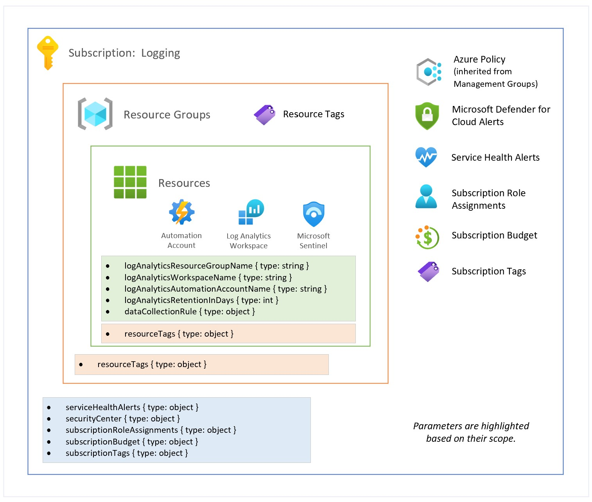

# Archetype:  Central Logging

## Table of Contents

* [Overview](#overview)
* [Schema Definition](#schema-definition)
* [Delete Locks](#delete-locks)
* [Deployment Instructions](#deployment-instructions)

## Overview

Centralized logging landing zone allows a common subscription for managing Log Analytics Workspace & Automation Account.  This landing zone will be in the `pubsecPlatformManagement` management group.

**Workflow**

*  A new subscription is created through existing process (either via ea.azure.com or Azure Portal).
*  The subscription will automatically be assigned to the **pubsecSandbox** management group.
*  Update configuration in Azure DevOps Git repo.
*  Execute the **Platform – Logging** Azure DevOps Pipeline.  The pipeline will:
  * Move it to the target management group.
  *  Scaffold the subscription with baseline configuration.

**Subscription Move**

Subscription can be moved to a target Management Group through Azure ARM Templates/Bicep.  Move has been incorporated into the landing zone Azure DevOps Pipeline automation.

**Capabilities**

| Capability | Description |
| --- | --- |
| Service Health Alerts | Configures Service Health alerts such as Security, Incident, Maintenance.  Alerts are configured with email, sms and voice notifications. |
| Microsoft Defender for Cloud | Configures security contact information (email and phone). |
| Subscription Role Assignments | Configures subscription scoped role assignments.  Roles can be built-in or custom. |
| Subscription Budget | Configures monthly subscription budget with email notification. Budget is configured by default for 10 years and the amount. |
| Log Analytics | Configures Automation Account, Log Analytics Workspace and Log Analytics Solutions (AgentHealthAssessment, AntiMalware, AzureActivity, ChangeTracking, Security, SecurityInsights, ServiceMap, SQLAssessment, Updates, VMInsights).  **SecurityInsights** solution pack will enable Microsoft Sentinel.  |
| Subscription Tags | A set of tags that are assigned to the subscription. |
| Resource Tags | A set of tags that are assigned to the resource group and resources.  These tags must include all required tags as defined the Tag Governance policy. |

## Schema Definition

Reference implementation uses parameter files with `object` parameters to consolidate parameters based on their context.  The schemas types are:

* Schema (version: `latest`)

  * Common
    * [Service Health Alerts](../../schemas/latest/landingzones/types/serviceHealthAlerts.json)
    * [Microsoft Defender for Cloud](../../schemas/latest/landingzones/types/securityCenter.json)
    * [Subscription Role Assignments](../../schemas/latest/landingzones/types/subscriptionRoleAssignments.json)
    * [Subscription Budget](../../schemas/latest/landingzones/types/subscriptionBudget.json)
    * [Subscription Tags](../../schemas/latest/landingzones/types/subscriptionTags.json)
    * [Resource Tags](../../schemas/latest/landingzones/types/resourceTags.json)

## Delete Locks

As an administrator, you can lock a subscription, resource group, or resource to prevent other users in your organization from accidentally deleting or modifying critical resources. The lock overrides any permissions the user might have.  You can set the lock level to `CanNotDelete` or `ReadOnly`.  Please see [Azure Docs](https://docs.microsoft.com/azure/azure-resource-manager/management/lock-resources) for more information.

By default, this archetype deploys `CanNotDelete` lock to prevent accidental deletion on all resource groups it creates.

## Deployment Instructions

Use the [Azure DevOps Pipelines](../onboarding/azure-devops-pipelines.md) onboarding guide to configure this archetype.
