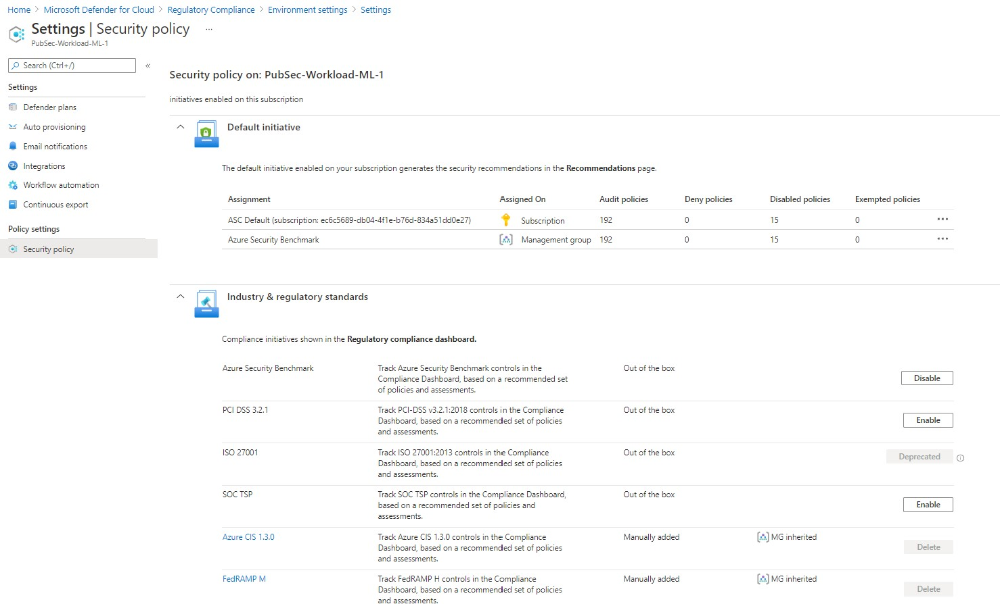
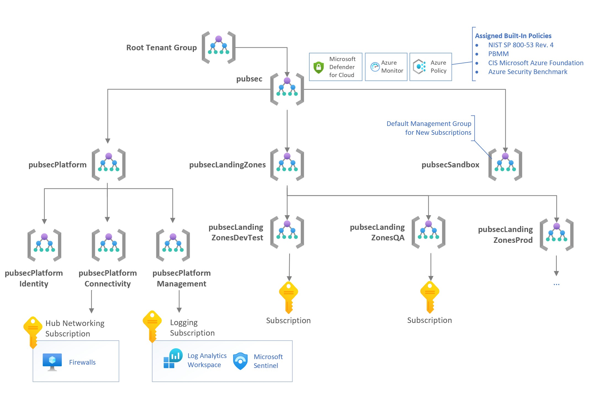
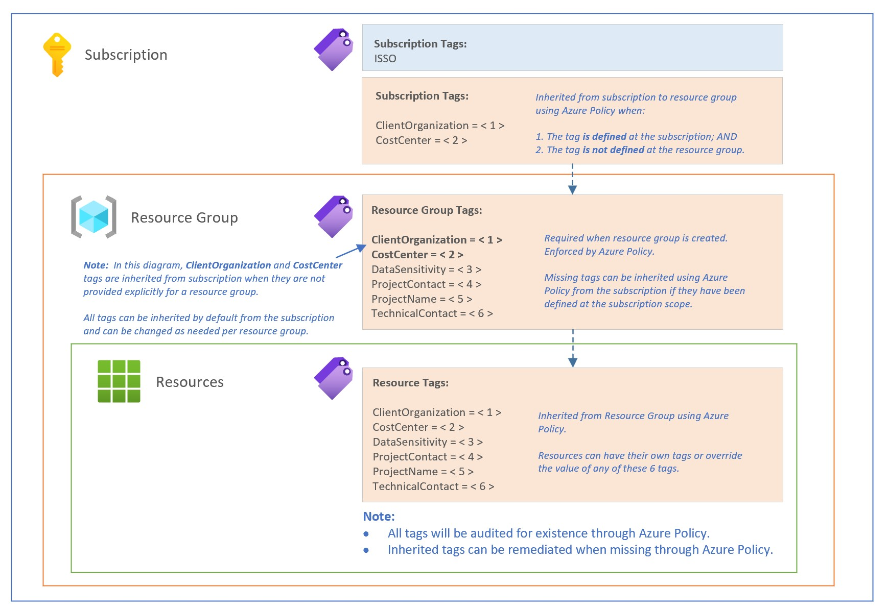

# Azure Landing Zones for Canadian Public Sector

The purpose of the reference implementation is to guide Canadian Public Sector customers on building Landing Zones in their Azure environment.  The reference implementation is based on [Cloud Adoption Framework for Azure][cafLandingZones] and provides an opinionated implementation that enables ITSG-33 regulatory compliance by using [NIST SP 800-53 Rev. 4][nist80053r4Policyset] and [Canada Federal PBMM][pbmmPolicyset] Regulatory Compliance Policy Sets.

Architecture supports up to **Treasury Board of Canada Secretariat (TBS) Cloud Profile 3** - Cloud Only Applications.  This profile is applicable to Infrastructure as a Service (IaaS) and Platform as a Service (PaaS) with [characteristics][cloudUsageProfiles]:

* Cloud-based services hosting sensitive (up to Protected B) information
* No direct system to system network interconnections required with GC data centers

This document describes the architecture and design decisions for building a **[Protected B][pbmm] capable** Azure Landing Zones.

---

## Table of Contents

1. [Key Decisions](\#1-key-decisions)
2. [Security Controls](\#2-security-controls)
3. [Management Groups](\#3-management-groups)
4. [Identity](\#4-identity)
5. [Network](\#5-network)
6. [Logging](\#6-logging)
7. [Tagging](\#7-tagging)
8. [Archetypes](\#8-archetypes)
9. [Automation](\#9-automation)

---

## 1. Key Decisions

The table below outlines the key decisions each department must consider as part of adopting Azure.  This list is provided to help guide and is not meant to be exhaustive.

| Topic |  Scenario | Ownership | Complexity to change | Decision |
| --- | --- | --- | --- | --- |
| Private IP range for Cloud | Based on [RFC 1918][rfc1918] and [RFC 6598][rfc6598], to allow seamless routing for hybrid connectivity. | | | |
| Ground to Cloud Network Connectivity | Use either: Express Route; or SCED for hybrid connectivity. | | | |
| Firewalls | Central firewalls for all egress and non-HTTP/S ingress traffic to VMs. | | | |
| Spoke Network Segmentation | Subnet Addressing & Network Security Groups. | | | |
| Application Gateway + WAF | Application Gateway per spoke subscription to allow direct delivery for HTTP/S traffic.  WAF and routing rules are managed by CloudOps.  | | | |
| Security Incident & Monitoring | Centralized security monitoring. | | | |
| Logging (IaaS & PaaS) | Centralized Log Analytics Workspace with RBAC permissions to allow resource owners to access resource logs & Security Monitor to access all logs. | | | |
| RBAC / IAM | Roles, security groups and access control for management groups, subscriptions & resource groups. | | | |
| Service Principals (App Registration) | Service Principals are required for automation and will require elevated permissions for role assignments. | | | |
| VM Patching | Centralized Patch Management with either Azure native tools or non-Azure solutions. | | | |
| Tag Governance | Tags that are required on all subscriptions, resource groups and resources to provide resource aggregation for reporting and cost management. | | | |

---

## 2. Security Controls

### 2.1 Scope

Departments are targeting workloads with **Unclassified**, **Protected A** and **Protected B** data classifications in Azure.  These classifications are based on [ITSG-33][itsg33] which is derived from [NIST SP 800-53 Revision 4][nist80053R4].

Guardrails in Azure are deployed through [Azure Policy](https://docs.microsoft.com/azure/governance/policy/overview).  Azure Policy helps to enforce organizational standards and to assess compliance at-scale. Through its compliance dashboard, it provides an aggregated view to evaluate the overall state of the environment, with the ability to drill down to the per-resource, per-policy granularity. It also helps to bring your resources to compliance through bulk remediation for existing resources and automatic remediation for new resources.

Common use cases for Azure Policy include implementing governance for resource consistency, regulatory compliance, security, cost, and management. Policy definitions for these common use cases are already available in your Azure environment as built-ins to help you get started.

See [Azure Policy for Guardrails for explanation of the built-in and custom policy definitions](policy/readme.md).

Azure Policy Compliance dashboard provides an up-to-date compliance view across the Azure environment.  Non-compliant resources can then be addressed through automated remediations, exemptions or through appropriate teams within the department.


Custom policy sets have been designed to increase compliance for logging, networking & tagging requirements.

### 2.3 Policy Remediation

Resources that are non-compliant can be put into a compliant state through [Remediation][policyRemediation]. Remediation is accomplished by instructing Azure Policy to run the deployment instructions of the assigned policy on your existing resources and subscriptions, whether that assignment is to a management group, a subscription, a resource group, or an individual resource. This article shows the steps needed to understand and accomplish remediation with Azure Policy.

**Non-compliant resources**


**Remediation history**


### 2.4 Microsoft Defender for Cloud Integration

The benefit of aligning to built-in policy sets is the Microsoft Defender for Cloud integration.  Microsoft Defender for Cloud can infer the built-in policy sets and build a Regulatory Compliance dashboard across each regulatory standard.  This compliance view is applicable to SP NIST 800-53 R4, SP NIST 800-53 R5, Canada Federal PBMM, Azure Security Benchmark, Azure CIS 1.3.0, HIPAA/HITRUST and FedRAMP Moderate.

**Compliance View**

The integration is based on the scope that the policy sets are assigned, and those assignments are inherited by all subscriptions within it.  There is no manual configuration required in Microsoft Defender for Cloud.



The compliance reporting will outline the Azure Policies, the resource types, the # of resources, and compliance status.  Data is grouped by control groups within each regulatory standard.  The data can also be exported as PDF or CSV based on need.

> It is not possible to exclude control groups.


### 2.5 Compliance Data Export

For custom reporting requirements, the raw compliance data can be exported using [Azure Resource Graph](https://docs.microsoft.com/azure/governance/resource-graph/overview).  This export allows for additional analysis and align to operational requirements.  A custom data export pipeline and processes will be needed to operationalize the dataset.  Primary queries to access the data are:

```none
securityresources
| where type == "microsoft.security/regulatorycompliancestandards"

securityresources
| where type == "microsoft.security/regulatorycompliancestandards/regulatorycompliancecontrols"

securityresources
| where type == "microsoft.security/regulatorycompliancestandards/regulatorycompliancecontrols/regulatorycomplianceassessments"
```

---

## 3. Management Groups

[Management Groups](https://docs.microsoft.com/azure/governance/management-groups/overview) enable organizations to efficiently manage access, governance and compliance across all subscriptions.  Azure management groups provide a level of scope above subscriptions. Subscriptions are organized into containers called "management groups" and apply Azure Policies and role-based access control to the management groups. All subscriptions within a management group automatically inherit the settings applied to the management group.

Management groups give you enterprise-grade management at a large scale no matter what type of subscriptions you might have. All subscriptions within a single management group must trust the same Azure Active Directory tenant.

Azure Landing Zones for Canadian Public Sector recommends the following Management Group structure.  This structure can be customized based on your organization's requirements.  Specifically:

* Landing Zones will be split by 3 groups of environments (DEV/TEST, QA, PROD).
  > Note that this is just one example of a management group hierarchy structure. Other hierarchy structures can be defined via configuration in CanadaPubSecALZ v0.9.0 or later. More on this below.

* Sandbox management group is used for any new subscriptions that will be created.  This will remove the subscription sprawl from the Root Tenant Group and will pull all subscriptions into the security compliance.



In **CanadaPubSecALZ v0.9.0 or later**, the management group hierarchy can be defined in the environment configuration file. The following configuration illustrates how you can adopt the [Enterprise Scale Management Group Structure](https://github.com/Azure/Enterprise-Scale/wiki/How-Enterprise-Scale-Works#enterprise-scale-management-group-structure) as defined by the [Azure / Enterprise-Scale](https://github.com/Azure/Enterprise-Scale) project:

```yml
var-managementgroup-hierarchy: >
  {
    "name": "Tenant Root Group",
    "id": "<azure-ad-tenant-guid>",
    "children": [
      {
        "name": "Top Level",
        "id": "Top-Level",
        "children": [
          {
            "name": "Platform", "id": "Platform",
            "children": [
              { "name": "Identity", "id": "PlatformIdentity", "children": [] },
              { "name": "Connectivity", "id": "PlatformConnectivity", "children": [] },
              { "name": "Management", "id": "PlatformManagement", "children": [] }
            ]
          },
          {
            "name": "Landing Zones", "id": "LandingZones",
            "children": [
              { "name": "Corp", "id": "LandingZonesCorp", "children": [] },
              { "name": "Online", "id": "LandingZonesOnline", "children": [] }
            ]
          },
          {
            "name": "Sandbox", "id": "Sandbox",
            "children": []
          }
        ]
      }
    ]
  }
```

The main difference between the original `pubsec` management group hierarchy and the example above is in the subdivision of the `LandingZones` management group; i.e. child management groups of `Corp` and `Online` rather than `DevTest`, `QA`, and `Prod`.

Other variations on possible child management groups of the `LandingZones` management group that have arisen in discussions with customers include:

* `Prod` and `NonProd`
* `Classified` and `Unclassified`

When choosing a management group hierarchy, consider the following:

* Authoritative guidance from subject matter experts
* Your organizational requirements
* Recommended best practices
* [Important facts about management groups](https://docs.microsoft.com/azure/governance/management-groups/overview#important-facts-about-management-groups)

Customers with existing management group structure can consider merging the recommended structure to continue to use the existing structure.  The new structure deployed side-by-side will enable the ability to:

* Configure all controls in the new management group without impacting existing subscriptions.
* Migrate existing subscriptions one-by-one (or small batches) to the new management group to reduce the impact of breaking changes.
* Learn from each migration, apply policy exemptions, and reconfigure Policy assignment scope from pubsec to another scope that's appropriate.

> Management Group structure can be modified through [Azure Bicep template located in "management-groups" folder](../management-groups)

---

## 4. Identity

Azure Landing Zones for Canadian Public Sector assumes that Azure Active Directory has been provisioned and configured based on department's requirements.  It is important to check the following configuration for Azure Active Directory:

* License - Consider Azure PD Premium P2
* Multi-Factor Authentication - Enabled for all users
* Conditional Access Policies - Configured based on location & devices
* Privileged Identity Management (PIM) - Enabled for elevated access control. 
* App Registration - Consider disabling for all users and created on-demand by CloudOps teams.
* Sign-In Logs - Logs are exported to Log Analytics workspace & Microsoft Sentinel used for threat hunting (Security Monitoring Team).
* Break-glass procedure - Process documented and implemented including 2 break glass accounts with different MFA devices & split up passwords.
* Azure Directory to Azure Active Directory synchronization - Are the identities synchronized or using cloud only account?

### 4.1 Service Principal Accounts

To support the landing zone deployment, **one** service principal account will be used for management. This service principal account should be limited to the Platform Automation as it has `Owner` permission across all management group scopes. `Owner` role is automatically assigned when management groups are created.

The service principal requires `Owner` role to configure role assignments for:

* Policy Assignments that provide remediation (i.e. `deployIfNotExists` policies)
* Archetype deployments (i.e. workload deployments) with role assignments between Azure Services for integration and to Security Groups for user access

> **Recommendation:**  Consider setting up approval flow through Azure DevOps to ensure better control over pipeline execution.  See [Release gates and approvals overview](https://docs.microsoft.com/azure/devops/pipelines/release/approvals/?view=azure-devops) in Azure Docs.

Additional service principal accounts must be created and scoped to child management groups, subscriptions or resource groups based on tasks that are expected of the service principal accounts.

### 4.2 User Accounts

It is common for user accounts to have access to an Azure environment with permanent permissions.  Our recommendation is to limit permanent permissions and elevate roles using time-limited, MFA verified access through Privilege Identity Management (Azure AD PIM).

All user accounts should be assigned to Security Groups and access should be granted to user accounts based on membership.

### 4.3 Recommendations for Management Groups

Access Control at Management Group scope enables management and oversight at scale. Permissions assigned at Management Group scopes will automatically be inherited by all child resources including child management groups, subscriptions, resource groups and resources. Therefore, it is an ideal scope for the following 6 scenarios.

| Scenario | Permanent Assignment | On-Demand Assignment (through Azure AD PIM) |
| --- | --- | --- |
| Global Reader | [Reader](https://docs.microsoft.com/azure/role-based-access-control/built-in-roles#reader) | - |
| Governance | - | [Resource Policy Contributor](https://docs.microsoft.com/azure/role-based-access-control/built-in-roles#resource-policy-contributor) |
| Log Management | [Log Analytics Reader](https://docs.microsoft.com/azure/role-based-access-control/built-in-roles#log-analytics-reader) | [Log Analytics Contributor](https://docs.microsoft.com/azure/role-based-access-control/built-in-roles#log-analytics-contributor) |
| Security Management | [Security Reader](https://docs.microsoft.com/azure/role-based-access-control/built-in-roles#security-reader) | [Security Admin](https://docs.microsoft.com/azure/role-based-access-control/built-in-roles#security-admin) | 
| User Management | - | [User Access Administrator](https://docs.microsoft.com/azure/role-based-access-control/built-in-roles#user-access-administrator) |
| Cost Management | [Billing Reader](https://docs.microsoft.com/azure/role-based-access-control/built-in-roles#billing-reader) | - |

### 4.4 Recommendations for Subscriptions

The table provides the 3 generic roles that are commonly used in Azure environment.  Granular built-in roles can be used based on use case to further limit the access control.  Our recommendation is to assign the least privileged role that is required for a person or service principal to complete the tasks.

Review the [Azure Built-In roles](https://docs.microsoft.com/azure/role-based-access-control/built-in-roles) to evaluate applicability.

| Environment | Scenario | Considerations | Permanent Assignment | On-Demand Assignment (through Azure AD PIM)
| --- | --- | --- | --- | --- |
| All | Read Access | Permanent role assigned to all users who need access to the Azure resources. | [Reader](https://docs.microsoft.com/azure/role-based-access-control/built-in-roles#reader) | - |
| Dev/Test, QA | Manage Azure resources |  Contributor role can deploy all Azure resources, however any RBAC assignments will require the permissions to be elevated to Owner.<br /><br />Alternative is to leverage DevOps Pipeline and the Service Principal Account with elevated permissions. | [Contributor](https://docs.microsoft.com/azure/role-based-access-control/built-in-roles#contributor) | [Owner](https://docs.microsoft.com/azure/role-based-access-control/built-in-roles#owner) |
| Production | Manage Azure resources | No standing management permissions in Production.<br /><br />Owner role is only required for RBAC changes, otherwise, use Contributor role or another built-in role for all other operations. | - | [Contributor](https://docs.microsoft.com/azure/role-based-access-control/built-in-roles#contributor) or [Owner](https://docs.microsoft.com/azure/role-based-access-control/built-in-roles#owner)

### 4.5 Recommendations for Resource Groups

Follow the same guidance as Subscriptions.

### 4.6 Recommendations for Resources

Due to overhead of access control and assignments, avoid assigning permissions per resource.  Consider using Resource Group or Subscription scope permissions.

---

## 5. Network

The recommended network design achieves the purpose of hosting [**Protected B** workloads on Profile 3][pbmm] (cloud only). In preparation for a future connection to on-premises infrastructure, we've taken recommendations from SSC guidance ([video](https://www.youtube.com/watch?v=rQYyatlO0-k)) detailed [https://github.com/canada-ca/Azure_LZBCA-AIZDB/tree/master/Network](https://github.com/canada-ca/Azure_LZBCA-AIZDB/tree/master/Network).

### IP Addresses

Both network designs will require 3 IP blocks:

* [RFC 1918][rfc1918] for Azure native-traffic (including IaaS and PaaS).  Example:  `10.18.0.0/16`
* [RFC 1918][rfc1918] for Azure Bastion.  Example:  `192.168.0.0/16`
* [RFC 6598][rfc1918] for department to department traffic through GCnet. Example:  `100.60.0.0/16`

> This document will reference the example IP addresses above to illustrate network flow and configuration. 

### Topology

Reference implementation provides two topologies for Hub Network design:

1. [Hub Networking with Azure Firewalls](archetypes/hubnetwork-azfw.md) (pre-configured with firewall rules, DNS proxy and forced tunneling mode)

2. [Hub Networking with Fortigate Firewalls](archetypes/hubnetwork-nva-fortigate.md) (departments must configure the firewalls).  Implementation can be adopted for additional firewall ISVs.

### Azure Bastion

Bastion [does not support User Defined Route](https://docs.microsoft.com/azure/bastion/bastion-faq#udr) but can work with Virtual Machines on peered virtual networks as long as the [Network Security Groups allow][nsgAzureBastion] it and the user has the [required role based access control](https://docs.microsoft.com/azure/bastion/bastion-faq#i-have-access-to-the-peered-vnet-but-i-cant-see-the-vm-deployed-there)

### Azure Application Gateway

Application Gateway [does not support default UDRs to an NVA](https://docs.microsoft.com/en-us/azure/application-gateway/configuration-infrastructure):

> "Any scenario where 0.0.0.0/0 needs to be redirected through any virtual appliance, a hub/spoke virtual network, or on-premise (forced tunneling) isn't supported for V2.".

Even though we could set UDRs to specific spoke IPs, we chose to place the Shared Application Gateway instances in the hub to avoid having to update UDRs each time a new spoke is added. Application Gateway will only have to have such an UDR if the department wants to configure Backends directly in the spoke, but still want to force that traffic via the firewall.

By default, via peering, Application Gateway will know the routes of the spokes, so adding a backend with an FQDN that resolves to an IP in the spoke will allow Application Gateway to reach that endpoint without traversing the firewall. That may be acceptable if the WAF features of Application Gateway are enabled.

### Private DNS Zones

Azure PaaS services use Private DNS Zones to map their fully qualified domain names (FQDNs) when Private Endpoints are used. Managing Private DNS Zones at scale requires additional configuration to ensure:

* All Private DNS Zones for private endpoints are created in the Hub Virtual Network.
* Private DNS Zones from being created in the spoke subscriptions. These can only be created in the designated resource group in the Hub Subscription.
* Ensure private endpoints can be automatically mapped to the centrally managed Private DNS Zones.

The following diagram shows a typical high-level architecture for enterprise environments with central DNS resolution and name resolution for Private Link resources via Azure Private DNS. This topology provides:

* Name resolution from hub to spoke
* Name resolution from spoke to spoke
* Name resolution from on-premises to Azure (Hub & Spoke resources).  Additional configuration is required to deploy DNS resolvers in the Hub Network & provide DNS forwarding from on-premises to Azure.


**Reference:** [Private Link and DNS integration at scale](https://docs.microsoft.com/azure/cloud-adoption-framework/ready/azure-best-practices/private-link-and-dns-integration-at-scale)

Reference implementation provides the following capabilities:

* Deploy Private DNS Zones to the Hub Networking subscription. Enable/disable via configuration.
* Azure Policy to block private zones from being created outside of the designated resource group in the Hub networking subscription.
* Azure Policy to automatically detect new private endpoints and add their A records to their respective Private DNS Zone.
* Support to ensure Hub managed Private DNS Zones are used when deploying archetypes.

The reference implementation does not deploy DNS Servers (as Virtual Machines) in the Hub nor Spoke for DNS resolution. It can:

* Leverage Azure Firewall's DNS Proxy where the Private DNS Zones are linked only to the Hub Virtual Network.  DNS resolution for all spokes will be through the VIP provided by Azure Firewall.

* Link Private DNS Zones directly to the spoke virtual networks and use the [built-in DNS resolver in each virtual network](https://docs.microsoft.com/azure/virtual-network/virtual-networks-name-resolution-for-vms-and-role-instances). Virtual network(s) in spoke subscriptions be configured through Virtual Network Link for name resolution. DNS resolution is automatic once the Private DNS Zone is linked to the virtual network.

* Leverage DNS Servers on virtual machines that are managed by department's IT.

### Spoke Landing Zone Networks

Following the nomenclature of [ITSG-22][itsg22], these would be the default subnets created in the spokes as part of new subscriptions.

* Presentation Zone (PAZ) - frontend web servers (not exposed to the internet, using RFC1918 IPs that only receive traffic via the application delivery controllers or L7 firewalls in the PAZ).
* Application Zone (RZ) - middleware application servers (only allow connections from the frontend).
* Data Zone (HRZ) - backend servers (only allow connections from the application RZ).
* App Management Zone (OZ), an optional network for app management servers in the spoke.
* All zones would allow management traffic from the Management Access Zone (OZ).

---

## 6. Logging

### 6.1 Scope

Microsoft's recommendation is [one central Log Analytics workspace](https://docs.microsoft.com/azure/azure-monitor/logs/design-logs-deployment#important-considerations-for-an-access-control-strategy) that will be shared by IT, Security Analysts and Application Teams.

The design and recommendation are based on the following requirements:

* Collect all logs from VMs and PaaS services.
* Central Logging for security monitoring.
* Limit data access based on resource permissions granted to individuals and teams.
* Tune alerting based on environments (i.e., less alerts from non-production environments).


This approach offers:

* Streamlined log correlation across multiple environments (Dev, QA, Prod) & line of businesses.
* Avoids log analytics workspace sprawl and streamlines tenant-wide governance through Azure Policy.
* Integration with compliance standards such as NIST 800-53 R4 and Protected B built-in Policy Sets to verify log collection compliance.
* Integration with Microsoft Defender for Cloud.
* Data access to logs are controlled through RBAC where Security Monitoring teams will access all data, while line of business teams access logs of the resources they manage.
* Cost optimization and better pricing at larger volume through capacity reservations.
* Tunable based on the types of logs and data retention as data ingestion grows.
* Modifiable as CloudOps and Cloud Security Monitoring evolves.

The workspace will be configured as:

* Workspace will be centrally managed and deployed in the **pubsecPlatformManagement** management group.  Workspace is managed by CloudOps team.
* Workspace will have the access mode set as use resource or workspace permissions.
* Data Retention set to **2 years** for all data types (i.e., Security Events, syslog).
* Log Analytics Workspace will be stored in **Canada Central**.

As the logging strategy evolves, Microsoft recommends considering the following improvements:

* To optimize cost, configure [data retention periods by data type](https://docs.microsoft.com/azure/azure-monitor/logs/manage-cost-storage#retention-by-data-type).
* To optimize cost, collect only the logs that are required for operations and security monitoring.  Current requirement is to collect all logs.
* For data retention greater than 2 years, export logs to Azure Storage and [leverage immutable storage](https://docs.microsoft.com/azure/storage/blobs/storage-blob-immutable-storage) with WORM policy (Write Once, Read Many) to make data non-erasable and non-modifiable.
* Use Security Groups to control access to all or per-resource logs.

### 6.2 Design considerations for multiple Log Analytics workspaces

| Rationale | Applicability |
| --- | --- |
| Require log data stored in specific regions for data sovereignty or compliance reasons. | Not applicable to current environment since all Azure deployments will be in Canada. |
| Avoid outbound data transfer charges by having a workspace in the same region as the Azure resources it manages. | Not applicable to current environment since all Azure deployments will be in Canada Central. |
| Manage multiple departments or business groups, and need each to see their own data, but not data from others. Also, there is no business requirement for a consolidated cross department or business group view. | Not applicable since security analysts require cross department querying capabilities, but each department or Application Team can only see their data.  Data access control is achieved through role-based access control. |

**Reference**: [Designing your Azure Monitor Logs deployment](https://docs.microsoft.com/en-ca/azure/azure-monitor/logs/design-logs-deployment#important-considerations-for-an-access-control-strategy)

### 6.3 Access Control - Use resource or workspace permissions

With Azure role-based access control (Azure RBAC), you can grant users and groups appropriate access they need to work with monitoring data in a workspace. This allows you to align with your IT organization operating model using a single workspace to store collected data enabled on all your resources.

For example, when you grant access to your team responsible for infrastructure services hosted on Azure virtual machines (VMs), and as a result they'll have access to only the logs generated by those VMs. This is following **resource-context** log model. The basis for this model is for every log record emitted by an Azure resource, it is automatically associated with this resource. Logs are forwarded to a central workspace that respects scoping and Azure RBAC based on the resources.

**Reference**:  [Designing your Azure Monitor Logs deployment - Access Control](https://docs.microsoft.com/en-ca/azure/azure-monitor/logs/design-logs-deployment?WT.mc_id=modinfra-11671-pierrer#access-control-overview)

| Scenario | Log Access Mode | Log Data Visibility |
| --- | --- | --- |
| Security Analyst with [Log Analytics Reader or Log Analytics Contributor](https://docs.microsoft.com/en-ca/azure/azure-monitor/logs/manage-access#manage-access-using-azure-permissions) RBAC role assignment. | Access the Log Analytics workspace directly through Azure Portal or through Microsoft Sentinel. | All data in the Log Analytics Workspace. |
| IT Teams responsible for one or more line of business with permissions to one or more subscriptions, resource groups or resources with at least Reader role. | Access the logs through the resource's Logs menu for the Azure resource (i.e., VM or Storage Account or Database). | Only to Azure resources based on RBAC.  User can query logs for specific resources, resource groups, or subscription they have access to from any workspace but can't query logs for other resources. |
| Application Team with permissions to one or more subscriptions, resource groups or resources with at least Reader role. | Access the logs through the resource's Logs menu for the Azure resource (i.e., VM or Storage Account or Database). | Only to Azure resources based on RBAC.  User can query logs for specific resources, resource groups, or subscription they have access to from any workspace but can't query logs for other resources. |

---

## 7. Tagging

Organize cloud assets to support governance, operational management, and accounting requirements. Well-defined metadata tagging conventions help to quickly locate and manage resources. These conventions also help associate cloud usage costs with business teams via charge back and show back accounting mechanisms.

A tagging strategy include business and operational details:

* The business side of this strategy ensures that tags include the organizational information needed to identify the teams. Use a resource along with the business owners who are responsible for resource costs.
* The operational side ensures that tags include information that IT teams use to identify the workload, application, environment, criticality, and other information useful for managing resources.

Tags can be assigned to resource groups using 2 approaches:

| Approach | Mechanism |
| --- | --- |
| Automatically assigned from the Subscription tags | Azure Policy:  Inherit a tag from the subscription to resource group if missing |
| Explicitly set on a Resource Group | Azure Portal, ARM templates, CLI, PowerShell, etc. All tags can be inherited by default from subscription and can be changed as needed per resource group. |

Tags can be assigned to resources using 2 approaches:

| Approach | Mechanism |
| --- | --- |
| Automatically assigned from the Resource Group tags | Azure Policy:  Inherit a tag from the resource group if missing |
| Explicitly set on a Resource | Azure Portal, ARM templates, CLI, PowerShell, etc.<br /><br />**Note:**  It's recommended to inherit tags that are required by the organization through Subscription & Resource Group.  Per resource tags are typically added by Application Teams for their own purposes. |

Azure Landing Zones for Canadian Public Sector recommends the following tagging structure.  

> The tags can be modified through Azure Policy.  Modify [Tag Azure Policy definition configuration](../policy/custom/definitions/policyset/Tags.parameters.json) to set the required Resource Group & Resource tags.



To achieve this design, custom Azure Policies are used to automatically propagate tags from subscription & resource group, validate mandatory tags at resource groups and to provide remediation to back-fill resource groups and resources with missing tags.  Azure Policies used to achieve this design are:

* [Custom] Inherit a tag from the subscription to resource group if missing (1 policy per tag)
* [Custom] Inherit a tag from the resource group if missing (1 policy per tag)
* [Custom] Require a tag on resource groups (1 policy per tag)
* [Custom] Audit missing tag on resource (1 policy per tag)

This approach ensures that:

* All resource groups contain the expected tags; and
* All resource groups can inherit common tags from subscription when missing; and
* All resources in that resource groups will automatically inherit those tags.

This helps remove deployment friction by eliminating the explicit tagging requirement per resource.  The tags can be overridden per resource group & resource if required.

**Example scenarios for inheriting from subscription to resource group**

These example scenarios outline the behaviour when using Azure Policy for inheriting tag values.

To simplify, let's assume a single `CostCenter` tag is required for every resource group.

| Subscription Tags | Resource Group Tags | Outcome |
| --- | --- | --- |
| `CostCenter=123` | `CostCenter` tag not defined when creating a resource group. | `CostCenter=123` is inherited from subscription.  Resource group is created. |
| `CostCenter=123` | `CostCenter=ABC` defined when creating the resource group. | `CostCenter=ABC` takes precedence since it's explicitly defined on the resource group.  Resource group is created. |
| `CostCenter` tag is not defined. | `CostCenter` tag not defined when creating a resource group. | Policy violation since tag can't be inherited from subscription nor it hasn't been defined on resource group. Resource group is not created. |

**Example scenarios for inheriting from resource group to resources**

These example scenarios outline the behaviour when using Azure Policy for inheriting tag values.

To simplify, let's assume a single `CostCenter` tag is required for every resource.

| Resource Group Tags | Resource Tags | Outcome |
| --- | --- | --- |
| `CostCenter=123` | `CostCenter` tag not defined when creating a resource. | `CostCenter=123` is inherited from resource group.  Resource is created. |
| `CostCenter=123` | `CostCenter=ABC` defined when creating the resource. | `CostCenter=ABC` takes precedence since it's explicitly defined on the resource.  Resource is created. |

*We chose custom policies so that they can be grouped in a policy set (initiative) and have unique names to describe their purpose.*

**Design Considerations**

* Only one policy can update a tag per deployment.  Therefore, to setup automatic assignments, the Azure Policy must be created at either Subscription or Resource Group scope, not both scopes.  This rule is applied per tag.  **This reference implementation has chosen to use Resource group tags only.**

* Do not enter names or values that could make your resources less secure or that contain personal/sensitive information because tag data will be replicated globally.

* There is a maximum of 50 tags that is assignable per subscription, resource group or resource.  

---

## 8. Archetypes

| Archetype | Design | Documentation |
| --- | --- | --- |
| **Central Logging** |  | [Archetype definition](archetypes/logging.md) |
| **Generic Subscription** |  | [Archetype definition](archetypes/generic-subscription.md)
| **Machine Learning** |  | [Archetype definition](archetypes/machinelearning.md) |
| **Healthcare** |  | [Archetype definition](archetypes/healthcare.md) |

---

## 9. Automation

There are 3 principles that are being followed to help automate Azure Landing Zones for Canadian Public Sector design:

* Start with Automation – We must automate all configurations.  There will be activities that are needed once or twice, but those too should be automated so that they can be applied consistently in many tenants.  Procedures that don't have a reasonable means to automate should be documented as manual steps.

* Reduce security surface – Automation accounts can have broad access control and we must limit the permissions when reasonably possible.  Start with least-privilege accounts as described in this document.  Least-privilege accounts will reduce the attack surface and create separation of duty.

* Integrate with native services and capabilities – Reduce the number of tools used for automation and favor built-in capabilities offered by Azure.

### 9.1 Tools

Azure DevOps Repository, Azure DevOps Pipelines, Azure CLI, Bicep, ARM Templates are used to create the environment as configuration and deploy those configurations to a target tenant.  All services and tools are supported by Microsoft.

| Tool | Purpose |
| --- | --- |
| Azure DevOps Repository | Git repository for versioning and single source of truth for automation scripts. |
| Azure DevOps Pipelines | Multi-stage, YAML-based orchestration to deploy Azure artifacts. |
| Azure CLI | Command-line interface used for deployment operations across multiple scopes like management groups, subscriptions, and resource groups. |
| Bicep | A domain-specific language for authoring Azure deployment scripts.  Azure Bicep is the primary language used for automation. |
| ARM Templates | JSON-based configuration that is used for authoring Azure deployment scripts.  Bicep scripts will be converted to ARM templates before execution.  ARM Templates will only be used when features are missing from Bicep. |

### 9.2 Structure

Repository is organized into different focus areas such as Management Groups, Landing Zones, Platform, Policy and Roles.  Each focus area can be deployed independently or orchestrated through a pipeline.

| Folder | Purpose |
| --- | --- |
| .pipelines | Orchestration to configure a target environment.  Since each component in this repository can have its own lifecycle (i.e., management groups rarely change, but landing zones have frequent changes), the approach is to separate orchestration based on the lifecycle requirements.  Approach allows for independent deployment of Azure capabilities. |
| azresources | Azure Resource definitions. |
| config | Environment specific configuration used by the Azure DevOps Pipelines.
| landingzones | Deployment templates required for any landing zones.  These can be converted to an Azure Blueprint if required. |
| management-groups | Deployment template to create the management group structure. |
| policy | Custom Policy Definitions & Built-in/Custom Policy Assignments.  Approach taken is to use the built-in policies & policy sets (initiatives) and only build custom policies when one is required.  Built-in policies will not be converted to custom policies for the purpose of version control. |
| roles | Custom role definitions |
| schemas | Schema definition for landing zone parameter files |
| tests | Unit & integration tests |

### 9.3 Azure DevOps Pipelines

Following list of pipelines are used to configure an Azure environment.


All pipelines are in **.pipelines/** folder.

Pipelines are stored as YAML definitions in Git and imported into Azure DevOps Pipelines.  This approach allows for portability and change tracking.  To import a pipeline:

1. Go to Pipelines
2. New Pipeline
3. Choose Azure Repos Git
4. Select Repository
5. Select Existing Azure Pipeline YAML file
6. Identify the pipeline using the table below and add.

Use the [Azure DevOps Pipelines](onboarding/azure-devops-pipelines.md) onboarding guide to configure each pipeline.

> Imported pipelines should be renamed to match the names in the table.

| Pipeline | YAML Definition | Pipeline Name | Purpose | Service Principal Account | Variables |
| --- | --- | --- | --- | --- | --- |
| Management Group | management-groups.yml | management-groups-ci | Deploys management group structure to a tenant. | spn-azure-platform-ops | None |
| Roles | roles.yml | roles-ci | Configures custom role definitions. | spn-azure-platform-ops | None |
| Azure Policy | policy.yml | policy-ci | Deploys policy definitions & assignments at Management Group scope. | spn-azure-platform-ops | None |
| Platform - Logging | platform-logging.yml | platform-logging-ci | Configures a Logging Landing Zone that will be used by all landing zones for managing their logs. | spn-azure-platform-ops | None |
| Platform – Hub Networking using NVAs | platform-connectivity-hub-nva.yml | platform-connectivity-hub-nva-ci | Configures Hub Networking with Fortigate Firewalls. | spn-azure-platform-ops | None |
| Platform – Hub Networking with Azure Firewall - Firewall Policy | platform-connectivity-hub-azfw-policy.yml | platform-connectivity-hub-azfw-policy-ci | Configures Azure Firewall Policy.  A policy contains firewall rules and firewall configuration such as enabling DNS Proxy.  Firewall policies can be updated independently of Azure Firewall. | spn-azure-platform-ops | None |
| Platform – Hub Networking with Azure Firewall | platform-connectivity-hub-azfw.yml | platform-connectivity-hub-azfw-ci | Configures Hub Networking with Azure Firewall. | spn-azure-platform-ops | None |
| Subscriptions | subscription.yml | subscription-ci | Configures a new subscription based on the archetype defined in the configuration file name. | spn-azure-platform-ops | None |
| Pull Request Validation | pull-request-check.yml | pull-request-validation-ci | Checks for breaking changes to Bicep templates & parameter schemas prior to merging the change to main branch.  This pipeline must be configured as a check for the `main` branch. | spn-azure-platform-ops | None |

### 9.4 Release Process

By using gates, approvals, and manual intervention you can take full control of your releases to meet a wide range of deployment requirements. Typical scenarios where approvals, gates, and manual intervention are useful include the following.

| Scenario | Feature(s) to use |
| --- | --- |
| A user must manually validate the change request and approve the deployment to a certain stage. | [Pre-deployment approvals](https://docs.microsoft.com/azure/devops/pipelines/release/approvals/approvals?view=azure-devops) |
| A user must manually sign off after deployment before the release is triggered to other stages. | [Post-deployment approvals](https://docs.microsoft.com/azure/devops/pipelines/release/approvals/approvals?view=azure-devops) |
| A team wants to ensure there are no active issues in the work item or problem management system before deploying a build to a stage. | [Pre-deployment gates](https://docs.microsoft.com/azure/devops/pipelines/release/approvals/gates?view=azure-devops) |
| A team wants to ensure there are no reported incidents after deployment, before triggering a release. | [Post-deployment gates](https://docs.microsoft.com/azure/devops/pipelines/release/approvals/gates?view=azure-devops) |
| After deployment, a team wants to wait for a specified time before prompting users to sign out. | [Post-deployment gates](https://docs.microsoft.com/azure/devops/pipelines/release/approvals/gates?view=azure-devops) and [post-deployment approvals](https://docs.microsoft.com/azure/devops/pipelines/release/approvals/approvals?view=azure-devops) |
| During deployment, a user must manually follow specific instructions and then resume the deployment. | [Manual Intervention](https://docs.microsoft.com/azure/devops/pipelines/release/deploy-using-approvals?view=azure-devops#configure-maninter) or [Manual Validation](https://docs.microsoft.com/azure/devops/pipelines/release/deploy-using-approvals?view=azure-devops#view-approvals) |
| During deployment, a team wants to prompt users to enter a value for a parameter used by the deployment tasks or allow users to edit the release. | [Manual Intervention](https://docs.microsoft.com/azure/devops/pipelines/release/deploy-using-approvals?view=azure-devops#configure-maninter) or [Manual Validation](https://docs.microsoft.com/azure/devops/pipelines/release/deploy-using-approvals?view=azure-devops#view-approvals) |
| During deployment, a team wants to wait for monitoring or information portals to detect any active incidents, before continuing with other deployment jobs. | Planned, but not yet implemented for YAML pipelines |

You can combine all three techniques within a release pipeline to fully achieve your own deployment requirements.

### 9.5 Manual Validation

Manual validation can be done in one of two ways:

1. Add an agentless (server) job before the existing pipeline job(s) where you want to enforce pre-deployment user validation.

2. Create an Environment (or multiple environments) in your Azure DevOps project where you can specify pre-deployment user validations via "Approvals and checks".

We will focus on the second option, as it allows for the following additional types of approvals and checks:


Steps to implement user validation (approval) check:

1. Create an Environment named after the branch (e.g. "main", "sandbox") you want to protect. You can do this manually through the web UI or by running the pipeline (if the environment does not exist, it will be created).

2. In the web UI, navigate to Pipelines | Environments, select the environment corresponding to the branch you want to protect, and select "Approvals and checks" from the context menu.

3. Select the "Approval" option to add a new user validation approval.

4. Add user(s)/group(s) to the "Approvers" field. Approval check will require approval from all listed users/groups. For a group approval, any one member of the group is sufficient for approval. Note that you may use Azure DevOps and Azure Active Directory groups and may want to do this to minimize administrative overhead associated with managing individual users roles and responsibilities.

5. Under "Advanced" options, decide if you want to allow users in the Approvers list to approve their own pipeline runs.

6. Under "Control options", set an appropriate "Timeout" after which approval requests will expire. The default is 30 days, however you may wish to reduce this time window.

[itsg33]: https://www.cyber.gc.ca/en/guidance/it-security-risk-management-lifecycle-approach-itsg-33
[itsg22]: https://www.cyber.gc.ca/sites/default/files/publications/itsg-22-eng.pdf
[pbmm]: https://www.canada.ca/en/government/system/digital-government/digital-government-innovations/cloud-services/government-canada-security-control-profile-cloud-based-it-services.html
[cloudUsageProfiles]: https://github.com/canada-ca/cloud-guardrails/blob/master/EN/00_Applicable-Scope.md
[rfc1918]: https://tools.ietf.org/html/rfc1918
[rfc6598]: https://tools.ietf.org/html/rfc6598
[nist80053r4]: https://csrc.nist.gov/publications/detail/sp/800-53/rev-4/archive/2015-01-22
[nist80053r4Policyset]: https://docs.microsoft.com/azure/governance/policy/samples/nist-sp-800-53-r4
[nist80053r5Policyset]: https://docs.microsoft.com/azure/governance/policy/samples/nist-sp-800-53-r5
[pbmmPolicyset]: https://docs.microsoft.com/azure/governance/policy/samples/canada-federal-pbmm
[cafLandingZones]: https://docs.microsoft.com/azure/cloud-adoption-framework/ready/landing-zone/
[policyRemediation]: https://docs.microsoft.com/azure/governance/policy/how-to/remediate-resources
[nsgAzureBastion]: https://docs.microsoft.com/azure/bastion/bastion-nsg#apply
