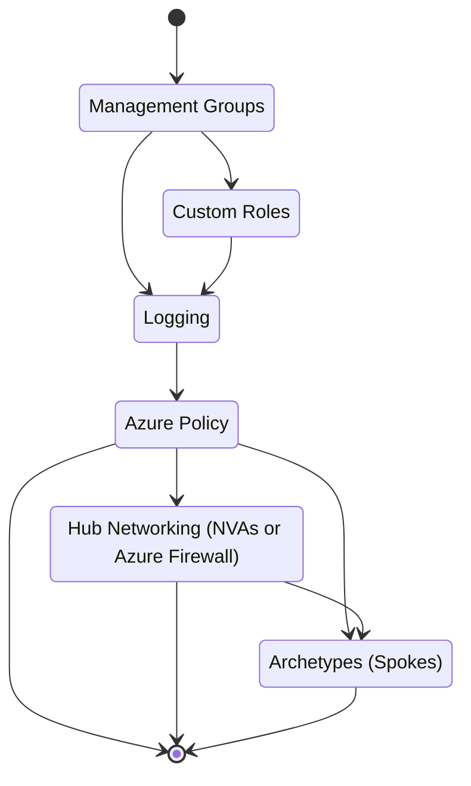
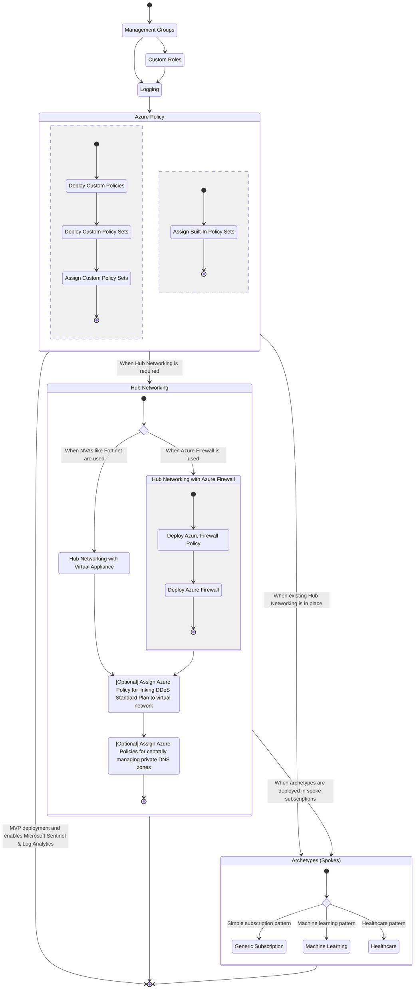

# Azure DevOps Pipelines Onboarding Guide

This document provides steps required to onboard to the Azure Landing Zones design using Azure DevOps Pipelines.

> There are scripts available to help simplify the onboarding process to Azure Landing Zones design using Azure DevOps Pipelines. The [Azure DevOps Scripts](./azure-devops-scripts.md) document contains more detailed information on the those scripts.

**All steps will need to be repeated per Azure AD tenant.**

---

## Telemetry

> Telemetry is introduced on November 11, 2021.

Microsoft can identify the deployments of the Azure Resource Manager and Bicep templates with the deployed Azure resources. Microsoft can correlate these resources used to support the deployments. Microsoft collects this information to provide the best experiences with their products and to operate their business.  The telemetry is collected through [customer usage attribution](https://docs.microsoft.com/azure/marketplace/azure-partner-customer-usage-attribution). The data is collected and governed by Microsoft's privacy policies, located at [https://www.microsoft.com/trustcenter](https://www.microsoft.com/trustcenter).

The automation is instrumented to identify the modules that are being deployed.  At this time, we don't differentiate the deployments and tracked under a single GUID (`a83f6385-f514-415f-991b-2d9bd7aed658`).

If you don't wish to send usage data to Microsoft, you can set the `customerUsageAttribution.enabled` setting to `false` in `config/telemetry.json`.

Example configuration with telemetry disabled:
<details>
  <summary>Expand/collapse</summary>

```json
{
  "customerUsageAttribution": {
    "enabled": false,
    "modules": {
      "managementGroups": "a83f6385-f514-415f-991b-2d9bd7aed658",
      "policy": "a83f6385-f514-415f-991b-2d9bd7aed658",
      "roles": "a83f6385-f514-415f-991b-2d9bd7aed658",
      "logging": "a83f6385-f514-415f-991b-2d9bd7aed658",
      "networking": {
        "nvaFortinet": "a83f6385-f514-415f-991b-2d9bd7aed658",
        "azureFirewall": "a83f6385-f514-415f-991b-2d9bd7aed658"
      },
      "archetypes": {
        "genericSubscription": "a83f6385-f514-415f-991b-2d9bd7aed658",
        "machineLearning": "a83f6385-f514-415f-991b-2d9bd7aed658",
        "healthcare": "a83f6385-f514-415f-991b-2d9bd7aed658"
      }
    }
  }
}
```

</details>

---

## Deployment Flow

This deployment diagram describes the steps for deploying one, many or all modules in your environment.

### High Level Flow



### Detailed Flow



---

## Instructions

* [Step 1 - Create Service Principal Account & Assign RBAC](#step-1---create-service-principal-account--assign-rbac)
* [Step 2 - Configure Azure DevOps](#step-2---configure-azure-devops)
* [Step 3 - Configure Management Groups](#step-3---configure-management-groups)
* [Step 4 - Configure Custom Roles](#step-4---configure-custom-roles)
* [Step 5 - Configure Logging](#step-5---configure-logging)
* [Step 6 - Configure Azure Policies](#step-6---configure-azure-policies)
* [Step 7 - Configure Hub Networking](#step-7---configure-hub-networking)
* [Step 8 - Configure Subscription Archetypes](#step-8---configure-subscription-archetypes)
* [Appendix](#appendix)
  * [Populate management group hierarchy from your environment](#populate-management-group-hierarchy-from-your-environment)
  * [Migrate Logging configuration from Azure DevOps variables to JSON parameters file](#migrate-logging-configuration-from-azure-devops-variables-to-json-parameters-file)
  * [Migrate Hub Networking configuration from Azure DevOps variables to JSON parameters file](#migrate-hub-networking-configuration-from-azure-devops-variables-to-json-parameters-file)

---

## Step 1 - Create Service Principal Account & Assign RBAC

An Azure service principal is an identity created for use with applications, hosted services, and automated tools to access Azure resources. This access is restricted by the roles assigned to the service principal, giving you control over which resources can be accessed and at which level. For security reasons, it's always recommended to use service principals with automated tools rather than allowing them to log in with a user identity.

* **Service Principal Name**:  any name (i.e. spn-azure-platform-ops)

* **RBAC Assignment Settings**

  * **Scope:**  Tenant Root Group (this is a management group in the Azure environment)

  * **Role:**  [Owner](https://docs.microsoft.com/azure/role-based-access-control/built-in-roles#owner) (Grants full access to manage all resources, including the ability to assign roles in [Azure RBAC](https://docs.microsoft.com/azure/role-based-access-control/overview).  Owner permission is required so that the Azure DevOps Pipelines can create resources and role assignments.)

  * **Instructions**:  [Create an Azure service principal with the Azure CLI | Microsoft Docs](https://docs.microsoft.com/cli/azure/create-an-azure-service-principal-azure-cli)

To create the service principal account and role assignment through Azure CLI:

> To execute the Azure CLI command, the user account must be either `User Access Administrator` or `Owner` on Tenant Root Group management group.

> Replace `<Azure Active Directory Tenant Id>` with your AAD tenant id.

```bash

az ad sp create-for-rbac --name spn-azure-platform-ops --role Owner --scopes /providers/Microsoft.Management/managementGroups/<Azure Active Directory Tenant Id>

```

Note down the `appId`, `tenant` and `password`.  These will be required to for setting up a Service Connection in Azure DevOps.  The default password expiry is **1 Year**.

```json
{
  "appId": "c996807d-1111-0000-0000-e2171950dd5d",
  "displayName": "spn-azure-platform-ops",
  "name": "c996807d-1111-0000-0000-e2171950dd5d",
  "password": "<your password>",
  "tenant": "<your tenant id>"
}
```
  
---

## Step 2 - Configure Azure DevOps

### Step 2.1: Configure Service Connection in Azure DevOps Project Configuration

* Settings
  * **Connection Type**:  Azure Resource Manager

  * **Authentication method**:  Service Principal (manual)

  * **Scope Level**:  Management Group

  * **Service Connection Name**:  spn-azure-platform-ops

    *Service Connection Name is referenced in the Azure DevOps Pipelines for Azure authentication and authorization.*

* Instructions

  * Navigate to **Project settings** (bottom left corner)
  * Under Pipelines, select **Service connections**
  * Select **New service connection** or **Create service connection** (if this is the first service connection in the project)
  * Select **Azure Resource Manager** from the connection type list
  * Select **Service Principal (manual)** from Authentication method list
  * Enter the following information for **New Azure service connection**
    * **Environment**:  Azure Cloud
    * **Scope Level**: Management Group
    * **Management Group ID**: < Management group Id, it is also the Azure AD Tenant ID >
    * **Management Group Name**: Tenant Root Group
    * **Service Principal Id**: < Service Principal App Id >
    * **Service principal key**: < Service Principal Password >
    * **Tenant ID**: < Azure AD Tenant ID >
    * **Service connection name**: spn-azure-platform-ops
    * **Grant access permission to all pipelines**:  Unchecked

        > When unchecked, each pipeline that references the service connection will require explicit approval to execute.  This is a one-time approval.  The approval request will be prompted during the first pipeline run.

  * Verify and save

* **Reference**:  [Service connections in Azure Pipelines - Azure Pipelines | Microsoft Docs](https://docs.microsoft.com/azure/devops/pipelines/library/service-endpoints?view=azure-devops&tabs=yaml).  Use the settings described above when following the instructions.

### Step 2.2: Configure Azure DevOps Pipeline Environment

An environment is a collection of resources that you can target with deployments from a pipeline. Typical examples of environment names are Dev, Test, QA, Staging, and Production.  More information such as benefits of using Environments can be found in [Azure Docs](https://docs.microsoft.com/azure/devops/pipelines/process/environments).

Azure DevOps may create an environment if it doesn't exist, however, it's recommended to explicitly create an empty environment and reference it from deployment jobs. This lets you record the deployment history against the environment.

This project uses Git branch names as environments and can be seen in Azure DevOps Pipeline YAMLs.  Each branch should have it's own environment defined.  For example:  `main` branch will have an environment called `main`.

Example:  [Management Group Pipeline](../../.pipelines/management-groups.yml)

```yml
  - deployment: DeployManagementGroupsJob
    displayName: Deploy Management Groups Job
    environment: ${{ variables['Build.SourceBranchName'] }}

    # ... deployment tasks
```

Instructions:

1. Navigate to Pipelines -> Environments
2. Click on `New environment` button
3. Enter the name of your Git branch, such as `main`
4. Ensure `None` is selected in the Resource section
5. Click `Create`

---

## Step 3 - Configure Management Groups

### Step 3.1: Update common.yml in git repository

1. Create/edit `./config/variables/common.yml` in Git with Service Connection name.  This file is used in all Azure DevOps pipelines.

    **Sample YAML**

    ```yaml
    variables:
      deploymentRegion: canadacentral
      serviceConnection: spn-azure-platform-ops

      vmImage: ubuntu-latest
      deployOperation: create  # valid options: 'create', 'what-if'

      loggingPathFromRoot: 'config/logging'
      networkPathFromRoot: 'config/networking'
      subscriptionsPathFromRoot: 'config/subscriptions'

      var-bashPreInjectScript: 'set -E; function catch { echo "##vso[task.logissue type=error]Caller: $(caller), LineNo: $LINENO, Command: $BASH_COMMAND" ; exit 1 ; } ; echo ; echo "Current working directory: $(pwd)" ; echo ; trap catch ERR'
      var-bashPostInjectScript: ':'

      var-TriggerSubscriptionDeployOn: 'A'  # A=added, M=modified, D=deleted
    ```

### Step 3.2:  Update environment config file in git repository

1. Identify the parent management group and obtain its ID.

    >**Note**: The ID of the default parent management group 'Tenant Root Group' is the same as the Azure Active Directory (AAD) Tenant ID (GUID).

2. Create/edit `./config/variables/<devops-org-name>-<branch-name>.yml` in Git (i.e. CanadaESLZ-main.yml).  This file name is automatically inferred by the pipeline based on the Azure DevOps organization name and the branch name.

    **Sample environment YAML (v0.9.0 or later)**

    ```yml
    variables:
    
      # Management Groups
      var-managementgroup-hierarchy: >
        {
          "name": "Tenant Root Group",
          "id": "abcddfdb-bef5-46d9-99cf-ed67dabc8783",
          "children": [
            {
              "name": "Azure Landing Zones for Canadian Public Sector",
              "id": "pubsec",
              "children": [
                {
                  "name": "Platform", "id": "pubsecPlatform",
                  "children": [
                    { "name": "Identity", "id": "pubsecPlatformIdentity", "children": [] },
                    { "name": "Connectivity", "id": "pubsecPlatformConnectivity", "children": [] },
                    { "name": "Management", "id": "pubsecPlatformManagement", "children": [] }
                  ]
                },
                {
                  "name": "LandingZones", "id": "pubsecLandingZones",
                  "children": [
                    { "name": "DevTest", "id": "pubsecLandingZonesDevTest", "children": [] },
                    { "name": "QA", "id": "pubsecLandingZonesQA", "children": [] },
                    { "name": "Prod", "id": "pubsecLandingZonesProd", "children": [] }
                  ]
                },
                {
                  "name": "Sandbox", "id": "pubsecSandbox",
                  "children": []
                }
              ]
            }
          ]
        }
    ```

    In CanadaPubSecALZ v0.9.0 or later, the management group hierarchy can be defined in the environment configuration file.  It is represented in JSON as a set of nested management group objects with the structure:

    ```json
    {
      "name": "Management Group Display Name",
      "id": "ManagementGroupIdentifier_NoSpaces",
      "children": []
    }
    ```

    Please follow the instructions in Appendix to [populate the management group hierarchy from your Azure environment](#populate-management-group-hierarchy-from-your-environment).

    Each `"children": []` element is an array of the same object type, and may contain zero or more child management group object definitions, which in turn may contain their own arrays of zero or more child management group object definitions.

    Observe the following guidance when configuring your management group hierarchy:

      * Specify the `id` and `name` of your existing Azure AD tenant for the topmost management group definition. The `id` attribute for this element is mapped into the `var-parentManagementGroupId` pipeline variable for backward compatibility.
      * Specify only 1 child management group definition for the topmost management group definition. You can specify more than 1 child of the topmost management group definition, but it is the first child of the topmost level that will be considered the root of of your management group hierarchy, and is the scope that the `policy-ci` pipeline will use to deploy built-in and custom policies. The `id` attribute for this element is mapped into the `var-topLevelManagementGroupName` pipeline variable for backward compatibility.
      * The `id` attribute for management group elements can only be an ASCII letter, digit, `-`, `_`, `(`, `)`, `.` and cannot end with a period. In the sample environment configuration file (`CanadaESLZ-main.yml`), we illustrate a convention that prepends the id of the parent management group to the id of each child management group. This is an example only and not a requirement. You are welcome to choose any management group id convention that best suits your needs.
      * If you are using **CanadaPubSecALZ v0.9.0 or later** and **do not** include a `var-managementgroup-hierarchy` variable setting in your configuration, it will fallback to using the pipeline variables `var-parentManagementGroupId` and `var-topLevelManagementGroupName`. This is to ensure backward compatibility, enabling newer versions of the code to run with older environment configurations.
      * If you are using **CanadaPubSecALZ v0.9.0** or later and **do** include a `var-managementgroup-hierarchy` variable setting in your configuration, it will override any pipeline variables `var-parentManagementGroupId` and `var-topLevelManagementGroupName` also present.

    **Sample environment YAML (v0.8.0 or earlier)**

    ```yaml
    variables:
  
        # Management Groups
        var-parentManagementGroupId: abcddfdb-bef5-46d9-99cf-ed67dabc8783
        var-topLevelManagementGroupName: pubsec
    ...
    ```

    In CanadaPubSecALZ v0.8.0 or earlier, the only portion of the management group hierarchy that is configurable is the top level management group id (specified using the `topLevelManagementGroupName` attribute shown above). For these versions, observe the following guidance:

    * The management group name is not configurable, it is automatically set ot the same value provided for the id.
    * The management group hierarchy is hard-coded in the [management-groups/structure.bicep](https://github.com/Azure/CanadaPubSecALZ/blob/main/management-groups/structure.bicep) source file. You will need to modify this file (add/edit/remove bicep code) if you want to change the management group hierarchy.
  
3. Commit the changes to git repository

### Step 3.3:  Configure Azure DevOps Pipeline

1. Pipeline definition for Management Group.

    *Note: Pipelines are stored as YAML definitions in Git and imported into Azure DevOps Pipelines.  This approach allows for portability and change tracking.*

    1. Go to Pipelines
    2. New Pipeline
    3. Choose Azure Repos Git
    4. Select Repository
    5. Select Existing Azure Pipeline YAML file
    6. Identify the pipeline in `.pipelines/management-groups.yml`.
    7. Save the pipeline (don't run it yet)
    8. Rename the pipeline to `management-groups-ci`

2. Run pipeline and wait for completion.

---

## Step 4 - Configure Custom Roles

1. Pipeline definition for Custom Roles.

    *Note: Pipelines are stored as YAML definitions in Git and imported into Azure DevOps Pipelines.  This approach allows for portability and change tracking.*

    1. Go to Pipelines
    2. New Pipeline
    3. Choose Azure Repos Git
    4. Select Repository
    5. Select Existing Azure Pipeline YAML file
    6. Identify the pipeline in `.pipelines/roles.yml`
    7. Save the pipeline (don't run it yet)
    8. Rename the pipeline to `roles-ci`

2. Run pipeline and wait for completion.

---

## Step 5 - Configure Logging

### Step 5.1:  Setup Azure AD Security Group (Recommended)

At least one Azure AD Security Group is recommended for role assignment.  Role assignment are set at the Subscription scope and can be either built-In roles (i.e. Owner, Contributor, Reader) or any custom roles that are configured in the Azure Active Directory tenant.  Note down the Security Group object id, it will be required for next step.

This role assignment is used to grant users access to the logging subscription based on their roles & responsibilities.

### Step 5.2:  Update configuration file(s) in git repository

> **When you are using an existing Log Analytics Workspace in your subscription**, set the configuration parameters of the existing Log Analytics Workspace.  These settings will be used by deployments such as Azure Policy for Log Analytics integration.
>
> When a Log Analytics Workspace & Automation account already exists - set the following:
>
>* Subscription ID
>* Resource Group
>* Log Analytics Workspace name
>* Automation account name  
>
> **The deployment automation will update the existing resources instead of creating new.**

1. Create directory `./config/logging`.
2. Create subdirectory based on the syntax: `<devops-org-name>-<branch-name>` (e.g. `CanadaESLZ-main` to create path `./config/logging/CanadaESLZ-main/`).
3. Create JSON parameters file with name `logging.parameters.json` (any name can be used) in directory created on step 2 (i.e. `./config/logging/CanadaESLZ-main/logging.parameters.json`).
4. Define deployment parameters based on example below.

    * Set valid contact information for the Azure Service Health Alerts: email and phone number.
    * Set the values for the Azure tags that would be applied to the logging resources.
    * Set preferred names for resource group, Log Analytics Workspace and Automation Account.
    * Set Log Analytics Workspace retention period.
    * Set Billing Alerts.
    * Set Subscription Role Assignments with the object ID of the AAD security group from step 5.1.  When there aren't any role assignments, configuration must be set as:

        ```json
          "subscriptionRoleAssignments": {
               "value": []
          }
        ```

    * Example deployment parameters file:
      <details>
        <summary>Expand/collapse</summary>

      ```json
        {
          "$schema": "https://schema.management.azure.com/schemas/2019-04-01/deploymentParameters.json#",
          "contentVersion": "1.0.0.0",
          "parameters": {
            "serviceHealthAlerts": {
              "value": {
                  "resourceGroupName": "service-health",
                  "incidentTypes": [ "Incident", "Security" ],
                  "regions": [ "Global", "Canada East", "Canada Central" ],
                  "receivers": {
                      "app": [ "alzcanadapubsec@microsoft.com" ],
                      "email": [ "alzcanadapubsec@microsoft.com" ],
                      "sms": [ { "countryCode": "1", "phoneNumber": "5555555555" } ],
                      "voice": [ { "countryCode": "1", "phoneNumber": "5555555555" } ]
                  },
                  "actionGroupName": "Service health action group",
                  "actionGroupShortName": "health-alert",
                  "alertRuleName": "Incidents and Security",
                  "alertRuleDescription": "Service Health: Incidents and Security"
              }
            },
            "securityCenter": {
              "value": {
                "email": "alzcanadapubsec@microsoft.com",
                "phone": "5555555555"
              }
            },
            "subscriptionRoleAssignments": {
              "value": [
                {
                  "comments": "Built-in Contributor Role",
                  "roleDefinitionId": "b24988ac-6180-42a0-ab88-20f7382dd24c",
                  "securityGroupObjectIds": [
                    "38f33f7e-a471-4630-8ce9-c6653495a2ee"
                  ]
                }
              ]
            },
            "subscriptionBudget": {
              "value": {
                "createBudget": true,
                "name": "MonthlySubscriptionBudget",
                "amount": 1000,
                "timeGrain": "Monthly",
                "contactEmails": [
                  "alzcanadapubsec@microsoft.com"
                ]
              }
            },
            "subscriptionTags": {
              "value": {
                "ISSO": "isso-tbd"
              }
            },
            "resourceTags": {
              "value": {
                "ClientOrganization": "client-organization-tag",
                "CostCenter": "cost-center-tag",
                "DataSensitivity": "data-sensitivity-tag",
                "ProjectContact": "project-contact-tag",
                "ProjectName": "project-name-tag",
                "TechnicalContact": "technical-contact-tag"
              }
            },
            "logAnalyticsResourceGroupName": {
              "value": "pubsec-central-logging"
            },
            "logAnalyticsWorkspaceName": {
              "value": "log-analytics-workspace"
            },
            "logAnalyticsRetentionInDays": {
              "value": 730
            },
            "logAnalyticsAutomationAccountName": {
              "value": "automation-account"
            }
          }
        }
      ```

      </details>
  
5. Edit `./config/variables/<devops-org-name>-<branch-name>.yml` in Git.  This configuration file was created in Step 3.

    * Set `var-logging-managementGroupId` with the logging management group:
      * For **CanadaPubSecALZ v0.9.0 or later**, this will be the management id that represents the Logging Management Group in the defined hierarchy.
      * For **CanadaPubSecALZ v0.8.0 or earlier**, this is based on the prefix defined in `var-topLevelManagementGroupName`.  For example, if `var-topLevelManagementGroupName` is set to `contoso`, then `var-logging-managementGroupId` will be `contosoPlatformManagement`.

     * Set `var-logging-subscriptionId` with subscription id for logging.
     * Set `var-logging-configurationFileName` with the file name of the logging configuration.  i.e. `logging.parameters.json`
     * Set `var-logging-diagnosticSettingsforNetworkSecurityGroupsStoragePrefix` to provide unique prefix to generate storage account. This parameter is only used for `HIPAA/HITRUST Policy Assignment`.

      **Sample environment YAML (Logging section only)**

      ```yml
          variables:
              # Logging
              var-logging-region: $(deploymentRegion)
              var-logging-managementGroupId: pubsecPlatformManagement
              var-logging-subscriptionId: bc0a4f9f-07fa-4284-b1bd-fbad38578d3a
              var-logging-configurationFileName: logging.parameters.json

              var-logging-diagnosticSettingsforNetworkSecurityGroupsStoragePrefix: pubsecnsg
      ```

6. Commit the changes to git repository.

### Step 5.3:  Configure Azure DevOps Pipeline

1. Pipeline definition for Logging.

    *Note: Pipelines are stored as YAML definitions in Git and imported into Azure DevOps Pipelines.  This approach allows for portability and change tracking.*

    1. Go to Pipelines
    2. New Pipeline
    3. Choose Azure Repos Git
    4. Select Repository
    5. Select Existing Azure Pipeline YAML file
    6. Identify the pipeline in `.pipelines/platform-logging.yml`.
    7. Save the pipeline (don't run it yet)
    8. Rename the pipeline to `platform-logging-ci`

2. Run pipeline and wait for completion.

### Step 5.4:  Configure Audit Stream from Azure DevOps to Log Analytics Workspace (Optional)

Audit streams represent a pipeline that flows audit events from your Azure DevOps organization to a stream target. Every half hour or less, new audit events are bundled and streamed to your targets.

We recommend reviewing common [Microsoft Sentinel detection patterns and rules provided in GitHub](https://github.com/Azure/Azure-Sentinel/tree/master/Detections/AzureDevOpsAuditing) as part of configuring Microsoft Sentinel.

In order to configure audit stream for Azure Monitor, identify the following information:

* Log Analytics Workspace ID
    1. Navigate to Azure Portal
    2. Navigate to Log Analytics Workspace
    3. Workspace ID is listed on the Overview screen
* Log Analytics Shared Key
    1. Navigate to Azure Portal
    2. Navigate to Log Analytics Workspace
    3. Navigate to Agents Management
    4. Select either Primary or Secondary Key

**Instructions**: [Create an audit stream in Azure DevOps for Azure Monitor](https://docs.microsoft.com/azure/devops/organizations/audit/auditing-streaming?view=azure-devops#create-a-stream).

---

## Step 6 - Configure Azure Policies

1. Pipeline definition for Azure Policies.

    *Note: Pipelines are stored as YAML definitions in Git and imported into Azure DevOps Pipelines.  This approach allows for portability and change tracking.*

    1. Go to Pipelines
    2. New Pipeline
    3. Choose Azure Repos Git
    4. Select Repository
    5. Select Existing Azure Pipeline YAML file
    6. Identify the pipeline in `.pipelines/policy.yml`.
    7. Save the pipeline (don't run it yet)
    8. Rename the pipeline to `policy-ci`

2. By default, the pipeline will configure built-in policy assignments (i.e. `PBMM`, `NIST 800-53 Rev 4`, `NIST 800-53 Rev 5`, `HIPAA`, etc.) and custom policy assignments (i.e. `Log Analytics`, `Defender for Cloud`, `Networking`, `Tag Governance`, etc.).  The assignments are scoped to the top management group (i.e. `pubsec`).  These policy sets are documented in [Azure Policy for Guardrails](../policy) and you may choose to customize them for your Azure environment.  To customize:

    1. Edit [/.pipelines/policy.yml](../../.pipelines/policy.yml)
    2. Update custom policy definitions & assignments
        1. Navigate to the `CustomPolicyJob` Job definition
        2. Navigate to the `Define Policy Set` Step definition and remove the policy definition name from the `deployTemplates` array parameter

              ```yaml
                  - template: templates/steps/define-policyset.yml
                    parameters:
                      description: 'Define Policy Set'
                      deployTemplates: [AKS, DefenderForCloud, LogAnalytics, Network, DNSPrivateEndpoints, Tags]
                      deployOperation: ${{ variables['deployOperation'] }}
                      workingDir: $(System.DefaultWorkingDirectory)/policy/custom/definitions/policyset
                    
              ```

        3. Navigate to the `Assign Policy Set` Step definition and remove the policy assignment name from the `deployTemplates` array parameter

            ```yaml
                - template: templates/steps/assign-policy.yml
                  parameters:
                    description: 'Assign Policy Set'
                    deployTemplates: [AKS, DefenderForCloud, LogAnalytics, Network, Tags]
                    deployOperation: ${{ variables['deployOperation'] }}
                    policyAssignmentManagementGroupScope: $(var-topLevelManagementGroupName)
                    workingDir: $(System.DefaultWorkingDirectory)/policy/custom/assignments
            ```

    3. Update built-in policy assignments

        1. Navigate to the `BuiltInPolicyJob` Job definition
        2. Navigate to the `Assign Policy Set` Step definition
        3. Remove the policy set assignment from the `deployTemplates` array parameter

            ```yaml
                - template: templates/steps/assign-policy.yml
                  parameters:
                    description: 'Assign Policy Set'
                    deployTemplates: [asb, cis-msft-130, location, nist80053r4, nist80053r5, pbmm, hitrust-hipaa, fedramp-moderate]
                    deployOperation: ${{ variables['deployOperation'] }}
                    policyAssignmentManagementGroupScope: $(var-topLevelManagementGroupName)
                    workingDir: $(System.DefaultWorkingDirectory)/policy/builtin/assignments
            ```

3. Commit the changes to git repository.

4. Run pipeline and wait for completion.

---

## Step 7 - Configure Hub Networking

> Configure Hub Networking to deploy one of the two options:
> * [Hub Networking with Azure Firewall](../../docs/archetypes/hubnetwork-azfw.md)
> * [Hub Networking with Fortigate Firewall (NVA)](../../docs/archetypes/hubnetwork-nva-fortigate.md)

1. Create directory `./config/networking`.
1. Create subdirectory based on the syntax: `<devops-org-name>-<branch-name>` (i.e. `CanadaESLZ-main` to create path `./config/networking/CanadaESLZ-main/`).
1. When using Hub Networking with Azure Firewall

    1. Create subdirectory: `hub-azfw-policy` (i.e. `./config/networking/CanadaESLZ-main/hub-azfw-policy`)
    1. Create JSON parameters file with name `azure-firewall-policy.parameters.json` (any name can be used) in the directory (i.e. `./config/networking/CanadaESLZ-main/hub-azfw-policy/azure-firewall-policy.parameters.json`).
    1. Define deployment parameters based on example below.

        * Set the values for the Azure tags that would be applied to the logging resources.
        * Set resource group name for Azure Firewall Policy.
        * Set Azure Firewall policy name

        * Example deployment parameters file:

        ```json
            {
              "$schema": "https://schema.management.azure.com/schemas/2019-04-01/deploymentParameters.json#",
              "contentVersion": "1.0.0.0",
              "parameters": {
                "resourceTags": {
                  "value": {
                    "ClientOrganization": "client-organization-tag",
                    "CostCenter": "cost-center-tag",
                    "DataSensitivity": "data-sensitivity-tag",
                    "ProjectContact": "project-contact-tag",
                    "ProjectName": "project-name-tag",
                    "TechnicalContact": "technical-contact-tag"
                  }
                },
                "resourceGroupName": {
                  "value": "pubsec-azure-firewall-policy"
                },
                "policyName": {
                  "value": "pubsecAzureFirewallPolicy"
                }
              }
            }
        ```

    1. Create subdirectory: `hub-azfw` (i.e. `./config/networking/CanadaESLZ-main/hub-azfw`)
    1. Create JSON parameters file with name `hub-network.parameters.json` (any name can be used) in the directory (i.e. `./config/networking/CanadaESLZ-main/hub-azfw/hub-network.json`).
    1. Define deployment parameters based on example below.

        * Set valid contact information for the Azure Service Health Alerts: email and phone number.
        * Set the values for the Azure tags that would be applied to the logging resources.
        * Set Billing Alerts.
        * Set Hub Networking configuration.
        * Set Subscription Role Assignments with the object ID of the AAD security group.  When there aren't any role assignments, configuration must be set as:

            ```json
              "subscriptionRoleAssignments": {
                   "value": []
              }
            ```

        * Example deployment parameters file:

          <details>
            <summary>Expand/collapse</summary>

            ```json
            {
              "$schema": "https://schema.management.azure.com/schemas/2019-04-01/deploymentParameters.json#",
              "contentVersion": "1.0.0.0",
              "parameters": {
                "serviceHealthAlerts": {
                  "value": {
                      "resourceGroupName": "service-health",
                      "incidentTypes": [ "Incident", "Security" ],
                      "regions": [ "Global", "Canada East", "Canada Central" ],
                      "receivers": {
                          "app": [ "alzcanadapubsec@microsoft.com" ],
                          "email": [ "alzcanadapubsec@microsoft.com" ],
                          "sms": [ { "countryCode": "1", "phoneNumber": "5555555555" } ],
                          "voice": [ { "countryCode": "1", "phoneNumber": "5555555555" } ]
                      },
                      "actionGroupName": "Service health action group",
                      "actionGroupShortName": "health-alert",
                      "alertRuleName": "Incidents and Security",
                      "alertRuleDescription": "Service Health: Incidents and Security"
                  }
                },
                "securityCenter": {
                  "value": {
                    "email": "alzcanadapubsec@microsoft.com",
                    "phone": "5555555555"
                  }
                },
                "subscriptionRoleAssignments": {
                  "value": [
                    {
                      "comments": "Built-in Contributor Role",
                      "roleDefinitionId": "b24988ac-6180-42a0-ab88-20f7382dd24c",
                      "securityGroupObjectIds": [
                        "38f33f7e-a471-4630-8ce9-c6653495a2ee"
                      ]
                    }
                  ]
                },
                "subscriptionBudget": {
                  "value": {
                    "createBudget": true,
                    "name": "MonthlySubscriptionBudget",
                    "amount": 1000,
                    "timeGrain": "Monthly",
                    "contactEmails": [
                      "alzcanadapubsec@microsoft.com"
                    ]
                  }
                },
                "subscriptionTags": {
                  "value": {
                    "ISSO": "isso-tbd"
                  }
                },
                "resourceTags": {
                  "value": {
                    "ClientOrganization": "client-organization-tag",
                    "CostCenter": "cost-center-tag",
                    "DataSensitivity": "data-sensitivity-tag",
                    "ProjectContact": "project-contact-tag",
                    "ProjectName": "project-name-tag",
                    "TechnicalContact": "technical-contact-tag"
                  }
                },
                "privateDnsZones": {
                  "value": {
                    "enabled": true,
                    "resourceGroupName": "pubsec-dns"
                  }
                },
                "ddosStandard": {
                  "value": {
                    "enabled": false,
                    "resourceGroupName": "pubsec-ddos",
                    "planName": "ddos-plan"
                  }
                },
                "publicAccessZone": {
                  "value": {
                    "enabled": true,
                    "resourceGroupName": "pubsec-public-access-zone"
                  }
                },
                "managementRestrictedZone": {
                  "value": {
                    "enabled": true,
                    "resourceGroupName": "pubsec-management-restricted-zone",
                    "network": {
                      "name": "management-restricted-vnet",
                      "addressPrefixes": ["10.18.4.0/22"],
                      "subnets": [
                        {
                          "comments": "Management (Access Zone) Subnet",
                          "name": "MazSubnet",
                          "addressPrefix": "10.18.4.0/25",
                          "nsg": {
                              "enabled": true
                          },
                          "udr": {
                              "enabled": true
                          }
                        },
                        {
                          "comments": "Infrastructure Services (Restricted Zone) Subnet",
                          "name": "InfSubnet",
                          "addressPrefix": "10.18.4.128/25",
                          "nsg": {
                              "enabled": true
                          },
                          "udr": {
                              "enabled": true
                          }
                        },
                        {
                          "comments": "Security Services (Restricted Zone) Subnet",
                          "name": "SecSubnet",
                          "addressPrefix": "10.18.5.0/26",
                          "nsg": {
                              "enabled": true
                          },
                          "udr": {
                              "enabled": true
                          }
                        },
                        {
                          "comments": "Logging Services (Restricted Zone) Subnet",
                          "name": "LogSubnet",
                          "addressPrefix": "10.18.5.64/26",
                          "nsg": {
                              "enabled": true
                          },
                          "udr": {
                              "enabled": true
                          }
                        },
                        {
                          "comments": "Core Management Interfaces (Restricted Zone) Subnet",
                          "name": "MgmtSubnet",
                          "addressPrefix": "10.18.5.128/26",
                          "nsg": {
                              "enabled": true
                          },
                          "udr": {
                              "enabled": true
                          }
                        }
                      ]
                    }
                  }
                },
                "hub": {
                  "value": {
                    "resourceGroupName": "pubsec-hub-networking",
                    "bastion": {
                      "enabled": true,
                      "name": "bastion",
                      "sku": "Standard",
                      "scaleUnits": 2
                    },
                    "azureFirewall": {
                      "name": "pubsecAzureFirewall",
                      "availabilityZones": ["1", "2", "3"],
                      "forcedTunnelingEnabled": false,
                      "forcedTunnelingNextHop": "10.17.1.4"
                    },
                    "network": {
                      "name": "hub-vnet",
                      "addressPrefixes": [
                        "10.18.0.0/22",
                        "100.60.0.0/16"
                      ],
                      "addressPrefixBastion": "192.168.0.0/16",
                      "subnets": {
                        "gateway": {
                          "comments": "Gateway Subnet used for VPN and/or Express Route connectivity",
                          "name": "GatewaySubnet",
                          "addressPrefix": "10.18.0.0/27"
                        },
                        "firewall": {
                          "comments": "Azure Firewall",
                          "name": "AzureFirewallSubnet",
                          "addressPrefix": "10.18.1.0/24"
                        },
                        "firewallManagement": {
                          "comments": "Azure Firewall Management",
                          "name": "AzureFirewallManagementSubnet",
                          "addressPrefix": "10.18.2.0/26"
                        },
                        "bastion": {
                          "comments": "Azure Bastion",
                          "name": "AzureBastionSubnet",
                          "addressPrefix": "192.168.0.0/24"
                        },
                        "publicAccess": {
                          "comments": "Public Access Zone (Application Gateway)",
                          "name": "PAZSubnet",
                          "addressPrefix": "100.60.1.0/24"
                        },
                        "optional": []
                      }
                    }
                  }
                },
                "networkWatcher": {
                  "value": {
                    "resourceGroupName": "NetworkWatcherRG"
                  }
                }
              }
            }
            ```

          </details>

1. When using Hub Networking with Fortigate Firewall (NVA)

    1. Create subdirectory: `hub-nva` (i.e. `./config/networking/CanadaESLZ-main/hub-nva`)
    1. Create JSON parameters file with name `hub-network.parameters.json` (any name can be used) in the directory (i.e. `./config/networking/CanadaESLZ-main/hub-nva/hub-network.parameters.json`).
    1. Define deployment parameters based on example below.

        * Set valid contact information for the Azure Service Health Alerts: email and phone number.
        * Set the values for the Azure tags that would be applied to the logging resources.
        * Set Billing Alerts.
        * Set Hub Networking configuration.
        * Set Subscription Role Assignments with the object ID of the AAD security group.  When there aren't any role assignments, configuration must be set as:

            ```json
              "subscriptionRoleAssignments": {
                   "value": []
              }
            ```

        * Example deployment parameters file:

          <details>
            <summary>Expand/collapse</summary>

            ```json
            {
              "$schema": "https://schema.management.azure.com/schemas/2019-04-01/deploymentParameters.json#",
              "contentVersion": "1.0.0.0",
              "parameters": {
                "serviceHealthAlerts": {
                  "value": {
                      "resourceGroupName": "service-health",
                      "incidentTypes": [ "Incident", "Security" ],
                      "regions": [ "Global", "Canada East", "Canada Central" ],
                      "receivers": {
                          "app": [ "alzcanadapubsec@microsoft.com" ],
                          "email": [ "alzcanadapubsec@microsoft.com" ],
                          "sms": [ { "countryCode": "1", "phoneNumber": "5555555555" } ],
                          "voice": [ { "countryCode": "1", "phoneNumber": "5555555555" } ]
                      },
                      "actionGroupName": "Service health action group",
                      "actionGroupShortName": "health-alert",
                      "alertRuleName": "Incidents and Security",
                      "alertRuleDescription": "Service Health: Incidents and Security"
                  }
                },
                "securityCenter": {
                  "value": {
                    "email": "alzcanadapubsec@microsoft.com",
                    "phone": "5555555555"
                  }
                },
                "subscriptionRoleAssignments": {
                  "value": [
                    {
                      "comments": "Built-in Contributor Role",
                      "roleDefinitionId": "b24988ac-6180-42a0-ab88-20f7382dd24c",
                      "securityGroupObjectIds": [
                        "38f33f7e-a471-4630-8ce9-c6653495a2ee"
                      ]
                    }
                  ]
                },
                "subscriptionBudget": {
                  "value": {
                    "createBudget": true,
                    "name": "MonthlySubscriptionBudget",
                    "amount": 1000,
                    "timeGrain": "Monthly",
                    "contactEmails": [
                      "alzcanadapubsec@microsoft.com"
                    ]
                  }
                },
                "subscriptionTags": {
                  "value": {
                    "ISSO": "isso-tbd"
                  }
                },
                "resourceTags": {
                  "value": {
                    "ClientOrganization": "client-organization-tag",
                    "CostCenter": "cost-center-tag",
                    "DataSensitivity": "data-sensitivity-tag",
                    "ProjectContact": "project-contact-tag",
                    "ProjectName": "project-name-tag",
                    "TechnicalContact": "technical-contact-tag"
                  }
                },
                "privateDnsZones": {
                  "value": {
                    "enabled": true,
                    "resourceGroupName": "pubsec-dns"
                  }
                },
                "ddosStandard": {
                  "value": {
                    "enabled": false,
                    "resourceGroupName": "pubsec-ddos",
                    "planName": "ddos-plan"
                  }
                },
                "publicAccessZone": {
                  "value": {
                    "enabled": true,
                    "resourceGroupName": "pubsec-public-access-zone"
                  }
                },
                "managementRestrictedZone": {
                  "value": {
                    "enabled": true,
                    "resourceGroupName": "pubsec-management-restricted-zone",
                    "network": {
                      "name": "management-restricted-vnet",
                      "addressPrefixes": ["10.18.4.0/22"],
                      "subnets": [
                        {
                          "comments": "Management (Access Zone) Subnet",
                          "name": "MazSubnet",
                          "addressPrefix": "10.18.4.0/25",
                          "nsg": {
                              "enabled": true
                          },
                          "udr": {
                              "enabled": true
                          }
                        },
                        {
                          "comments": "Infrastructure Services (Restricted Zone) Subnet",
                          "name": "InfSubnet",
                          "addressPrefix": "10.18.4.128/25",
                          "nsg": {
                              "enabled": true
                          },
                          "udr": {
                              "enabled": true
                          }
                        },
                        {
                          "comments": "Security Services (Restricted Zone) Subnet",
                          "name": "SecSubnet",
                          "addressPrefix": "10.18.5.0/26",
                          "nsg": {
                              "enabled": true
                          },
                          "udr": {
                              "enabled": true
                          }
                        },
                        {
                          "comments": "Logging Services (Restricted Zone) Subnet",
                          "name": "LogSubnet",
                          "addressPrefix": "10.18.5.64/26",
                          "nsg": {
                              "enabled": true
                          },
                          "udr": {
                              "enabled": true
                          }
                        },
                        {
                          "comments": "Core Management Interfaces (Restricted Zone) Subnet",
                          "name": "MgmtSubnet",
                          "addressPrefix": "10.18.5.128/26",
                          "nsg": {
                              "enabled": true
                          },
                          "udr": {
                              "enabled": true
                          }
                        }
                      ]
                    }
                  }
                },
                "hub": {
                  "value": {
                    "resourceGroupName": "pubsec-hub-networking",
                    "bastion": {
                      "enabled": true,
                      "name": "bastion",
                      "sku": "Standard",
                      "scaleUnits": 2
                    },
                    "network": {
                      "name": "hub-vnet",
                      "addressPrefixes": [
                        "10.18.0.0/22",
                        "100.60.0.0/16"
                      ],
                      "addressPrefixBastion": "192.168.0.0/16",
                      "subnets": {
                        "gateway": {
                          "comments": "Gateway Subnet used for VPN and/or Express Route connectivity",
                          "name": "GatewaySubnet",
                          "addressPrefix": "10.18.1.0/27"
                        },
                        "bastion": {
                          "comments": "Azure Bastion",
                          "name": "AzureBastionSubnet",
                          "addressPrefix": "192.168.0.0/24"
                        },
                        "public": {
                          "comments": "Public Subnet Name (External Facing (Internet/Ground))",
                          "name": "PublicSubnet",
                          "addressPrefix": "100.60.0.0/24"
                        },
                        "publicAccessZone": {
                          "comments": "Public Access Zone (i.e. Application Gateway)",
                          "name": "PAZSubnet",
                          "addressPrefix": "100.60.1.0/24"
                        },
                        "externalAccessNetwork": {
                          "comments": "External Access Network",
                          "name": "EanSubnet",
                          "addressPrefix": "10.18.0.0/27"
                        },
                        "nonProductionInternal": {
                          "comments": "Non-production Internal for firewall appliances (Internal Facing Non-Production Traffic)",
                          "name": "DevIntSubnet",
                          "addressPrefix": "10.18.0.64/27"
                        },
                        "productionInternal": {
                          "comments": "Production Internal for firewall appliances (Internal Facing Production Traffic)",
                          "name": "PrdIntSubnet",
                          "addressPrefix": "10.18.0.32/27"
                        },
                        "managementRestrictedZoneInternal": {
                          "comments": "Management Restricted Zone",
                          "name": "MrzSubnet",
                          "addressPrefix": "10.18.0.96/27"
                        },
                        "highAvailability": {
                          "comments": "High Availability (Firewall to Firewall heartbeat)",
                          "name": "HASubnet",
                          "addressPrefix": "10.18.0.128/28"
                        },
                        "optional": []
                      }
                    },
                    "nvaFirewall": {
                      "image": {
                        "publisher": "fortinet",
                        "offer": "fortinet_fortigate-vm_v5",
                        "sku": "fortinet_fg-vm",
                        "version": "6.4.5",
                        "plan": "fortinet_fg-vm"
                      },
                      "nonProduction": {
                        "internalLoadBalancer": {
                          "name": "pubsecDevFWILB",
                          "tcpProbe": {
                            "name": "lbprobe",
                            "port": 8008,
                            "intervalInSeconds": 5,
                            "numberOfProbes": 2 
                          },
                          "internalIp": "10.18.0.68",
                          "externalIp": "100.60.0.7"
                        },
                        "deployVirtualMachines": true,
                        "virtualMachines": [
                          {
                            "name": "pubsecDevFW1",
                            "vmSku": "Standard_D8s_v4",
                            "internalIp": "10.18.0.69",
                            "externalIp": "100.60.0.8",
                            "mrzInternalIp": "10.18.0.104",
                            "highAvailabilityIp": "10.18.0.134",
                            "availabilityZone": "2"
                          },
                          {
                            "name": "pubsecDevFW2",
                            "vmSku": "Standard_D8s_v4",
                            "internalIp": "10.18.0.70",
                            "externalIp": "100.60.0.9",
                            "mrzInternalIp": "10.18.0.105",
                            "highAvailabilityIp": "10.18.0.135",
                            "availabilityZone": "3"
                          }
                        ]
                      },
                      "production": {
                        "internalLoadBalancer": {
                          "name": "pubsecProdFWILB",
                          "tcpProbe": {
                            "name": "lbprobe",
                            "port": 8008,
                            "intervalInSeconds": 5,
                            "numberOfProbes": 2 
                          },
                          "internalIp": "10.18.0.36",
                          "externalIp": "100.60.0.4"
                        },
                        "deployVirtualMachines": true,
                        "virtualMachines": [
                          {
                            "name": "pubsecProdFW1",
                            "vmSku": "Standard_F8s_v2",
                            "internalIp": "10.18.0.37",
                            "externalIp": "100.60.0.5",
                            "mrzInternalIp": "10.18.0.101",
                            "highAvailabilityIp": "10.18.0.132",
                            "availabilityZone": "1"
                          },
                          {
                            "name": "pubsecProdFW2",
                            "vmSku": "Standard_F8s_v2",
                            "internalIp": "10.18.0.38",
                            "externalIp": "100.60.0.6",
                            "mrzInternalIp": "10.18.0.102",
                            "highAvailabilityIp": "10.18.0.133",
                            "availabilityZone": "2"
                          }
                        ]
                      }
                    }
                  }
                },
                "networkWatcher": {
                  "value": {
                    "resourceGroupName": "NetworkWatcherRG"
                  }
                }
              }
            }
            ```

          </details>

1. Edit `./config/variables/<devops-org-name>-<branch-name>.yml` in Git.  This configuration file was created in Step 3.  

    * Set **var-hubnetwork-managementGroupId** with the networking management group:
      * For **CanadaPubSecALZ v0.9.0 or later**, this will be the management id that represents the Networking Management Group in the defined hierarchy.
      * For **CanadaPubSecALZ v0.8.0 or earlier**, this is based on the prefix defined in `var-topLevelManagementGroupName`.  For example, if `var-topLevelManagementGroupName` is set to `contoso`, then `var-hubnetwork-managementGroupId` will be `contosoPlatformConnectivity`.

     * Set `var-hubnetwork-region` with preferred Azure region.
     * Set `var-hubnetwork-subscriptionId` with subscription id for networking.
     * When using Hub Networking with Azure Firewall
        * Set `var-hubnetwork-azfwPolicy-configurationFileName` with the file name of the Azure Firewall Policy configuration.  i.e. `hub-azfw-policy/azure-firewall-policy.parameters.json`
        * Set `var-hubnetwork-azfw-configurationFileName` with the file name of the Hub Networking configuration.  i.e. `hub-azfw/hub-network.parameters.json`

          **Sample environment YAML (Networking section only)**

          ```yml
              variables:
                  # Hub Networking
                  var-hubnetwork-region: $(deploymentRegion)
                  var-hubnetwork-managementGroupId: pubsecPlatformConnectivity
                  var-hubnetwork-subscriptionId: ed7f4eed-9010-4227-b115-2a5e37728f27
                
                  ## Hub Network configuration using Azure Firewall - required when Azure Firewall is used
                  var-hubnetwork-azfwPolicy-configurationFileName: hub-azfw-policy/azure-firewall-policy.parameters.json
                  var-hubnetwork-azfw-configurationFileName: hub-azfw/hub-network.parameters.json
          ```

     * When using Hub Networking with Fortigate Firewall
        * Set `var-hubnetwork-nva-configurationFileName` with the file name of the Hub Networking configuration.  i.e. `hub-nva/hub-network.parameters.json`

          **Sample environment YAML (Networking section only)**

          ```yml
              variables:
                  # Hub Networking
                  var-hubnetwork-region: $(deploymentRegion)
                  var-hubnetwork-managementGroupId: pubsecPlatformConnectivity
                  var-hubnetwork-subscriptionId: ed7f4eed-9010-4227-b115-2a5e37728f27
                
                  ## Hub Network configuration using Network Virtual Appliance (NVA) - required when Network Virtual Appliance (NVA) like Fortigate Firewalls are used
                  var-hubnetwork-nva-configurationFileName: hub-nva/hub-network.parameters.json
          ```

1. Configure Variable Group:  firewall-secrets **(required for Fortigate Firewall deployment)**

    * In Azure DevOps, go to Pipelines -> Library
    * Create a new variable group by clicking the `+ Variable group` button
    * Set Variable group name:  `firewall-secrets`
    * Add two variables:
      * `var-hubnetwork-nva-fwUsername`
      * `var-hubnetwork-nva-fwPassword`

      These two variables are used when creating Firewall virtual machines.  These are temporary passwords and recommended to be changed after creation. The same username and password are used for all virtual machines.

      When creating both variables, toggle the lock icon to make it a secret.  This ensures that the values are not shown in logs nor to Azure DevOps users.

      Write down the username and password as it's not retrievable once saved.

    * Click Save

1. Configure Pipeline for Platform – Hub Networking using Azure Firewall (only if Azure Firewall based Hub Networking is used)

    > Note: Pipelines are stored as YAML definitions in Git and imported into Azure DevOps Pipelines.  This approach allows for portability and change tracking.

    1. Go to Pipelines

    2. New Pipeline

        1. Choose Azure Repos Git
        2. Select Repository
        3. Select Existing Azure Pipeline YAML file
        4. Identify the pipeline in `.pipelines/platform-connectivity-hub-azfw-policy.yml`.
        6. Save the pipeline (don't run it yet)
        7. Rename the pipeline to `platform-connectivity-hub-azfw-policy-ci`

    3. New Pipeline

        1. Choose Azure Repos Git
        2. Select Repository
        3. Select Existing Azure Pipeline YAML file
        4. Identify the pipeline in `.pipelines/platform-connectivity-hub-azfw.yml`.
        5. Save the pipeline (don't run it yet)
        6. Rename the pipeline to `platform-connectivity-hub-azfw-ci`

1. Configure Pipeline for Platform – Hub Networking using NVAs (only if Fortigate Firewall based Hub Networking is used)

    > Note: Pipelines are stored as YAML definitions in Git and imported into Azure DevOps Pipelines.  This approach allows for portability and change tracking.

    1. Go to Pipelines
    2. New Pipeline
    3. Choose Azure Repos Git
    4. Select Repository
    5. Select Existing Azure Pipeline YAML file
    6. Identify the pipeline in `.pipelines/platform-connectivity-hub-nva.yml`.
    7. Save the pipeline (don't run it yet)
    8. Rename the pipeline to `platform-connectivity-hub-nva-ci`

1. If using Fortigate Firewalls, configure Pipeline permissions for the secrets.

    * In Azure DevOps, go to Pipelines -> Library
    * Select variable group previously created (i.e. "firewall-secrets")
    * Click "Pipeline Permissions", and in resulting dialog window:
        * Click "Restrict permission"
        * Click "+" button
        * Select the "platform-connectivity-hub-nva-ci" pipeline
        * Close the dialog window

1. Run pipeline and wait for completion.

    * When using Hub Networking with Azure Firewall, run `platform-connectivity-hub-azfw-policy-ci` pipeline first.  This ensures that the Azure Firewall Policy is deployed and can be used as a reference for Azure Firewall.  This approach allows for Azure Firewall Policies (such as allow/deny rules) to be managed independently from the Hub Networking components.

---

## Step 8 - Configure Subscription Archetypes

1. Configure Pipeline definition for subscription archetypes

    > Pipelines are stored as YAML definitions in Git and imported into Azure DevOps Pipelines.  This approach allows for portability and change tracking.

    1. Go to Pipelines
    2. New Pipeline
    3. Choose Azure Repos Git
    4. Select Repository
    5. Select Existing Azure Pipeline YAML file
    6. Identify the pipeline in `.pipelines/subscriptions.yml`.
    7. Save the pipeline (don't run it yet)
    8. Rename the pipeline to `subscriptions-ci`

2. Create a subscription configuration file (JSON)

    *Review the [README.md under `/config/subscriptions`](../../config/subscriptions/README.md) to create the folder structure required for subscriptions deployments.*

    1. Make a copy of an existing subscription configuration file under `config/subscriptions/CanadaESLZ-main` as a starting point

    2. Be sure to rename the file in one of the following formats:
       * `[GUID]_[TYPE].json`
       * `[GUID]_[TYPE]_[LOCATION].json`

       Replace `[GUID]` with the subscription GUID. Replace `[TYPE]` with the subscription archetype. Optionally, add (replace) `[LOCATION]` with an Azure deployment location, e.g. `canadacentral`. If you do not specify a location in the configuration file name, the `deploymentRegion` variable will be used by default.

       > If a fourth specifier is added to the configuration filename at some future point and you do not want to supply an explicit deployment location in the third part of the configuration file name, you can either leave it empty (two consecutive underscore characters) or provide the case-sensitive value `default` to signal the `deploymentRegion` variable value should be used.

    3. Save the subscription configuration file in a subfolder (under `config/subscriptions`) that is named for your Azure DevOps organization combined with the branch name corresponding to your deployment environment. For example, if your Azure DevOps organization name is `Contoso` and your Azure Repos branch for the target deployment environment is `main`, then the subfolder name would be `Contoso-main`.

    4. Update the contents of the newly created subscription configuration file to match your deployment environment.

    5. Commit the subscription file to Azure Repos.

3. Run the subscription pipeline

    1. In Azure DevOps, go to Pipelines
    2. Select the `subscriptions-ci` pipeline and run it.

       > The `subscriptions-ci` pipeline YAML is configured, by default, to **not** run automatically; you can change this if desired.

    3. In the Run Pipelines dialog window, enter the first 4 digits of your new subscription configuration file name (4 is usually enough of the GUID to uniquely identify the subscription) between the square brackets in the `subscriptions` parameter field. For example: `[802e]`.

    4. In the Run Pipelines dialog window, click the `Run` button to start the pipeline.

---

## Appendix

### Populate management group hierarchy from your environment

You can migrate to the management group hierarchy implemented in v0.9.0 by populating the hierarchy from your existing Azure environment.  By migrating to the hierarchy, you can take advantage of simplified configuration without modifying Bicep templates.  To generate the hierarchy:

1. Install [Azure CLI](https://docs.microsoft.com/cli/azure/install-azure-cli) & [jq](https://stedolan.github.io/jq/download/) on your environment.

2. Login to Azure CLI.

    ```bash
    az login
    ```

3. Execute the following command

    **Bash Shell**

    ```bash
    # Replace this value with your environment.  This id is the same as Azure Active Directory ID.
    TENANT_ROOT_GROUP_ID='< TENANT ROOT GROUP ID >'
    
    az account management-group show --name $TENANT_ROOT_GROUP_ID -e -r | jq 'recurse(.children[]?) |= del(select(.type == "/subscriptions")) | del(..|nulls) | recurse(.children[]?) |= {"id":.name, "name":.displayName, "children": (.children // [] )}'
    ```

    **Windows Shell**

    ```bash
    set TENANT_ROOT_GROUP_ID=< TENANT ROOT GROUP ID >
    
    az account management-group show --name %TENANT_ROOT_GROUP_ID% -e -r | jq "recurse(.children[]?) |= del(select(.type == \"/subscriptions\")) | del(..|nulls) | recurse(.children[]?) |= {\"id\":.name, \"name\":.displayName, \"children\": (.
    children // [] )}"
    ```

    This command will:

    * Use Azure CLI to retrieve the management group structure recursively from `TENANT ROOT GROUP ID`.  This management group is typically called `Tenant Root Group` unless it has been changed by your organization.  Response from Azure CLI will include subscriptions.
    * Use `jq` to
      * Remove all objects that are of type: `/subscription`
      * Removing the subscription objects leaves `null` in place in arrays so we then delete the nulls references
      * Recurse through the intermediate json and select `name`, `id` and `children` (if children is null, then mark it as an empty array `[]`).

    Output:

    ```json
    {
      "id": "< TENANT ROOT GROUP ID >",
      "name": "Tenant Root Group",
      "children": [
        {
          "id": "pubsec",
          "name": "Azure Landing Zones for Canadian Public Sector",
          "children": [
            {
              "id": "pubsecSandbox",
              "name": "Sandbox",
              "children": []
            },
            {
              "id": "pubsecPlatform",
              "name": "Platform",
              "children": [
                {
                  "id": "pubsecPlatformIdentity",
                  "name": "Identity",
                  "children": []
                },
                {
                  "id": "pubsecPlatformManagement",
                  "name": "Management",
                  "children": []
                },
                {
                  "id": "pubsecPlatformConnectivity",
                  "name": "Connectivity",
                  "children": []
                }
              ]
            },
            {
              "id": "pubsecLandingZones",
              "name": "Landing Zones",
              "children": [
                {
                  "id": "pubsecLandingZonesQA",
                  "name": "QA",
                  "children": []
                },
                {
                  "id": "pubsecLandingZonesDevTest",
                  "name": "Dev/Test",
                  "children": []
                },
                {
                  "id": "pubsecLandingZonesProd",
                  "name": "Production",
                  "children": []
                }
              ]
            }
          ]
        }
      ]
    }
    ```

4. Update `./config/variables/<devops-org-name>-<branch-name>.yml`

    * Delete the following two variables.  They will be queried from the management group hierarchy and set by Azure DevOps for pipeline execution:
      * var-parentManagementGroupId
      * var-topLevelManagementGroupName
    * Add new variable `var-managementgroup-hierarchy` with the JSON output from above.

    > **Note:** YAML is indentation sensitive, therefore ensure this section is indented correctly in your configuration.

      **Sample YAML**

      ```yml
      # Management Groups
      var-managementgroup-hierarchy: >
        {
          "name": "Tenant Root Group",
          "id": "343ddfdb-bef5-46d9-99cf-ed67d5948783",
          "children": [
            {
              "name": "Azure Landing Zones for Canadian Public Sector",
              "id": "pubsec",
              "children": [
                {
                  "name": "Platform", "id": "pubsecPlatform",
                  "children": [
                    { "name": "Identity", "id": "pubsecPlatformIdentity", "children": [] },
                    { "name": "Connectivity", "id": "pubsecPlatformConnectivity", "children": [] },
                    { "name": "Management", "id": "pubsecPlatformManagement", "children": [] }
                  ]
                },
                {
                  "name": "LandingZones", "id": "pubsecLandingZones",
                  "children": [
                    { "name": "DevTest", "id": "pubsecLandingZonesDevTest", "children": [] },
                    { "name": "QA", "id": "pubsecLandingZonesQA", "children": [] },
                    { "name": "Prod", "id": "pubsecLandingZonesProd", "children": [] }
                  ]
                },
                {
                  "name": "Sandbox", "id": "pubsecSandbox",
                  "children": []
                }
              ]
            }
          ]
        }
        ```

### Migrate Logging configuration from Azure DevOps variables to JSON parameters file

As of `v0.10.0`, logging configuration have been migrated to JSON parameters file.  This change enables:

* Path for deploying logging without Azure DevOps such as using Azure CLI/PowerShell, etc.
* Separates Azure DevOps pipeline variables from ARM deployment parameters.
* Simplifies support for multiple Log Analytics Workspaces in an Azure tenant (i.e. LAWs deployed by region or workload)

We added a new parameter to `common.yml` to set the folder for logging configuration.  This folder is used by Azure DevOps Pipelines to create a fully qualified file path for logging configuration.  A fully qualified path will have the following structure: `<loggingPathFromRoot>`/`<devops-org-name>-<branch-name>`/`logging.parameters.json`.  For example:  `config/logging/CanadaESLZ-main/logging.parameters.json`

```yaml
  loggingPathFromRoot: 'config/logging'
```

Migration process:

1. Create directory `./config/logging`.
2. Create subdirectory based on the syntax: `<devops-org-name>-<branch-name>` (i.e. `CanadaESLZ-main` to create path `./config/logging/CanadaESLZ-main/`).
3. Create JSON parameters file with name `logging.parameters.json` (any name can be used) in the directory (i.e. `./config/logging/CanadaESLZ-main/logging.parameters.json`).
4. Define deployment parameters based on example below.

    **Template to use for logging.parameters.json**

    ```json
      {
        "$schema": "https://schema.management.azure.com/schemas/2019-04-01/deploymentParameters.json#",
        "contentVersion": "1.0.0.0",
        "parameters": {
          "serviceHealthAlerts": {
            "value": < value from var-logging-serviceHealthAlerts >
          },
          "securityCenter": {
            "value": < value from var-logging-securityCenter >
          },
          "subscriptionRoleAssignments": {
            "value": < value from var-logging-subscriptionRoleAssignment >
          },
          "subscriptionBudget": {
            "value": < value from var-logging-subscriptionBudget >
          },
          "subscriptionTags": {
            "value": < value from var-logging-subscriptionTags >
          },
          "resourceTags": {
            "value": < value from var-logging-resourceTags >
          },
          "logAnalyticsResourceGroupName": {
            "value": "< value from var-logging-logAnalyticsResourceGroupName >"
          },
          "logAnalyticsWorkspaceName": {
            "value": "< value from var-logging-logAnalyticsWorkspaceName >"
          },
          "logAnalyticsRetentionInDays": {
            "value": < value from var-logging-logAnalyticsRetentionInDays >
          },
          "logAnalyticsAutomationAccountName": {
            "value": "< value from var-logging-logAnalyticsAutomationAccountName >"
          }
        }
      }
    ```

5. Edit `./config/variables/<devops-org-name>-<branch-name>.yml` in Git and define the following parameters.

      * Delete Azure DevOps variables (these have been moved the JSON parameters files):
        * var-logging-logAnalyticsResourceGroupName
        * var-logging-logAnalyticsWorkspaceName
        * var-logging-logAnalyticsRetentionInDays
        * var-logging-logAnalyticsAutomationAccountName
        * var-logging-serviceHealthAlerts
        * var-logging-securityCenter
        * var-logging-subscriptionRoleAssignments
        * var-logging-subscriptionBudget
        * var-logging-subscriptionTags
        * var-logging-resourceTags
      * Add Azure DevOps variables:
        * var-logging-region (value of your preferred region)
        * var-logging-configurationFileName (path to the logging JSON parameters file)
      * Keep Azure DevOps variables:
        * var-logging-managementGroupId
        * var-logging-subscriptionId
        * var-logging-diagnosticSettingsforNetworkSecurityGroupsStoragePrefix

      **Sample environment YAML (Logging section only)**

      ```yml
          variables:
              # Logging
              var-logging-region: $(deploymentRegion)
              var-logging-managementGroupId: pubsecPlatformManagement
              var-logging-subscriptionId: bc0a4f9f-07fa-4284-b1bd-fbad38578d3a
              var-logging-configurationFileName: logging.parameters.json

              var-logging-diagnosticSettingsforNetworkSecurityGroupsStoragePrefix: pubsecnsg
      ```

6. Commit the changes to git repository.

### Migrate Hub Networking configuration from Azure DevOps variables to JSON parameters file

As of `v0.10.0`, hub networking configuration have been migrated to JSON parameters file.  This change enables:

* Path for deploying hub networking without Azure DevOps such as using Azure CLI/PowerShell, etc.
* Separates Azure DevOps pipeline variables from ARM deployment parameters.
* Simplifies support for multiple Hub Networks in an Azure tenant (i.e. Hub Network deployed by region)

We added a new parameter to `common.yml` to set the folder for networking configuration.  This folder is used by Azure DevOps Pipelines to create a fully qualified file path for networking configuration.  A fully qualified path will have the following structure: `<networkPathFromRoot>`/`<devops-org-name>-<branch-name>`/`hub-capability`/`hub-network.parameters.json`.  For example:  `config/networking/CanadaESLZ-main/hub-azfw/hub-network.parameters.json`

```yaml
  networkPathFromRoot: 'config/networking'
```

Migration process:

1. Create directory `./config/networking`.
2. Create subdirectory based on the syntax: `<devops-org-name>-<branch-name>` (i.e. `CanadaESLZ-main` to create path `./config/networking/CanadaESLZ-main/`).
3. When using Hub Networking with Azure Firewall

    1. Create subdirectory: `hub-azfw-policy` (i.e. `./config/networking/CanadaESLZ-main/hub-azfw-policy`)
    1. Create JSON parameters file with name `azure-firewall-policy.parameters.json` (any name can be used) in the directory (i.e. `./config/networking/CanadaESLZ-main/hub-azfw-policy/azure-firewall-policy.parameters.json`).
    1. Define deployment parameters based on example below.

        **Template to use for azure-firewall-policy.parameters.json**

        ```json
        {
          "$schema": "https://schema.management.azure.com/schemas/2019-04-01/deploymentParameters.json#",
          "contentVersion": "1.0.0.0",
          "parameters": {
            "resourceTags": {
              "value": < value from var-hubnetwork-resourceTags >
            },
            "resourceGroupName": {
              "value": "< value from var-hubnetwork-azfw-rgPolicyName >"
            },
            "policyName": {
              "value": "< value from var-hubnetwork-azfw-policyName >"
            }
          }
        }
        ```

    1. Create subdirectory: `hub-azfw` (i.e. `./config/networking/CanadaESLZ-main/hub-azfw`)
    1. Create JSON parameters file with name `hub-network.parameters.json` (any name can be used) in the directory (i.e. `./config/networking/CanadaESLZ-main/hub-azfw/hub-network.json`).
    1. Define deployment parameters based on example below.

        **Template to use for hub-network.parameters.json**

        <details>
            <summary>Expand/collapse</summary>

        ```json
            {
              "$schema": "https://schema.management.azure.com/schemas/2019-04-01/deploymentParameters.json#",
              "contentVersion": "1.0.0.0",
              "parameters": {
                "serviceHealthAlerts": {
                  "value": < value from var-hubnetwork-serviceHealthAlerts >
                },
                "securityCenter": {
                  "value": < value from var-hubnetwork-securityCenter >
                },
                "subscriptionRoleAssignments": {
                  "value": < value from var-hubnetwork-subscriptionRoleAssignments >
                },
                "subscriptionBudget": {
                  "value": < value from var-hubnetwork-subscriptionBudget >
                },
                "subscriptionTags": {
                  "value": < value from var-hubnetwork-subscriptionTags >
                },
                "resourceTags": {
                  "value": < value from var-hubnetwork-resourceTags >
                },
                "privateDnsZones": {
                  "value": {
                    "enabled": < value from var-hubnetwork-deployPrivateDnsZones >,
                    "resourceGroupName": "< value from var-hubnetwork-rgPrivateDnsZonesName >"
                  }
                },
                "ddosStandard": {
                  "value": {
                    "enabled": < value from var-hubnetwork-deployDdosStandard >,
                    "resourceGroupName": "< value from var-hubnetwork-rgDdosName >",
                    "planName": "< value from var-hubnetwork-ddosPlanName >"
                  }
                },
                "publicAccessZone": {
                  "value": {
                    "enabled": true,
                    "resourceGroupName": "< value from var-hubnetwork-rgPazName >"
                  }
                },
                "managementRestrictedZone": {
                  "value": {
                    "enabled": true,
                    "resourceGroupName": "< value from var-hubnetwork-rgMrzName >",
                    "network": {
                      "name": "< value from var-hubnetwork-mrzVnetName >",
                      "addressPrefixes": [
                        "< value from var-hubnetwork-mrzVnetAddressPrefixRFC1918 >"
                      ],
                      "subnets": [
                        {
                          "comments": "Management (Access Zone) Subnet",
                          "name": "< value from var-hubnetwork-mrzMazSubnetName >",
                          "addressPrefix": "< value from var-hubnetwork-mrzMazSubnetAddressPrefix >",
                          "nsg": {
                              "enabled": true
                          },
                          "udr": {
                              "enabled": true
                          }
                        },
                        {
                          "comments": "Infrastructure Services (Restricted Zone) Subnet",
                          "name": "< value from var-hubnetwork-mrzInfSubnetName >",
                          "addressPrefix": "< value from var-hubnetwork-mrzInfSubnetAddressPrefix >",
                          "nsg": {
                              "enabled": true
                          },
                          "udr": {
                              "enabled": true
                          }
                        },
                        {
                          "comments": "Security Services (Restricted Zone) Subnet",
                          "name": "< value from var-hubnetwork-mrzSecSubnetName >",
                          "addressPrefix": "< value from var-hubnetwork-mrzSecSubnetAddressPrefix >",
                          "nsg": {
                              "enabled": true
                          },
                          "udr": {
                              "enabled": true
                          }
                        },
                        {
                          "comments": "Logging Services (Restricted Zone) Subnet",
                          "name": "< value from var-hubnetwork-mrzLogSubnetName >",
                          "addressPrefix": "< value from var-hubnetwork-mrzLogSubnetAddressPrefix >",
                          "nsg": {
                              "enabled": true
                          },
                          "udr": {
                              "enabled": true
                          }
                        },
                        {
                          "comments": "Core Management Interfaces (Restricted Zone) Subnet",
                          "name": "< value from var-hubnetwork-mrzMgmtSubnetName >",
                          "addressPrefix": "< value from var-hubnetwork-mrzMgmtSubnetAddressPrefix >",
                          "nsg": {
                              "enabled": true
                          },
                          "udr": {
                              "enabled": true
                          }
                        }
                      ]
                    }
                  }
                },
                "hub": {
                  "value": {
                    "resourceGroupName": "< value from var-hubnetwork-azfw-rgHubName >",
                    "bastion": {
                      "enabled": true,
                      "name": "< value from var-hubnetwork-bastionName >",
                      "sku": "< value from var-hubnetwork-bastionSku >",
                      "scaleUnits": < value from var-hubnetwork-bastionScaleUnits >
                    },
                    "azureFirewall": {
                      "name": "< value from var-hubnetwork-azfw-azureFirewallName >",
                      "availabilityZones": < value from var-hubnetwork-azfw-azureFirewallZones >,
                      "forcedTunnelingEnabled": < value from var-hubnetwork-azfw-azureFirewallForcedTunnelingEnabled >,
                      "forcedTunnelingNextHop": "< value from var-hubnetwork-azfw-azureFirewallForcedTunnelingNextHop >"
                    },
                    "network": {
                      "name": "< value from var-hubnetwork-azfw-hubVnetName >",
                      "addressPrefixes": [
                        "< value from var-hubnetwork-azfw-hubVnetAddressPrefixRFC1918 >",
                        "< value from var-hubnetwork-azfw-hubVnetAddressPrefixRFC6598 >"
                      ],
                      "addressPrefixBastion": "< value from var-hubnetwork-azfw-hubVnetAddressPrefixBastion >",
                      "subnets": {
                        "gateway": {
                          "comments": "Gateway Subnet used for VPN and/or Express Route connectivity",
                          "name": "GatewaySubnet",
                          "addressPrefix": "< value from var-hubnetwork-azfw-hubGatewaySubnetPrefix >"
                        },
                        "firewall": {
                          "comments": "Azure Firewall",
                          "name": "AzureFirewallSubnet",
                          "addressPrefix": "< value from var-hubnetwork-azfw-hubAzureFirewallSubnetAddressPrefix >"
                        },
                        "firewallManagement": {
                          "comments": "Azure Firewall Management",
                          "name": "AzureFirewallManagementSubnet",
                          "addressPrefix": "< value from var-hubnetwork-azfw-hubAzureFirewallManagementSubnetAddressPrefix >"
                        },
                        "bastion": {
                          "comments": "Azure Bastion",
                          "name": "AzureBastionSubnet",
                          "addressPrefix": "< value from var-hubnetwork-azfw-hubBastionSubnetAddressPrefix >"
                        },
                        "publicAccess": {
                          "comments": "Public Access Zone (Application Gateway)",
                          "name": "< value from var-hubnetwork-azfw-hubPazSubnetName >",
                          "addressPrefix": "< value from var-hubnetwork-azfw-hubPazSubnetAddressPrefix >"
                        },
                        "optional": []
                      }
                    }
                  }
                },
                "networkWatcher": {
                  "value": {
                    "resourceGroupName": "NetworkWatcherRG"
                  }
                }
              }
            }
        ```

        </details>

4. When using Hub Networking with Network Virtual Appliance

    1. Create subdirectory: `hub-nva` (i.e. `./config/networking/CanadaESLZ-main/hub-nva`)
    1. Create JSON parameters file with name `hub-network.parameters.json` (any name can be used) in the directory (i.e. `./config/networking/CanadaESLZ-main/hub-nva/hub-network.parameters.json`).
    1. Define deployment parameters based on example below.

        **Template to use for hub-network.parameters.json**

        <details>
            <summary>Expand/collapse</summary>

        ```json
        {
          "$schema": "https://schema.management.azure.com/schemas/2019-04-01/deploymentParameters.json#",
          "contentVersion": "1.0.0.0",
          "parameters": {
            "serviceHealthAlerts": {
              "value": < value from var-hubnetwork-serviceHealthAlerts >
            },
            "securityCenter": {
              "value": < value from var-hubnetwork-securityCenter >
            },
            "subscriptionRoleAssignments": {
              "value": < value from var-hubnetwork-subscriptionRoleAssignments >
            },
            "subscriptionBudget": {
              "value": < value from var-hubnetwork-subscriptionBudget >
            },
            "subscriptionTags": {
              "value": < value from var-hubnetwork-subscriptionTags >
            },
            "resourceTags": {
              "value": < value from var-hubnetwork-resourceTags >
            },
            "privateDnsZones": {
              "value": {
                "enabled": < value from var-hubnetwork-deployPrivateDnsZones >,
                "resourceGroupName": "< value from var-hubnetwork-rgPrivateDnsZonesName >"
              }
            },
            "ddosStandard": {
              "value": {
                "enabled": < value from var-hubnetwork-deployDdosStandard >,
                "resourceGroupName": "< value from var-hubnetwork-rgDdosName >",
                "planName": "< value from var-hubnetwork-ddosPlanName >"
              }
            },
            "publicAccessZone": {
              "value": {
                "enabled": true,
                "resourceGroupName": "< value from var-hubnetwork-rgPazName >"
              }
            },
            "managementRestrictedZone": {
              "value": {
                "enabled": true,
                "resourceGroupName": "< value from var-hubnetwork-rgMrzName >",
                "network": {
                  "name": "< value from var-hubnetwork-mrzVnetName >",
                  "addressPrefixes": [
                    "< value from var-hubnetwork-mrzVnetAddressPrefixRFC1918 >"
                  ],
                  "subnets": [
                    {
                      "comments": "Management (Access Zone) Subnet",
                      "name": "< value from var-hubnetwork-mrzMazSubnetName >",
                      "addressPrefix": "< value from var-hubnetwork-mrzMazSubnetAddressPrefix >",
                      "nsg": {
                          "enabled": true
                      },
                      "udr": {
                          "enabled": true
                      }
                    },
                    {
                      "comments": "Infrastructure Services (Restricted Zone) Subnet",
                      "name": "< value from var-hubnetwork-mrzInfSubnetName >",
                      "addressPrefix": "< value from var-hubnetwork-mrzInfSubnetAddressPrefix >",
                      "nsg": {
                          "enabled": true
                      },
                      "udr": {
                          "enabled": true
                      }
                    },
                    {
                      "comments": "Security Services (Restricted Zone) Subnet",
                      "name": "< value from var-hubnetwork-mrzSecSubnetName >",
                      "addressPrefix": "< value from var-hubnetwork-mrzSecSubnetAddressPrefix >",
                      "nsg": {
                          "enabled": true
                      },
                      "udr": {
                          "enabled": true
                      }
                    },
                    {
                      "comments": "Logging Services (Restricted Zone) Subnet",
                      "name": "< value from var-hubnetwork-mrzLogSubnetName >",
                      "addressPrefix": "< value from var-hubnetwork-mrzLogSubnetAddressPrefix >",
                      "nsg": {
                          "enabled": true
                      },
                      "udr": {
                          "enabled": true
                      }
                    },
                    {
                      "comments": "Core Management Interfaces (Restricted Zone) Subnet",
                      "name": "< value from var-hubnetwork-mrzMgmtSubnetName >",
                      "addressPrefix": "< value from var-hubnetwork-mrzMgmtSubnetAddressPrefix >",
                      "nsg": {
                          "enabled": true
                      },
                      "udr": {
                          "enabled": true
                      }
                    }
                  ]
                }
              }
            },
            "hub": {
              "value": {
                "resourceGroupName": "< value from var-hubnetwork-azfw-rgHubName >",
                "bastion": {
                  "enabled": true,
                  "name": "< value from var-hubnetwork-bastionName >",
                  "sku": "< value from var-hubnetwork-bastionSku >",
                  "scaleUnits": < value from var-hubnetwork-bastionScaleUnits >
                },
                "network": {
                  "name": "< value from var-hubnetwork-azfw-hubVnetName >",
                  "addressPrefixes": [
                    "< value from var-hubnetwork-azfw-hubVnetAddressPrefixRFC1918 >",
                    "< value from var-hubnetwork-azfw-hubVnetAddressPrefixRFC6598 >"
                  ],
                  "addressPrefixBastion": "< value from var-hubnetwork-azfw-hubVnetAddressPrefixBastion >",
                  "subnets": {
                    "gateway": {
                      "comments": "Gateway Subnet used for VPN and/or Express Route connectivity",
                      "name": "GatewaySubnet",
                      "addressPrefix": "< value from var-hubnetwork-nva-hubGatewaySubnetPrefix >"
                    },
                    "bastion": {
                      "comments": "Azure Bastion",
                      "name": "AzureBastionSubnet",
                      "addressPrefix": "< value from var-hubnetwork-nva-hubBastionSubnetAddressPrefix >"
                    },
                    "public": {
                      "comments": "Public Subnet Name (External Facing (Internet/Ground))",
                      "name": "< value from var-hubnetwork-nva-hubPublicSubnetName >",
                      "addressPrefix": "< value from var-hubnetwork-nva-hubPublicSubnetAddressPrefix >"
                    },
                    "publicAccessZone": {
                      "comments": "Public Access Zone (i.e. Application Gateway)",
                      "name": "< value from var-hubnetwork-nva-hubPazSubnetName >",
                      "addressPrefix": "< value from var-hubnetwork-nva-hubPazSubnetAddressPrefix >"
                    },
                    "externalAccessNetwork": {
                      "comments": "External Access Network",
                      "name": "< value from var-hubnetwork-nva-hubEanSubnetName >",
                      "addressPrefix": "< value from var-hubnetwork-nva-hubEanSubnetAddressPrefix >"
                    },
                    "nonProductionInternal": {
                      "comments": "Non-production Internal for firewall appliances (Internal Facing Non-Production Traffic)",
                      "name": "< value from var-hubnetwork-nva-hubDevIntSubnetName >",
                      "addressPrefix": "< value from var-hubnetwork-nva-hubDevIntSubnetAddressPrefix >"
                    },
                    "productionInternal": {
                      "comments": "Production Internal for firewall appliances (Internal Facing Production Traffic)",
                      "name": "< value from var-hubnetwork-nva-hubProdIntSubnetName >",
                      "addressPrefix": "< value from var-hubnetwork-nva-hubProdIntSubnetAddressPrefix >"
                    },
                    "managementRestrictedZoneInternal": {
                      "comments": "Management Restricted Zone",
                      "name": "< value from var-hubnetwork-nva-hubMrzIntSubnetName >",
                      "addressPrefix": "< value from var-hubnetwork-nva-hubMrzIntSubnetAddressPrefix >"
                    },
                    "highAvailability": {
                      "comments": "High Availability (Firewall to Firewall heartbeat)",
                      "name": "< value from var-hubnetwork-nva-hubHASubnetName >",
                      "addressPrefix": "< value from var-hubnetwork-nva-hubHASubnetAddressPrefix >"
                    },
                    "optional": []
                  }
                },
                "nvaFirewall": {
                  "image": {
                    "publisher": "fortinet",
                    "offer": "fortinet_fortigate-vm_v5",
                    "sku": "fortinet_fg-vm",
                    "version": "6.4.5",
                    "plan": "fortinet_fg-vm"
                  },
                  "nonProduction": {
                    "internalLoadBalancer": {
                      "name": "< value from var-hubnetwork-nva-fwDevILBName >",
                      "tcpProbe": {
                        "name": "lbprobe",
                        "port": 8008,
                        "intervalInSeconds": 5,
                        "numberOfProbes": 2 
                      },
                      "internalIp": "< value from var-hubnetwork-nva-fwDevILBDevIntIP >",
                      "externalIp": "< value from var-hubnetwork-nva-fwDevILBExternalFacingIP >"
                    },
                    "deployVirtualMachines": < value from var-hubnetwork-nva-deployFirewallVMs >,
                    "virtualMachines": [
                      {
                        "name": "< value from var-hubnetwork-nva-fwDevVM1Name >",
                        "vmSku": "< value from var-hubnetwork-nva-fwDevVMSku >",
                        "internalIp": "< value from var-hubnetwork-nva-fwDevVM1DevIntIP >",
                        "externalIp": "< value from var-hubnetwork-nva-fwDevVM1ExternalFacingIP >",
                        "mrzInternalIp": "< value from var-hubnetwork-nva-fwDevVM1MrzIntIP >",
                        "highAvailabilityIp": "< value from var-hubnetwork-nva-fwDevVM1HAIP >",
                        "availabilityZone": "2"
                      },
                      {
                        "name": "< value from var-hubnetwork-nva-fwDevVM2Name >",
                        "vmSku": "< value from var-hubnetwork-nva-fwDevVMSku >",
                        "internalIp": "< value from var-hubnetwork-nva-fwDevVM2DevIntIP >",
                        "externalIp": "< value from var-hubnetwork-nva-fwDevVM2ExternalFacingIP >",
                        "mrzInternalIp": "< value from var-hubnetwork-nva-fwDevVM2MrzIntIP >",
                        "highAvailabilityIp": "< value from var-hubnetwork-nva-fwDevVM2HAIP >",
                        "availabilityZone": "3"
                      }
                    ]
                  },
                  "production": {
                    "internalLoadBalancer": {
                      "name": "< value from var-hubnetwork-nva-fwProdILBName >",
                      "tcpProbe": {
                        "name": "lbprobe",
                        "port": 8008,
                        "intervalInSeconds": 5,
                        "numberOfProbes": 2 
                      },
                      "internalIp": "< value from var-hubnetwork-nva-fwProdILBPrdIntIP >",
                      "externalIp": "< value from var-hubnetwork-nva-fwProdILBExternalFacingIP >"
                    },
                    "deployVirtualMachines": < value from var-hubnetwork-nva-deployFirewallVMs >,
                    "virtualMachines": [
                      {
                        "name": "< value from var-hubnetwork-nva-fwProdVM1Name >",
                        "vmSku": "< value from var-hubnetwork-nva-fwProdVMSku >",
                        "internalIp": "< value from var-hubnetwork-nva-fwProdVM1PrdIntIP >",
                        "externalIp": "< value from var-hubnetwork-nva-fwProdVM1ExternalFacingIP >",
                        "mrzInternalIp": "< value from var-hubnetwork-nva-fwProdVM1MrzIntIP >",
                        "highAvailabilityIp": "< value from var-hubnetwork-nva-fwProdVM1HAIP >",
                        "availabilityZone": "1"
                      },
                      {
                        "name": "< value from var-hubnetwork-nva-fwProdVM2Name >",
                        "vmSku": "< value from var-hubnetwork-nva-fwProdVMSku >",
                        "internalIp": "< value from var-hubnetwork-nva-fwProdVM2PrdIntIP >",
                        "externalIp": "< value from var-hubnetwork-nva-fwProdVM2ExternalFacingIP >",
                        "mrzInternalIp": "< value from var-hubnetwork-nva-fwProdVM2MrzIntIP >",
                        "highAvailabilityIp": "< value from var-hubnetwork-nva-fwProdVM2HAIP >",
                        "availabilityZone": "2"
                      }
                    ]
                  }
                }
              }
            },
            "networkWatcher": {
              "value": {
                "resourceGroupName": "NetworkWatcherRG"
              }
            }
          }
        }
        ```

        </details>

5. Edit `./config/variables/<devops-org-name>-<branch-name>.yml` in Git and define the following parameters.

      * Delete all hub network Azure DevOps variables (i.e. var-hubnetwork-*) **except for**:
        * var-hubnetwork-managementGroupId
        * var-hubnetwork-subscriptionId
      * Add Azure DevOps variables:
        * var-hubnetwork-region (value of your preferred region)
        * When using Azure Firewall, add
            * var-hubnetwork-azfwPolicy-configurationFileName (file path to configuration, i.e. `hub-azfw-policy/azure-firewall-policy.parameters.json`)
            * var-hubnetwork-azfw-configurationFileName (file path to configuration, i.e. `hub-azfw/hub-network.parameters.json`)
        * When using Network Virtual Appliance, add
            * var-hubnetwork-nva-configurationFileName (file path to configuration, i.e. `hub-nva/hub-network.parameters.json`)

      **Sample environment YAML (Networking section only)**

      ```yml
          variables:
              # Hub Networking
              var-hubnetwork-region: $(deploymentRegion)
              var-hubnetwork-managementGroupId: pubsecPlatformConnectivity
              var-hubnetwork-subscriptionId: ed7f4eed-9010-4227-b115-2a5e37728f27
            
              ## Hub Network configuration using Azure Firewall - required when Azure Firewall is used
              var-hubnetwork-azfwPolicy-configurationFileName: hub-azfw-policy/azure-firewall-policy.parameters.json
              var-hubnetwork-azfw-configurationFileName: hub-azfw/hub-network.parameters.json
            
              ## Hub Network configuration using Network Virtual Appliance (NVA) - required when Network Virtual Appliance (NVA) like Fortigate Firewalls are used
              var-hubnetwork-nva-configurationFileName: hub-nva/hub-network.parameters.json
      ```

6. Commit the changes to git repository.
