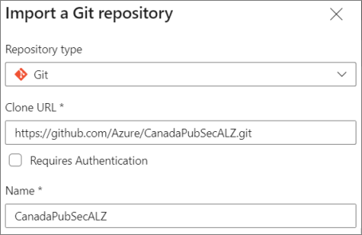

# Azure DevOps Scripts

> Copyright (c) Microsoft Corporation.  
  Licensed under the MIT license.  
  THIS CODE AND INFORMATION ARE PROVIDED "AS IS" WITHOUT WARRANTY OF ANY KIND, EITHER EXPRESSED OR IMPLIED, INCLUDING BUT NOT LIMITED TO THE IMPLIED WARRANTIES OF MERCHANTABILITY AND/OR FITNESS FOR A PARTICULAR PURPOSE.

## Introduction

This document discusses the scripts available to help simplify the onboarding process to Azure Landing Zones design using Azure DevOps pipelines. The [Azure DevOps Pipelines Onboarding Guide](./azure-devops-pipelines.md) document contains detailed onboarding instructions, and is referenced in this document.

## Table of Contents

- [Required Tools](#required-tools)
- [Required Permissions](#required-permissions)
- [Setting Up Azure DevOps](#setting-up-azure-devops)
- [Creating Your Repository](#creating-your-repository)
- [Using the Scripts to Configure Your Environment](#using-the-scripts-to-configure-your-environment)

---

## Required Tools

The instructions in this document and scripts in the `/scripts/onboarding` folder require the latest versions of the following tools are installed. Review each tool and complete any post-install configuration instructions provided.

### Azure CLI

Install instructions:

- <https://docs.microsoft.com/cli/azure/install-azure-cli>

After installation:

- Sign in with `az login`  
  <https://docs.microsoft.com/cli/azure/authenticate-azure-cli>

### Azure CLI devops extension

Install instructions:

- <https://docs.microsoft.com/azure/devops/cli>

After installation:

- Sign-in with a Personal Access Token (PAT):
  <https://docs.microsoft.com/azure/devops/cli/log-in-via-pat>. For example:  
  `az devops login --organization https://dev.azure.com/[DEVOPS-ORG]`

Optionally, you may also want to perform the following steps:

- Set the default Azure DevOps organization and project. For example:  
  `az devops configure --defaults project=[DEVOPS-PROJECT] organization=https://dev.azure.com/[DEVOPS-ORG]`

- Verify the default values are set correctly. For example:  
  `az devops configure --list`

These additional steps are optional since the scripts use the `DEVOPS_ORG` and `DEVOPS_PROJECT_NAME` environment variables. Setting the default Azure DevOps organization and project may be useful when you are invoking the `az devops` commands directly.

- For other `az devops` commands, refer to the following documentation: <https://docs.microsoft.com/cli/azure/ext/azure-devops>

### jq.exe

Install instructions:

- <https://stedolan.github.io/jq/download/>

Verify that the path to `jq.exe` is included in the `echo %PATH%` output, i.e. it must be part of your system path or user environment path for the user running these scripts.

### Git for Windows

Download from here:

- <https://gitforwindows.org>

Git for Windows includes Unix utilities (e.g. `cut`, `tr`, etc.) that are used by these scripts.

Verify that the path to these utilities is included in the `echo %PATH%` output, i.e. it must be part of your system path or user environment path for the user running these scripts. The default installation location for these files is `C:\Program Files\Git\usr\bin`.

> NOTE: In addition to ensuring the path to these utilities is included in your `%PATH%`, you should also verify that it precedes the `C:\Windows\System32` path. This is due to a conflict with the Linux version of the `sort.exe` utility and the Windows version of the `sort.exe` utility. The following script files invoke `sort.exe` and expect the Linux version: `delete-management-groups.bat` and `list-management-groups.bat`.

---

## Required Permissions

### Azure DevOps

If you need to create Azure DevOps project(s) or manage organization-wide policy settings, your user account will need to be a member of the `Project Collection Administrators` group in your Azure DevOps organization.

If you don't need to create Azure DevOps project(s) or manage organization-wide policy settings, then your user account will only need to be a member of the `Project Administrators` group in an existing Azure DevOps project.

Detailed instructions on how to configure security & usage settings for Azure DevOps are outside the scope of this documentation. For additional information on these topics, refer to the following: [Settings, Security & Usage documentation](https://docs.microsoft.com/azure/devops/organizations).

### Azure Active Directory

Your user account needs the `Global administrator` role assigned in your Azure Active Directory.

Perform the following steps to verify your administrative access level:

1. Navigate to <https://aad.portal.azure.com/>
1. Select the `Azure Active Directory` service
1. Select `Manage > Roles and administrators`
1. Select the `Global administrator` role
1. Verify your account is assigned the `Global administrator` role

Next, ensure your account has elevated access at Azure AD tenant root scope, so that you are able to manage management groups:
    Reference: <https://docs.microsoft.com/azure/role-based-access-control/elevate-access-global-admin>

Here are some sample Azure CLI commands you can use:

> **Note**: these commands are available as scripts in the `/scripts/onboarding` folder: `add-root-user-access-admin.bat`, `list-root-user-access-admin.bat`, and `remove-root-user-access-admin.bat`.

- Elevate currently signed in user:  
  `az rest --method post --url "/providers/Microsoft.Authorization/elevateAccess?api-version=2016-07-01"`

- List role assignments:  
  `az role assignment list --role "User Access Administrator" --scope "/" -o table`

- Remove elevated access:  
  `az role assignment delete --assignee username@example.com --role "User Access Administrator" --scope "/"`

### Azure Subscriptions

You will need to either have the ability to create new Azure subscriptions or have Azure subscriptions created for you and ready for use. If you need to create Azure subscriptions, then review the following documentation that discusses the role requirements depending on whether your Azure subscriptions are procured through an Azure Enterprise Agreement, Microsoft Customer Agreement, Microsoft Partner Agreement, or Microsoft Online Service Program billing account: [Create an additional Azure subscription](https://docs.microsoft.com/azure/cost-management-billing/manage/create-subscription).

---

## Setting Up Azure DevOps

Azure DevOps is used to define pipelines that automate landing zone deployments. It may also be used as the location for the repository files.

> This section is optional if you have already created and configured your Azure DevOps organization and project.

Refer to the instructions in [Azure DevOps Setup](../../docs/onboarding/azure-devops-setup.md) for assistance in setting up a new Azure DevOps environment or validating an existing one against best practices.

---

## Creating Your Repository

> This section is optional. If you have already forked or cloned the `CanadaPubSecALZ` repository into a repository of your choosing, then proceed to the next section.

There are two options for hosting the repository code, outlined in the following subsections. Regardless of where you manage your repository (Azure DevOps or GitHub), the pipelines used to run the automation workflow reside in Azure DevOps.

### Import the `CanadaPubSecALZ` GitHub repository into your Azure DevOps repository

> Choose this option if you are already using (or more comfortable working with) Azure DevOps as a location for maintaining your repository files. This option is also a good choice if you want to simplify Azure DevOps pipelines creation by referencing Git repositories in Azure DevOps instead of GitHub Enterprise.

Follow the instructions in the documentation [Import a Git repo](https://docs.microsoft.com/azure/devops/repos/git/import-git-repository?view=azure-devops).

In the instructions above, you will use the following Clone URL value: `https://github.com/Azure/CanadaPubSecALZ.git`, and the process will look similar to the following screenshot at the import stage:



Once you have imported the `CanadaPubSecALZ` repository into your Azure DevOps repository, it will not have any connection with the original GitHub repository. If you would like to synchronize with the original GitHub repository, you will need to add a remote pointing to the original repo.

To add a remote named `upstream` to the GitHub repository, first clone your newly imported copy in Azure DevOps, and then run the following commands from the cloned repository workspace:

```bash
git remote add upstream https://github.com/Azure/CanadaPubSecALZ.git
git remote update
```

Once you have established a remote (upstream) connection from your Azure DevOps repository back to the original GitHub repository, you can get updates using the following `git` command:

```bash
git pull upstream main && git push
```

This is just one example of interacting with the remote (upstream). It shows how to update the `main` branch of your Azure DevOps repository with the `main` branch of the original GitHub repository. Additional operations such as pushing changes from your repository back to the original are also possible, but beyond the scope of this documentation.

### Fork the `CanadaPubSecALZ` GitHub repository into your GitHub repository

> Choose this option if you are already using (or more comfortable working with) GitHub Enterprise, as opposed to Azure DevOps as a location for maintaining your repository files.

Follow the instructions in the documentation [Fork a repo](https://docs.github.com/get-started/quickstart/fork-a-repo).

Using the documentation above, you will perform the following steps:

  1. Navigate to <https://github.com/Azure/CanadaPubSecALZ>
  1. Click on the `Fork` button

If you are a member of a GitHub organization, you will be prompted to select the destination account where the repository will be forked into.

If you are not a member of any GitHub organizations, the CanadaPubSecALZ repository will be automatically forked into your personal account.

After the repository fork operation has completed, you will be redirected to the newly forked GitHub repository.

Once you have forked the `CanadaPubSecALZ` repository into your GitHub repository, it will not have any connection with the original GitHub repository. If you would like to synchronize with the original GitHub repository, you will need to add a remote pointing to the original repo.

To add a remote named `upstream` to the GitHub repository, first clone your newly imported copy in Azure DevOps, and then run the following commands from the cloned repository workspace:

```bash
git remote add upstream https://github.com/Azure/CanadaPubSecALZ.git
git remote update
```

Once you have established a remote (upstream) connection from your Azure DevOps repository back to the original GitHub repository, you can get updates using the following `git` command:

```bash
git pull upstream main && git push
```

This is just one example of interacting with the remote (upstream). It shows how to update the `main` branch of your Azure DevOps repository with the `main` branch of the original GitHub repository. Additional operations such as pushing changes from your repository back to the original are also possible, but beyond the scope of this documentation.

---

## Using the Scripts to Configure Your Environment

The following subsections go through the process of using the scripts to configure Azure DevOps pipelines for deploying Azure Landing Zones. Follow the steps and run the scripts in the order the subsections are presented, as some steps have dependencies on previous steps. For example, you will need an Azure service principal created before you can create an Azure DevOps service endpoint.

### Create an environment variable settings file

Make a copy of the `set-variables.DevOpsOrgName.bat`, replacing `DevOpsOrgName` portion of the file name with the name of your Azure DevOps organization or any other meaningful name (no spaces).

Next, edit the newly created file, using the guidance in the following table.

| Variable Name | Description | Example
| ---- | ---- | ----
| DEVOPS_TENANT_ID | Azure AD tenant identifier. | c0196602-5a7d-4b1e-9128-69dbf7152c18
| DEVOPS_MGMT_GROUP_NAME | Azure AD root management group name. | Tenant Root Group
| DEVOPS_SP_NAME | Azure service principal name. The service principal has Owner RBAC at the tenant root scope. | spn-azure-platform-ops
| DEVOPS_SG_NAME | Azure security group name for 'Owner` RBAC subscription, network, and logging | alz-owners
| DEVOPS_ORG | Azure DevOps organization URL. | <https://dev.azure.com/DevOpsOrgName>
| DEVOPS_PROJECT_NAME | Azure DevOps project name. | CanadaPubSecALZ
| DEVOPS_REPO_NAME_OR_URL | Azure DevOps or GitHub repository name or URL. | CanadaPubSecALZ
| DEVOPS_REPO_TYPE | Repository type. Can be `tfsgit` or `github`. | tfsgit
| DEVOPS_REPO_BRANCH | Repository branch name. | main
| DEVOPS_PIPELINE_NAME_SUFFIX | Azure DevOps pipeline name suffix | -ci
| DEVOPS_SE_NAME | Azure DevOps service endpoint name. | spn-azure-platform-ops
| DEVOPS_SE_TEMPLATE | File name for the generated Azure DevOps service endpoint template JSON file. | service-endpoint.AzDevOpsOrg.json
| DEVOPS_VARIABLES_GROUP_NAME | Azure DevOps variable group name. Leave this set to `firewall-secrets` as the YAML pipeline for networking is hard-coded to use this value. | firewall-secrets
| DEVOPS_VARIABLES_VALUES | Specify values for the NVA firewall username and password in format `key=value key=value`. Replace `YourUsername` and `YourPassword` in the example with your values. DO NOT commit changes that include username and password plaintext values to your repository. | var-hubnetwork-nva-fwUsername=YourUserName var-hubnetwork-nva-fwPassword=YourPassword
| DEVOPS_VARIABLES_ARE_SECRET | Indicates whether variables in the variable group are marked as secret. Possible values are `true` or `false`. Recommend using `true` unless you plan to reconfigure your variable group to use another secure source such as KeyVault. | true
| DEVOPS_OUTPUT_DIR | Name of temporary folder for generated files. | .\output

Once you have saved your changes to the newly created file, run it from the command line. After running your new script, run the `list-variables.bat` script to view these environment variable settings.

### Create service principal

Run the `create-service-principal.bat` script to create an Azure AD service principal with `Owner` RBAC at the tenant root scope.

> There is also a `delete-service-principal.bat` script that you can use to delete an existing service principal. For example, if you want to re-create the service principal, use the `delete-service-principal.bat` script followed by the `create-service-principal.bat` script.

If you would rather perform this step manually, detailed guidance is available at the following location: [Step 1 -  Create Service Principal Account & Assign RBAC](azure-devops-pipelines.md#step-1---create-service-principal-account--assign-rbac).

### Create service endpoint

Note that this script, `create-service-endpoint.bat`, depends on the output from a successful run of the `create-service-principal.bat` script (mentioned in the previous section), which contains the service principal password. If that output does not exist, you will be prompted for the service principal password.

Run the `create-service-endpoint.bat` script to create an Azure DevOps service endpoint (aka service connection). this script uses an output file generated in the previous step to provide the service principal attributes needed to create the service endpoint.

> There is also a `delete-service-endpoint.bat` script that you can use to delete an existing service endpoint. For example, if you want to re-create the service endpoint, use the `delete-service-endpoint.bat` script followed by the `create-service-endpoint.bat` script.

If you would rather perform this step manually, detailed guidance is available at the following location: [Step 2 - Configure Service Connection in Azure DevOps Project Configuration](azure-devops-pipelines.md#step-2---configure-service-connection-in-azure-devops-project-configuration).

### Create landing zone pipelines

Run the `create-pipelines.bat` script to create the landing zone pipelines:

- management-groups-ci
- roles-ci
- platform-logging policy-ci
- platform-connectivity-hub-nva-ci
- platform-connectivity-hub-azfw-ci
- platform-connectivity-hub-azfw-policy-ci
- subscriptions-ci

If you would rather perform these steps manually, detailed guidance is available in the following sections of the [Azure DevOps Pipelines Onboarding Guide](./azure-devops-pipelines.md):

- [Step 3 - Configure Management Groups](./azure-devops-pipelines.md#step-3---configure-management-groups)
- [Step 4 - Configure Custom Roles](./azure-devops-pipelines.md#step-4---configure-custom-roles)
- [Step 5 - Configure Logging](./azure-devops-pipelines.md#step-5--configure-logging)
- [Step 6 - Configure Azure Policies](./azure-devops-pipelines.md#step-6---configure-azure-policies)
- [Step 7 - Configure Hub Networking](./azure-devops-pipelines.md#step-7---configure-hub-networking)
- [Step 8 - Configure Subscription Archetypes](./azure-devops-pipelines.md#step-8---configure-subscription-archetypes)

### Give pipelines access to service endpoint

Run the `share-service-endpoint.bat` script to allow all pipelines in the project to use the service endpoint.

If you would rather perform this step manually, detailed guidance is available at the following location: [Step 2 - Configure Service Connection in Azure DevOps Project Configuration](azure-devops-pipelines.md#step-2---configure-service-connection-in-azure-devops-project-configuration).

### Create variable group

The `firewall-secrets` variable group is required by the networking pipeline when using a Fortinet firewall deployment configuration. It is optional for all other scenarios.

If needed, run the `create-variable-group.bat` script to created the required variable group and variables in Azure DevOps.

### Create security group

Run the `create-security-group.bat` script to create a new Azure security group. The security group name is defined using the `%DEVOPS_SG_NAME%` environment variable. Save the Azure security group GUID provided by this script for later use when configuring your environment. It will be used in the `securityGroupObjectIds` values in the environment configuration (YAML) files and subscription configuration (JSON) files.

### Configure your environment

Before running the landing zone pipelines, you will need to create and edit configuration files (YAML and JSON) with values corresponding to your environment, along with specific configuration information needed for each layer: management groups, roles, logging, policy, networking, and subscriptions.

Detailed guidance on these configuration requirements is available in the [Azure DevOps Pipelines Onboarding Guide](./azure-devops-pipelines.md). In that documentation you can start at this location: [Step 3 - Configure Management Groups](./azure-devops-pipelines.md#step-3---configure-management-groups), since Step 1 and Step 2 have already been completed using the scripts mentioned above in this document. As you work through Steps 3 - 8 in the other document, keep in mind that you can skip any instructions related to creating the service principal, service endpoint, or Azure DevOps pipelines that you have already performed using the scripts in this document.

### Run pipelines

Run the `run-pipelines.bat` script to interactively run individual landing zone pipelines. Note that at present time the `subscriptions-ci` pipeline is not included in the list of runnable pipelines as the script requires additional work to enable that capability.

### Clear environment variables used by scripts

Run the `unset-variables.bat` script to clear (unset) all "DEVOPS_" environment variables

---

## Files

### .gitignore

The `/scripts/onboarding/.gitignore` file prevents the `./output` folder (default value for `%DEVOPS_OUTPUT_DIR%`) contents from being added to Azure Repos. This is important as the `create-service-principal.bat` and `create-service-endpoint.bat` scripts use this folder to store the client id and password for the service principal, and you do not want to expose these values in the repository.

### Scripts

| Area | File Name | Description
| ---- | ---- | ----
| Azure | `create-security-group.bat` | Create an Azure security group to be used in the `securityGroupObjectIds` values in environment configuration (YAML) files and subscription configuration (JSON) files
| Azure | `delete-management-groups.bat` | Deletes all management groups in the current tenant, with the exception of the 'Tenant Root Group'. It is useful for resetting the management groups in your Azure AD tenant. Exercise caution when using this script as it will remove **all** management groups in the Azure AD tenant.
| Azure | `list-management-groups.bat` | List all Management Groups in the current tenant. It is useful for validating the successful deployment of the Management Groups pipeline.
| Azure DevOps | `create-pipelines.bat` | Create the Azure DevOps pipelines for landing zone deployment.
| Azure DevOps | `create-service-endpoint.bat` | Create a new Azure DevOps service endpoint for use with Azure Pipelines.
| Azure DevOps | `create-variable-group.bat` | Create a variable group to store secrets used by the pipelines.
| Azure DevOps | `delete-pipelines.bat` | Delete the Azure DevOps pipelines.
| Azure DevOps | `delete-service-endpoint.bat` | Delete the specified service endpoint used by Azure DevOps pipelines.
| Azure DevOps | `run-pipelines.bat` | Runs all landing zone pipelines in sequence.
| Azure DevOps | `service-endpoint.[ENV].json` | Template files generated by the `create-service-endpoint.bat` script.
| Azure DevOps | `service-endpoint.template.json` | Template file used by the `create-service-endpoint.bat` script to generate environment-specific templates in the `%DEVOPS_OUTPUT_DIR%` folder.
| Azure DevOps | `share-service-endpoint.bat` | Update the existing Azure DevOps service endpoint, allowing it to be used by all pipelines in the project.
| Azure DevOps | `update-variable-group.bat` | Update the existing Azure DevOps variable group, applying or removing the `secret` attribute as specified. This script is called by `create-variable-group.bat` and can also be invoked directly.
| Environment | `list-variables.bat` | Display all `DEVOPS_` environment variables.
| Environment | `set-variables.[ENV].bat` | These scripts, one per environment, set the base `DEVOPS_` environment variables.
| Environment | `unset-variables.bat` | Unset all `DEVOPS_` environment variables.
| Tenant | `add-root-user-access-admin.bat` | Elevate the currently signed-in user to "User Access Administrator" role.
| Tenant | `create-service-principal.bat` | Create a new Azure service principal that is used for pipeline authentication.
| Tenant | `delete-service-principal.bat` | Delete the specified Azure service principal.
| Tenant | `list-root-user-access-admin.bat` | List the users with elevated "User Access Administrator" role at tenant root scope.
| Tenant | `remove-root-user-access-admin.bat` | Remove the specified user from elevated "User Access Administrator" role at tenant root scope.
| Utility | `whereami-azure.bat` | Show all identities signed-in with the current Azure CLI session.
| Utility | `whoami-azure.bat` | Show the active identity signed-in with the current Azure CLI session.
